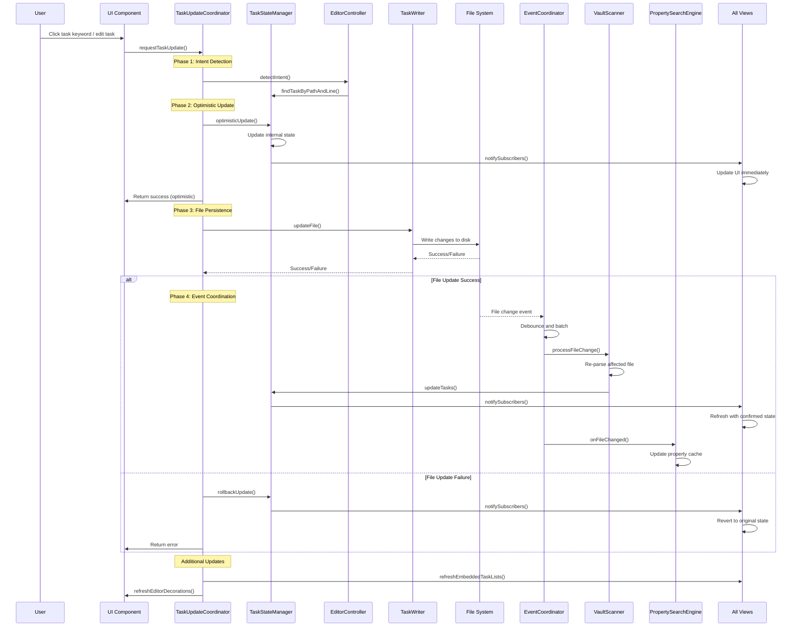

# Architecture Documentation

## Overview

TODOseq is a lightweight, keyword-based task tracker for Obsidian that provides advanced task management capabilities while preserving users' original Markdown formatting. The architecture is designed around principles of **centralized state management**, **event-driven updates**, and **layered separation of concerns**.

### Core Philosophy

1. **Non-intrusive Integration**: Tasks exist as plain text in Markdown files - no special syntax required
2. **Performance First**: Incremental scanning, optimistic updates, and efficient parsing
3. **Reactive UI**: Immediate feedback with async persistence for smooth user experience
4. **Type Safety**: Comprehensive TypeScript interfaces throughout the codebase

## High-Level System Architecture

```mermaid
graph TB
    subgraph "Obsidian Platform"
        ObsidianAPI["Obsidian APIs"]
        Workspace["Workspace Manager"]
        FileSystem["File System"]
        Editor["Editor (CodeMirror)"]
    end

    subgraph "TODOseq Plugin"
        Main[Main Plugin Class<br/>TodoTracker]

        subgraph "Service Layer"
            StateManager["TaskStateManager<br/>Central State"]
            VaultScanner["VaultScanner<br/>File Monitoring"]
            UpdateCoordinator["TaskUpdateCoordinator<br/>Update Pipeline"]
            EditorController["EditorController<br/>Editor Operations"]
            TaskWriter["TaskWriter<br/>File Operations"]
            EventCoordinator["EventCoordinator<br/>Unified Event Handling"]
            PropertySearchEngine["PropertySearchEngine<br/>Property Search"]
            KeywordManager["KeywordManager<br/>Keyword Classification"]
            StateTransitionManager["TaskStateTransitionManager<br/>State Transitions"]
        end

        subgraph "UI Layer"
            UIManager["UIManager<br/>UI Coordination"]
            TaskListView["TaskListView<br/>Main Task Panel"]
            ReaderFormatter["ReaderViewFormatter<br/>Reader Mode"]
            StatusBarManager["StatusBarManager<br/>Status Bar"]
            EditorKeywordMenu["EditorKeywordMenu<br/>Keyword Menu"]
            StateMenuBuilder["StateMenuBuilder<br/>State Menu"]
            EmbeddedProcessor["TodoseqCodeBlockProcessor<br/>Embedded Lists"]
            SearchOptionsDropdown["SearchOptionsDropdown<br/>Search Options"]
            SearchSuggestionDropdown["SearchSuggestionDropdown<br/>Search Suggestions"]
        end

        subgraph "Parser Layer"
            TaskParser["TaskParser<br/>Markdown Engine"]
            OrgModeParser["OrgModeTaskParser<br/>Org-mode Engine"]
            ParserRegistry["ParserRegistry<br/>Parser Router"]
            LanguageRegistry["LanguageRegistry<br/>Multi-language Support"]
            DateParser["DateParser<br/>Date Recognition"]
        end

        subgraph "Search Layer"
            Search["Search System<br/>Query Engine"]
            SearchParser["Search Parser<br/>AST Builder"]
            SearchEvaluator["Search Evaluator<br/>Task Filtering"]
            SearchTokenizer["SearchTokenizer<br/>Lexical Analysis"]
            SearchSuggestions["SearchSuggestions<br/>Auto-complete"]
        end

        subgraph "Utilities"
            TaskUtils["Task Utilities"]
            KeywordManager["KeywordManager<br/>Keyword Classification"]
            SettingsMigration["SettingsMigration<br/>Settings Migration"]
            DateUtils["Date Utilities"]
            SettingsUtils["Settings Utils"]
            RegexCache["RegexCache<br/>Pattern Caching"]
            Patterns["Regex Patterns"]
            TaskSort["Task Sorting"]
            TaskUrgency["Task Urgency"]
            DailyNoteUtils["Daily Note Utils"]
        end

        subgraph "Lifecycle"
            LifecycleManager["PluginLifecycleManager<br/>Plugin Lifecycle"]
        end
    end

    subgraph "External Dependencies"
        DailyNotes["Daily Notes Interface"]
    end

    %% Connections
    Main --> StateManager
    Main --> VaultScanner
    Main --> UpdateCoordinator
    Main --> UIManager
    Main --> EventCoordinator
    Main --> PropertySearchEngine

    StateManager --> TaskListView
    StateManager --> EmbeddedProcessor
    StateManager --> Search

    VaultScanner --> ParserRegistry
    ParserRegistry --> TaskParser
    ParserRegistry --> OrgModeParser
    TaskParser --> LanguageRegistry
    TaskParser --> DateParser
    OrgModeParser --> DateParser
    VaultScanner --> FileSystem

    UpdateCoordinator --> StateManager
    UpdateCoordinator --> TaskWriter
    UpdateCoordinator --> UIManager

    EventCoordinator --> VaultScanner
    EventCoordinator --> PropertySearchEngine
    EventCoordinator --> FileSystem

    PropertySearchEngine --> Search
    Search --> SearchParser
    Search --> SearchEvaluator
    Search --> StateManager

    UIManager --> Editor
    UIManager --> TaskListView
    UIManager --> ReaderFormatter

    TaskListView --> Search
    TaskWriter --> FileSystem

    TaskParser --> DateParser
    TaskParser --> LanguageRegistry
    TaskParser --> TaskUtils
    TaskParser --> KeywordManager
    TaskWriter --> KeywordManager
    EditorController --> KeywordManager

    %% Keyword and State Management
    KeywordManager --> TaskStateTransitionManager
    TaskStateTransitionManager --> TaskWriter
    TaskStateTransitionManager --> EditorController

    %% Search dropdown connections
    TaskListView --> SearchOptionsDropdown
    TaskListView --> SearchSuggestionDropdown
    SearchOptionsDropdown --> SearchSuggestionDropdown

    %% External connections
    Main --> ObsidianAPI
    Main --> Workspace
    VaultScanner --> FileSystem
    TaskWriter --> FileSystem
    DateUtils --> DailyNotes

    %% Styling
    classDef pluginLayer fill:#e1f5fe
    classDef serviceLayer fill:#f3e5f5
    classDef uiLayer fill:#e8f5e8
    classDef parserLayer fill:#fff3e0
    classDef searchLayer fill:#fce4ec
    classDef external fill:#f5f5f5

    class Main pluginLayer
    class StateManager,VaultScanner,UpdateCoordinator,EditorController,TaskWriter,EventCoordinator,PropertySearchEngine,TaskStateTransitionManager serviceLayer
    class UIManager,TaskListView,TaskWriter,ReaderFormatter,EmbeddedProcessor,SearchOptionsDropdown,SearchSuggestionDropdown uiLayer
    class TaskParser,OrgModeParser,ParserRegistry,LanguageRegistry,DateParser parserLayer
    class Search,SearchParser,SearchEvaluator searchLayer
    class ObsidianAPI,Workspace,FileSystem,Editor,DailyNotes external
```



## Component Layering and Separation of Concerns

### 1. Service Layer (Business Logic)

**TaskStateManager** (`src/services/task-state-manager.ts`)

- **Responsibility**: Single source of truth for all task data
- **Key Patterns**: Observer pattern for reactive updates
- **Interface**: `getTasks()`, `setTasks()`, `subscribe(callback)`, `findTaskByPathAndLine()`

**VaultScanner** (`src/services/vault-scanner.ts`)

- **Responsibility**: File system monitoring, incremental scanning, owns KeywordManager and parsers
- **Key Patterns**: Event-driven architecture, performance optimization, yielding to event loop
- **Interface**: `scanVault()`, `updateSettings()`, `getKeywordManager()`, `getParser()`, event emission
- **Ownership**: Creates and owns KeywordManager instance; creates TaskParser internally; registers additional parsers (e.g., OrgModeTaskParser)

**TaskUpdateCoordinator** (`src/services/task-update-coordinator.ts`)

- **Responsibility**: Centralized update pipeline with optimistic UI
- **Key Patterns**: Command pattern, optimistic updates
- **Interface**: `updateTaskState()`, `createTask()`, coordinate updates

**EditorController** (`src/services/editor-controller.ts`)

- **Responsibility**: Editor operations, task parsing under cursor, intent detection
- **Key Patterns**: Bridge pattern, command delegation
- **Interface**: Task cycling, priority changes, keyword toggling

**TaskWriter** (`src/services/task-writer.ts`)

- **Responsibility**: Atomic file operations, state preservation, formatting
- **Key Patterns**: Strategy pattern, atomic operations
- **Interface**: `updateFile()`, `generateTaskLine()`, file persistence

**EventCoordinator** (`src/services/event-coordinator.ts`)

- **Responsibility**: Unified vault event handling with debouncing and batching
- **Key Patterns**: Event aggregation, debouncing, batch processing
- **Interface**: `onFileChange()`, `initialize()`, event coordination

**PropertySearchEngine** (`src/services/property-search-engine.ts`)

- **Responsibility**: Property-based search with caching and optimization
- **Key Patterns**: Singleton, caching, async initialization
- **Interface**: `searchProperties()`, `isReady()`, `onFileChanged()`, property cache management

**KeywordManager** (`src/utils/keyword-manager.ts`)

- **Responsibility**: Single source of truth for keyword classification and detection
- **Key Patterns**: Reads directly from settings (no caching), static builtin sets
- **Interface**: `isCompleted()`, `isActive()`, `isWaiting()`, `isInactive()`, `isArchived()`, `getGroup()`, `getAllKeywords()`, `getKeywordsForGroup()`, `getBuiltinActiveKeywords()`, `getBuiltinInactiveKeywords()`, `getBuiltinWaitingKeywords()`, `getBuiltinCompletedKeywords()`, `getBuiltinArchivedKeywords()`
- **Used by**: TaskParser, OrgModeTaskParser, VaultScanner (owns instance), TaskWriter, EditorController, UI components (task-list-view, task-renderer), task-sort, task-urgency
- **Ownership**: VaultScanner creates and owns the KeywordManager instance; components get it via `vaultScanner.getKeywordManager()`

**TaskStateTransitionManager** (`src/services/task-state-transition-manager.ts`)

- **Responsibility**: State transition logic for task cycling and toggling
- **Key Patterns**: State machine, immutable archived states
- **Interface**: `getNextState()`, `getCycleState()`, `canTransition()`, `isArchivedState()`
- **Used by**: TaskWriter, EditorController, UI components

### 2. UI Layer (User Interaction)

**UIManager** (`src/ui-manager.ts`)

- **Responsibility**: Central UI coordination, extension registration
- **Key Patterns**: Extension system, event delegation
- **Interface**: UI component lifecycle, event coordination

**TaskListView** (`src/view/task-list/task-list-view.ts`)

- **Responsibility**: Main task panel with search, filtering, sorting
- **Key Patterns**: Observer pattern, component-based rendering
- **Interface**: Obsidian View API implementation

**ReaderViewFormatter** (`src/view/markdown-renderers/reader-formatting.ts`)

- **Responsibility**: Task keyword formatting in reader/preview mode
- **Key Patterns**: Double-click detection, settings change detection
- **Interface**: `refreshReaderViewFormatter()`, keyword styling, state menus

**StatusBarManager** (`src/view/editor-extensions/status-bar.ts`)

- **Responsibility**: Status bar integration with task count display
- **Key Patterns**: Event subscription, UI updates
- **Interface**: `setupStatusBarItem()`, task count display

**EditorKeywordMenu** (`src/view/editor-extensions/editor-keyword-menu.ts`)

- **Responsibility**: In-editor keyword interaction and menu display
- **Key Patterns**: Context menu, keyword detection
- **Interface**: Keyword menu management

**StateMenuBuilder** (`src/view/components/state-menu-builder.ts`)

- **Responsibility**: Context menu generation for task state changes
- **Key Patterns**: Dynamic menu building, state categorization
- **Interface**: `getSelectableStatesForMenu()`, menu generation

**TodoseqCodeBlockProcessor** (`src/view/embedded-task-list/code-block-processor.ts`)

- **Responsibility**: Embedded task list processing in markdown blocks
- **Key Patterns**: Post-processor registration, separate lifecycle
- **Interface**: Code block parsing, embedded list rendering

**SearchOptionsDropdown** (`src/view/components/search-options-dropdown.ts`)

- **Responsibility**: Search options and history management with dropdown UI
- **Key Patterns**: Dropdown UI, search history, debounced updates
- **Interface**: Search history management, options display, debounce control

**SearchSuggestionDropdown** (`src/view/components/search-suggestion-dropdown.ts`)

- **Responsibility**: Search query suggestions and autocomplete
- **Key Patterns**: Prefix matching, suggestion ranking, dropdown UI
- **Interface**: Suggestion generation, prefix filtering, keyboard navigation

### 3. Parser Layer (Data Extraction)

**ITaskParser Interface** (`src/parser/types.ts`)

- **Responsibility**: Defines the contract for all task parsers
- **Key Patterns**: Interface segregation, strategy pattern
- **Interface**: `parseFile()`, `parseLine()`, `supportsFile()`, `getFileExtensions()`

**ParserRegistry** (`src/parser/parser-registry.ts`)

- **Responsibility**: Manages multiple parsers and routes files to appropriate parser
- **Key Patterns**: Registry pattern, factory pattern, file extension routing
- **Interface**: `registerParser()`, `getParserForFile()`, `parseFile()`

**TaskParser** (`src/parser/task-parser.ts`)

- **Responsibility**: Complex regex-based task extraction for Markdown files
- **Key Patterns**: State machine, builder pattern, security-first design
- **Interface**: Implements `ITaskParser`, `parseFile()`, `parseLine()`, language-aware parsing
- **Creation**: TaskParser.create(keywordManager, app, urgencyCoefficients, parserSettings) - first parameter must be KeywordManager

**OrgModeTaskParser** (`src/parser/org-mode-task-parser.ts`)

- **Responsibility**: Parse tasks from Org-mode files (`.org` extension)
- **Key Patterns**: Headline-based parsing, org-mode syntax support
- **Interface**: Implements `ITaskParser`, supports priorities, scheduled/deadline dates
- **Creation**: OrgModeTaskParser.create(keywordManager, app, urgencyCoefficients) - first parameter must be KeywordManager

**LanguageRegistry** (`src/parser/language-registry.ts`)

- **Responsibility**: Multi-language comment pattern management
- **Key Patterns**: Registry pattern, factory pattern
- **Interface**: Language definition storage and resolution

### 4. Search Layer (Query Processing)

**Search System** (`src/search/search.ts`)

- **Responsibility**: Query parsing and evaluation
- **Key Patterns**: Compiler pattern (parsing → AST → evaluation)
- **Interface**: `search()`, query validation, error handling

**SearchParser** (`src/search/search-parser.ts`)

- **Responsibility**: AST building from query tokens
- **Key Patterns**: Parser combinators, syntax tree construction
- **Interface**: Query parsing, AST generation, property filter parsing

**SearchEvaluator** (`src/search/search-evaluator.ts`)

- **Responsibility**: Task matching and filtering based on query AST
- **Key Patterns**: Visitor pattern, filter chain execution, property search integration
- **Interface**: Task evaluation, result filtering, `evaluatePropertyFilter()`

**SearchTokenizer** (`src/search/search-tokenizer.ts`)

- **Responsibility**: Lexical analysis of search queries
- **Key Patterns**: Tokenization, pattern matching, property token detection
- **Interface**: Token generation, lexical analysis, property token handling

**SearchSuggestions** (`src/search/search-suggestions.ts`)

- **Responsibility**: Auto-complete functionality for search queries
- **Key Patterns**: Suggestion ranking, prefix matching
- **Interface**: Suggestion generation, completion lists

## Component Dependency Diagram

```mermaid
graph TD
    subgraph "Core Components"
        Main[TodoTracker<br/>Main Plugin]
    end

    subgraph "Service Layer Dependencies"
        StateManager[TaskStateManager]
        VaultScanner[VaultScanner]
        UpdateCoordinator[TaskUpdateCoordinator]
        EventCoordinator[EventCoordinator]
        PropertySearchEngine[PropertySearchEngine]
    end

     subgraph "UI Layer Dependencies"
         UIManager[UIManager]
         TaskListView[TaskListView]
         ReaderFormatter[ReaderViewFormatter]
         StatusBar[StatusBarManager]
         EditorKeywordMenu[EditorKeywordMenu]
         StateMenuBuilder[StateMenuBuilder]
         EmbeddedProcessor[TodoseqCodeBlockProcessor]
         SearchOptionsDropdown[SearchOptionsDropdown]
         SearchSuggestionDropdown[SearchSuggestionDropdown]
     end

    subgraph "Parser Dependencies"
        TaskParser[TaskParser]
        OrgModeParser[OrgModeTaskParser]
        ParserRegistry[ParserRegistry]
        LanguageRegistry[LanguageRegistry]
        DateParser[DateParser]
    end

    subgraph "Search Dependencies"
        Search[Search]
        SearchParser[SearchParser]
        SearchEvaluator[SearchEvaluator]
        SearchTokenizer[SearchTokenizer]
        SearchSuggestions[SearchSuggestions]
    end

    subgraph "Utility Dependencies"
        TaskUtils[TaskUtils]
        KeywordManager[KeywordManager]
        DateUtils[DateUtils]
        SettingsUtils[SettingsUtils]
        Patterns[Patterns]
        RegexCache[RegexCache]
        TaskSort[TaskSort]
        TaskUrgency[TaskUrgency]
        DailyNoteUtils[DailyNoteUtils]
    end

    subgraph "Service Layer Dependencies"
        EditorController[EditorController]
        TaskWriter[TaskWriter]
    end

    subgraph "Lifecycle Dependencies"
        LifecycleManager[PluginLifecycleManager]
    end

    subgraph "External APIs"
        Obsidian[Obsidian API]
        DailyNotes[Daily Notes Interface]
    end

    %% Dependency arrows (A depends on B)
    Main --> StateManager
    Main --> VaultScanner
    Main --> UpdateCoordinator
    Main --> UIManager
    Main --> EditorController
    Main --> TaskWriter
    Main --> LifecycleManager
    Main --> EventCoordinator
    Main --> PropertySearchEngine

    StateManager -.-> Main
    VaultScanner -.-> Main
    UpdateCoordinator -.-> Main
    UIManager -.-> Main
    EditorController -.-> Main
    TaskWriter -.-> Main
    LifecycleManager -.-> Main
    EventCoordinator -.-> Main
    PropertySearchEngine -.-> Main

    UpdateCoordinator --> StateManager
    UpdateCoordinator --> TaskWriter

    UIManager --> TaskListView
    UIManager --> ReaderFormatter
    UIManager --> StatusBar
    UIManager --> EditorKeywordMenu
    UIManager --> StateMenuBuilder

     TaskListView --> StateManager
     TaskListView --> Search
     TaskListView --> SearchOptionsDropdown
     TaskListView --> SearchSuggestionDropdown
     SearchOptionsDropdown --> SearchSuggestionDropdown

    VaultScanner --> ParserRegistry
    ParserRegistry --> TaskParser
    ParserRegistry --> OrgModeParser
    TaskParser --> LanguageRegistry
    TaskParser --> DateParser
    OrgModeParser --> DateParser
    TaskParser --> TaskUtils
    TaskParser --> Patterns

    Search --> SearchParser
    Search --> SearchEvaluator
    SearchParser --> SearchTokenizer
    Search --> SearchSuggestions
    Search --> StateManager
    SearchEvaluator --> PropertySearchEngine

    EventCoordinator --> VaultScanner
    EventCoordinator --> PropertySearchEngine

    EditorController --> TaskWriter
    EditorController --> StateManager

    TaskWriter --> Obsidian
    VaultScanner --> Obsidian
    DateUtils --> DailyNotes
    PropertySearchEngine --> Obsidian

    TaskListView --> Obsidian
    ReaderFormatter --> Obsidian

    %% Utility dependencies
    TaskWriter --> TaskUtils
    TaskListView --> TaskUtils
    SearchEvaluator --> TaskUtils
    EditorController --> Patterns

    %% RegexCache dependencies
    VaultScanner --> RegexCache
    SearchEvaluator --> RegexCache

    %% Lifecycle dependencies
    LifecycleManager --> VaultScanner
    LifecycleManager --> TaskWriter
    LifecycleManager --> EditorKeywordMenu
    LifecycleManager --> StatusBar
    LifecycleManager --> TaskListView

    %% Styling for dependency direction
    linkStyle 0,1,2,3,4,5,6 stroke:#2196f3,stroke-width:2px
    linkStyle 7,8,9,10,11,12 stroke:#4caf50,stroke-width:2px
    linkStyle 13,14,15,16,17,18,19,20,21,22 stroke:#ff9800,stroke-width:2px
    linkStyle 23,24,25,26,27,28,29,30,31 stroke:#9c27b0,stroke-width:2px
    linkStyle 32,33,34,35,36 stroke:#f44336,stroke-width:2px
    linkStyle 37,38,39,40,41 stroke:#607d8b,stroke-width:2px

    %% Class styling for component types
    class Main,LifecycleManager pluginLayer
    class StateManager,VaultScanner,UpdateCoordinator,EditorController,TaskWriter,EventCoordinator,PropertySearchEngine,TaskStateTransitionManager serviceLayer
     class UIManager,TaskListView,ReaderFormatter,StatusBar,EditorKeywordMenu,StateMenuBuilder,EmbeddedProcessor,SearchOptionsDropdown,SearchSuggestionDropdown uiLayer
    class TaskParser,OrgModeParser,ParserRegistry,LanguageRegistry,DateParser parserLayer
    class Search,SearchParser,SearchEvaluator,SearchTokenizer,SearchSuggestions searchLayer
    class TaskUtils,KeywordManager,DateUtils,SettingsUtils,Patterns,RegexCache,TaskSort,TaskUrgency,DailyNoteUtils utilityLayer
    class Obsidian,DailyNotes external
```



## Data Flow Architecture: Task Updates



## Search System Architecture

```mermaid
graph LR
    subgraph "Query Input"
        UserInput[User Search Query]
        PrefixFilters[Prefix Filters<br/>title:, tag:, etc.]
        PropertyFilters[Property Filters<br/>[key:value]]
        SearchHistory[Search History<br/>Recent Queries]
        SearchOptions[Search Options<br/>Case sensitivity, etc.]
    end

    subgraph "Parsing Pipeline"
        Tokenizer[SearchTokenizer<br/>Lexical Analysis]
        Parser[SearchParser<br/>AST Building]
        Validator[Query Validator<br/>Error Checking]
    end

    subgraph "Evaluation Engine"
        Evaluator[SearchEvaluator<br/>Task Matching]
        FilterChain[Filter Chain<br/>Multi-criteria]
        SortEngine[Sort Engine<br/>Results Ordering]
        PropertySearch[PropertySearchEngine<br/>Property Lookup]
    end

    subgraph "UI Components"
        SearchDropdown[SearchOptionsDropdown<br/>Options & History]
        SearchSuggestions[SearchSuggestionDropdown<br/>Autocomplete]
        ViewUpdater[TaskListView<br/>UI Updates]
        EmbeddedUpdater[EmbeddedTaskLists<br/>In-note Updates]
    end

    UserInput --> Tokenizer
    PrefixFilters --> Tokenizer
    PropertyFilters --> Tokenizer

    Tokenizer --> Parser
    Parser --> Validator
    Validator --> Evaluator

    TaskSource[TaskStateManager<br/>Task Data Source] --> Evaluator
    Evaluator --> FilterChain
    Evaluator --> PropertySearch
    PropertySearch --> Evaluator
    FilterChain --> SortEngine
    SortEngine --> ViewUpdater
    SortEngine --> EmbeddedUpdater

    SearchOptions --> Evaluator
    SearchHistory --> SearchDropdown
    SearchDropdown --> SearchSuggestions
    SearchSuggestions --> UserInput

    subgraph "AST Node Types"
        AND[AND Operation]
        OR[OR Operation]
        NOT[NOT Operation]
        TEXT[Text Match]
        TAG[Tag Match]
        DATE[Date Range]
        PRIORITY[Priority Filter]
        STATE[State Filter]
        PROPERTY[Property Filter]
        PROPERTY_OR[Property OR Operation]
        PROPERTY_COMP[Property Comparison]
    end

    Parser -.-> AND
    Parser -.-> OR
    Parser -.-> NOT
    Parser -.-> TEXT
    Parser -.-> TAG
    Parser -.-> DATE
    Parser -.-> PRIORITY
    Parser -.-> STATE
    Parser -.-> PROPERTY
    Parser -.-> PROPERTY_OR
    Parser -.-> PROPERTY_COMP

    classDef input fill:#e3f2fd
    classDef parser fill:#f3e5f5
    classDef evaluator fill:#e8f5e8
    classDef integration fill:#fff3e0
    classDef ast fill:#fce4ec
    classDef ui fill:#ffecb3

    class UserInput,PrefixFilters,PropertyFilters,SearchHistory,SearchOptions input
    class Tokenizer,Parser,Validator parser
    class Evaluator,FilterChain,SortEngine,PropertySearch evaluator
    class TaskSource,ViewUpdater,EmbeddedUpdater integration
    class AND,OR,NOT,TEXT,TAG,DATE,PRIORITY,STATE,PROPERTY,PROPERTY_OR,PROPERTY_COMP ast
    class SearchDropdown,SearchSuggestions ui
```

## Core Architectural Patterns

### 1. Centralized State Management

- **Single Source of Truth**: `TaskStateManager` holds all task data
- **Observer Pattern**: Components subscribe to state changes
- **Immutable Updates**: State changes return new arrays, prevent mutation
- **Optimistic Updates**: UI updates immediately, persists asynchronously

### 2. Event-Driven Architecture

- **File Change Events**: `VaultScanner` monitors vault for changes
- **State Change Events**: `TaskStateManager` notifies subscribers
- **UI Events**: `UIManager` coordinates user interactions
- **Error Events**: Graceful error handling and recovery

### 3. Plugin Architecture

- **Language Registry**: Extensible language support via `LanguageRegistry`
- **Editor Extensions**: Pluggable CodeMirror decorations and commands
- **Search Extensions**: Customizable search filters and evaluators
- **Format Extensions**: Configurable task formatting options
- **Property Search**: Extensible property-based search via `PropertySearchEngine`

### 4. Performance Patterns

- **Incremental Scanning**: Only re-scan changed files
- **Yielding to Event Loop**: Prevent UI freezing during large operations
- **Lazy Loading**: Components created on-demand
- **Efficient Parsing**: Optimized regex patterns and caching
- **Regex Caching**: `RegexCache` utility caches compiled regex patterns to avoid repeated compilation during vault scans and searches
- **Property Caching**: `PropertySearchEngine` caches frontmatter properties for fast lookup with lazy initialization
- **Event Debouncing**: `EventCoordinator` debounces file change events to avoid unnecessary processing with configurable delay
- **Batch Processing**: `EventCoordinator` batches events for efficient handling with interrupt pattern
- **Chunked Rendering**: TaskListView uses chunked rendering with lazy loading for large task lists
- **Scroll Position Preservation**: TaskListView preserves scroll position across refreshes using anchor-based restoration
- **Element Caching**: TaskListView caches DOM elements to avoid redundant re-rendering
- **Debounced Refresh**: TaskListView uses debounced refresh to handle rapid state changes

### 5. Security Patterns

- **Input Validation**: All user inputs validated before processing
- **Regex Injection Prevention**: User input sanitized before regex compilation
- **File Path Validation**: Prevents path traversal attacks
- **Type Safety**: Comprehensive TypeScript interfaces

## Parser Architecture

The parser layer uses a strategy pattern with a registry to support multiple file formats. This allows TODOseq to parse tasks from both Markdown and Org-mode files using a unified interface.

### ITaskParser Interface

All parsers implement the `ITaskParser` interface defined in [`src/parser/types.ts`](src/parser/types.ts):

```typescript
interface ITaskParser {
  parseFile(content: string, filePath: string): Task[];
  parseLine(line: string, lineNumber: number, filePath: string): Task | null;
  supportsFile(filePath: string): boolean;
  getFileExtensions(): string[];
}
```

### ParserRegistry

The [`ParserRegistry`](src/parser/parser-registry.ts) manages multiple parsers and routes files to the appropriate parser based on file extension:

- **Registration**: Parsers are registered with `registerParser(parser: ITaskParser)`
- **Routing**: `getParserForFile(filePath)` returns the appropriate parser
- **Delegation**: `parseFile()` and `parseLine()` delegate to the correct parser

### Parser Lifecycle

1. **Initialization**: VaultScanner creates KeywordManager and TaskParser internally during construction. TaskParser.create() receives KeywordManager as the first argument.
2. **Settings Updates**: When settings change, VaultScanner creates a new KeywordManager and updates parsers via `updateConfig()`
3. **File Scanning**: `VaultScanner` uses `ParserRegistry` to parse files based on extension
4. **Parser Registration**: Additional parsers (e.g., OrgModeTaskParser) are created with KeywordManager via `OrgModeTaskParser.create(keywordManager, app, coefficients)` and registered via `vaultScanner.registerParser()`
5. **Parser Access**: Use `vaultScanner.getParser()` to access the shared parser instance

### Supported Parsers

| Parser              | File Extensions    | Features                                                 |
| ------------------- | ------------------ | -------------------------------------------------------- |
| `TaskParser`        | `.md`, `.markdown` | Markdown tasks, checkboxes, code blocks, comments        |
| `OrgModeTaskParser` | `.org`             | Org-mode headlines, priorities, scheduled/deadline dates |

> **Note**: The `OrgModeTaskParser` is registered conditionally based on the `detectOrgModeFiles` experimental feature setting. When disabled (default), `.org` files are not parsed. Enable it in Settings → TODOseq → Experimental Features.

### Extending with New Parsers

To add support for a new file format:

1. Implement the `ITaskParser` interface
2. Register the parser in `PluginLifecycleManager.registerParsers()`
3. Add tests following the patterns in `tests/org-mode-parser.test.ts`

## Data Models and Type System

### Core Task Interface

```typescript
interface Task {
  path: string; // File path in vault
  line: number; // Line number in file
  rawText: string; // Original full line
  indent: string; // Leading whitespace
  listMarker: string; // List marker (+ space)
  footnoteMarker?: string; // Footnote marker
  text: string; // Task content (without keywords/priority)
  textDisplay?: string; // Lazy-computed markdown-stripped text for display
  state: string; // Current state (TODO, DOING, etc.)
  completed: boolean; // Completion status
  priority: 'high' | 'med' | 'low' | null;
  scheduledDate: Date | null;
  deadlineDate: Date | null;
  tail?: string; // Trailing characters
  urgency: number | null; // Calculated urgency score
  file?: TFile; // Obsidian file reference
  tags?: string[]; // Extracted tags
  isDailyNote: boolean; // Daily note detection
  dailyNoteDate: Date | null;
  embedReference?: string;
  footnoteReference?: string;
  quoteNestingLevel?: number; // Number of nested quote levels (e.g., 1 for "> ", 2 for "> > ")
}
```

### Search Types and Interfaces

```typescript
// Search query AST node types
interface SearchNode {
  type:
    | 'AND'
    | 'OR'
    | 'NOT'
    | 'TEXT'
    | 'TAG'
    | 'DATE'
    | 'PRIORITY'
    | 'STATE'
    | 'PROPERTY';
  value?: string;
  left?: SearchNode;
  right?: SearchNode;
}

// Property search configuration
interface PropertySearchQuery {
  key: string;
  value: string;
  caseSensitive: boolean;
}

// Search sort methods
type SortMethod =
  | 'default'
  | 'sortByScheduled'
  | 'sortByDeadline'
  | 'sortByPriority'
  | 'sortByUrgency'
  | 'sortByKeyword';

// View modes for task list
type TaskListViewMode = 'showAll' | 'sortCompletedLast' | 'hideCompleted';

// Future task sorting options
type FutureTaskSorting =
  | 'showAll'
  | 'showUpcoming'
  | 'sortToEnd'
  | 'hideFuture';
```

### Key Type Definitions

- **State Transitions**: `TaskStateTransitionManager` class handles all state transitions (see `src/services/task-state-transition-manager.ts`)
- **Search AST**: `SearchNode` interface for query representation
- **Event Types**: Typed event interfaces for file changes and state updates
- **Configuration**: `TodoTrackerSettings` with validation

## Extension Points and Plugin Architecture

### 1. Language Support Extensions

- **Language Definition**: Add new programming languages to `LanguageRegistry`
- **Comment Patterns**: Define language-specific comment syntax
- **Keyword Mappings**: Map language-specific keywords to standard states

### 2. Search Extension Points

- **Custom Filters**: Implement new search criteria
- **AST Node Types**: Add new query syntax elements
- **Evaluation Functions**: Custom task matching logic
- **Property Search**: Extend property-based search capabilities via `PropertySearchEngine`

### 3. UI Extension Points

- **Editor Decorations**: Add new visual indicators
- **Context Menu Items**: Extend task interaction menus
- **View Modes**: Create new task display formats

### 4. Parser Extensions

- **ITaskParser Interface**: Implement new parsers for different file formats
- **ParserRegistry**: Register custom parsers for file extensions
- **Format Handlers**: Support new task formats
- **Date Parsers**: Add new date format recognition
- **Priority Systems**: Custom priority token parsing

### 5. Property Search Extensions

- **Property Extractors**: Add support for custom property types
- **Search Operators**: Implement new property comparison operators
- **Cache Strategies**: Custom property cache invalidation and refresh strategies
- **Property Comparators**: Extend property comparison logic for dates, numbers, and strings
- **OR Operation Support**: Implement OR operations for property values
- **Case Insensitive Search**: Customize case sensitivity behavior for property keys and values

### 6. Search UI Extensions

- **Search Options**: Add new search options to SearchOptionsDropdown
- **Search Suggestions**: Customize search suggestion generation in SearchSuggestionDropdown
- **Search History**: Implement custom search history management
- **Search Filters**: Extend prefix filter suggestions and behavior

## Development Guidelines

### For Developers

1. **State Management**: Always use `TaskStateManager` for task data access
2. **File Operations**: Use `TaskWriter` for atomic file updates
3. **Event Handling**: Subscribe to state changes via EventCoordinator, don't poll
4. **Error Handling**: Implement proper error boundaries and recovery
5. **Performance**: Use `yieldToEventLoop()` for long-running operations
6. **Property Search**: Use `PropertySearchEngine` for efficient frontmatter property searches
7. **Event Coordination**: Use `EventCoordinator` for unified vault event handling

### For AI Coding Assistants

1. **Dependency Injection**: Components receive dependencies via constructors
2. **Interface Compliance**: Implement required interfaces for new components
3. **Type Safety**: Use TypeScript interfaces for all public APIs
4. **Testing Patterns**: Mock `Obsidian` API using provided test utilities
5. **Build Process**: Use `npm run build`

### Critical Gotchas

1. **Circular Dependencies**: Avoid importing components that depend on each other
2. **Parser Recreation**: Call `recreateParser()` when settings change via `src/main.ts`
3. **State Consistency**: Use `TaskUpdateCoordinator` for all state changes
4. **Editor Operations**: Use `EditorController` for intent detection and `TaskWriter` for file operations
5. **File Race Conditions**: Use atomic operations and proper error handling
6. **Performance Testing**: Test with large vaults (1000+ files, 10000+ tasks)
7. **Embedded Lists**: Use `TodoseqCodeBlockProcessor` with separate lifecycle from main plugin
8. **Parser Registry**: Use `ParserRegistry` for file parsing - never call parsers directly from VaultScanner
9. **Org-Mode Limitations**: Org-mode files support vault scanning only; editor styling is not supported
10. **Property Search Initialization**: `PropertySearchEngine` initializes lazily - ensure to await `initialize()` before using
11. **Event Debouncing**: `EventCoordinator` handles debouncing of file change events automatically
12. **Property Cache Invalidation**: File changes automatically invalidate the property cache via EventCoordinator
13. **Task List Performance**: TaskListView uses chunked rendering - avoid synchronous DOM updates for large task sets
14. **Scroll Position Management**: TaskListView preserves scroll position - use anchor-based restoration for state changes
15. **Search Debouncing**: SearchOptionsDropdown and SearchSuggestionDropdown use debounced updates - handle search history with care
16. **Visibility Detection**: TaskListView detects panel visibility using ResizeObserver - refresh UI only when visible
17. **Dropdown Coordination**: SearchOptionsDropdown and SearchSuggestionDropdown coordinate visibility - ensure proper cleanup
18. **Keyword Sorting**: Keyword-based sorting requires configuration - use `buildKeywordSortConfig()` for setup
19. **Keyword Classification**: Use `KeywordManager` for all keyword detection - do not check keywords directly in components
20. **State Transitions**: Use `TaskStateTransitionManager` for state cycling - handles custom keywords and archived states correctly
21. **KeywordManager Ownership**: Components should get KeywordManager from `vaultScanner.getKeywordManager()` rather than creating new instances
22. **Parser Keyword Parameter**: TaskParser.create() and OrgModeTaskParser.create() require KeywordManager as first argument - never pass settings object
23. **Keyword Group Access**: Use `getKeywordsForGroup('groupName', settings)` for all keyword groups - do not use separate getInactiveKeywords()
24. **Urgency Calculation**: task-urgency functions require keyword sets to be passed via UrgencyContext - no fallback defaults

### Testing Architecture

- **Unit Tests**: Comprehensive Jest test suite in `/tests` directory
- **Mock Setup**: Global test setup in `tests/test-setup.ts`
- **Language Tests**: Separate test files for each supported language
- **Performance Tests**: Utility tests for parsing and scanning performance
- **Coverage**: Excludes `src/main.ts` from coverage reporting

## Performance Characteristics

### Optimizations Built Into Architecture

1. **Incremental Updates**: Only re-scan changed files
2. **Optimistic UI**: Immediate feedback with async persistence
3. **Efficient Parsing**: Optimized regex patterns and state machines
4. **Yielding**: `yieldToEventLoop()` prevents UI freezing during vault scans
5. **Lazy Loading**: Components created when needed
6. **Regex Caching**: `RegexCache` utility caches compiled regex patterns to avoid repeated compilation during vault scans and searches
7. **Shared Parser**: Single parser instance reused across vault scans, recreated only when settings change
8. **Chunked Rendering**: TaskListView uses chunked rendering with lazy loading for large task lists
9. **Element Caching**: TaskListView caches DOM elements to avoid redundant re-rendering
10. **Scroll Position Preservation**: Anchor-based scroll position restoration across refreshes
11. **Debounced Updates**: Search and task refresh operations use debouncing to prevent excessive processing
12. **Visibility Detection**: UI updates only occur when the panel is visible
13. **Property Caching**: PropertySearchEngine caches frontmatter properties with lazy initialization
14. **Batch Processing**: EventCoordinator batches file change events for efficient handling

### Performance Bottlenecks to Monitor

1. **Large Vault Scans**: Initial vault scan can be slow
2. **Regex Compilation**: Complex regex patterns for parsing (mitigated by `RegexCache` utility)
3. **DOM Updates**: Frequent view updates can impact performance
4. **File I/O**: Synchronous file operations during updates
5. **Search Evaluation**: Complex queries on large task sets
6. **Editor Refresh**: Complex `requestMeasure()` + `dispatch()` + `setTimeout` sequence for decoration updates

This architecture provides a robust, maintainable, and extensible foundation for task management while ensuring optimal performance and user experience through careful design patterns, performance optimizations, and a well-structured component hierarchy.
