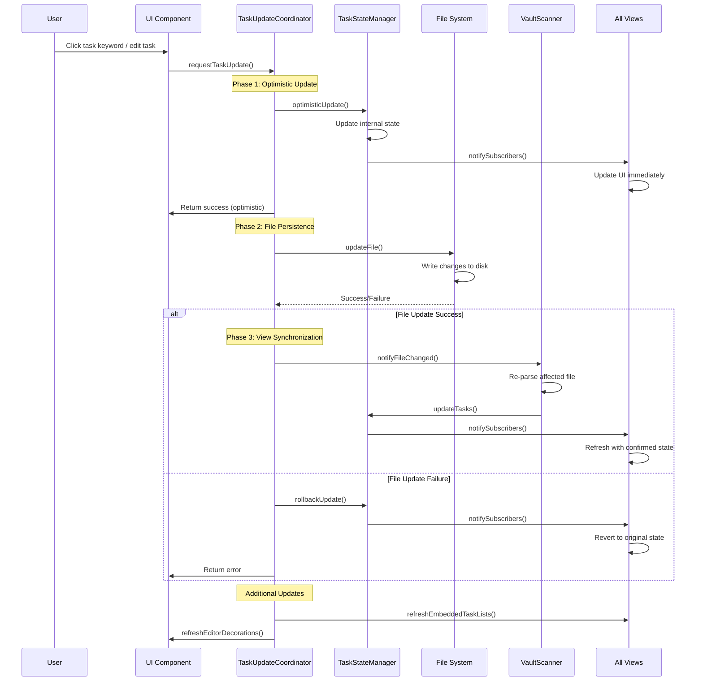
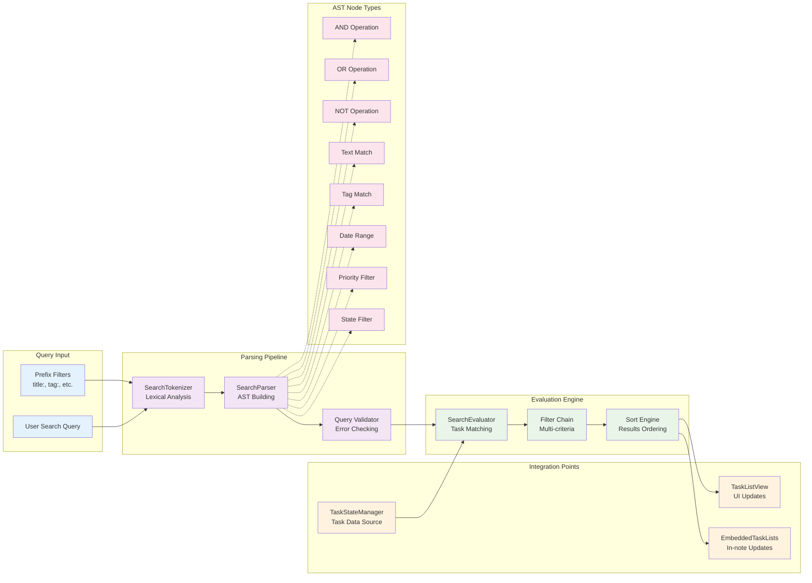

# Architecture Documentation

## Overview

TODOseq is a lightweight, keyword-based task tracker for Obsidian that provides advanced task management capabilities while preserving users' original Markdown formatting. The architecture is designed around principles of **centralized state management**, **event-driven updates**, and **layered separation of concerns**.

### Core Philosophy

1. **Non-intrusive Integration**: Tasks exist as plain text in Markdown files - no special syntax required
2. **Performance First**: Incremental scanning, optimistic updates, and efficient parsing
3. **Reactive UI**: Immediate feedback with async persistence for smooth user experience
4. **Type Safety**: Comprehensive TypeScript interfaces throughout the codebase

## High-Level System Architecture

```mermaid
graph TB
    subgraph "Obsidian Platform"
        ObsidianAPI["Obsidian APIs"]
        Workspace["Workspace Manager"]
        FileSystem["File System"]
        Editor["Editor (CodeMirror)"]
    end

    subgraph "TODOseq Plugin"
        Main[Main Plugin Class<br/>TodoTracker]

        subgraph "Service Layer"
            StateManager["TaskStateManager<br/>Central State"]
            VaultScanner["VaultScanner<br/>File Monitoring"]
            UpdateCoordinator["TaskUpdateCoordinator<br/>Update Pipeline"]
        end

        subgraph "UI Layer"
            UIManager["UIManager<br/>Editor Extensions"]
            TaskListView["TaskListView<br/>Main Task Panel"]
            TaskEditor["TaskEditor<br/>File Operations"]
            ReaderFormatter["ReaderViewFormatter<br/>Reader Mode"]
            EmbeddedProcessor["EmbeddedTaskProcessor<br/>Code Blocks"]
        end

        subgraph "Parser Layer"
            TaskParser["TaskParser<br/>Regex Engine"]
            LanguageRegistry["LanguageRegistry<br/>Multi-language Support"]
            DateParser["DateParser<br/>Date Recognition"]
        end

        subgraph "Search Layer"
            Search["Search System<br/>Query Engine"]
            SearchParser["Search Parser<br/>AST Builder"]
            SearchEvaluator["Search Evaluator<br/>Task Filtering"]
        end

        subgraph "Utilities"
            TaskUtils["Task Utilities"]
            DateUtils["Date Utilities"]
            PerformanceUtils["Performance Utils"]
            RegexCache["RegexCache<br/>Pattern Caching"]
        end
    end

    subgraph "External Dependencies"
        DailyNotes["Daily Notes Interface"]
    end

    %% Connections
    Main --> StateManager
    Main --> VaultScanner
    Main --> UpdateCoordinator
    Main --> UIManager

    StateManager --> TaskListView
    StateManager --> EmbeddedProcessor
    StateManager --> Search

    VaultScanner --> TaskParser
    VaultScanner --> LanguageRegistry
    VaultScanner --> FileSystem

    UpdateCoordinator --> StateManager
    UpdateCoordinator --> TaskEditor
    UpdateCoordinator --> UIManager

    UIManager --> Editor
    UIManager --> TaskListView
    UIManager --> ReaderFormatter

    TaskListView --> Search
    TaskEditor --> FileSystem

    Search --> SearchParser
    Search --> SearchEvaluator
    Search --> StateManager

    TaskParser --> DateParser
    TaskParser --> LanguageRegistry
    TaskParser --> TaskUtils

    %% External connections
    Main --> ObsidianAPI
    Main --> Workspace
    VaultScanner --> FileSystem
    TaskEditor --> FileSystem
    DateUtils --> DailyNotes

    %% Styling
    classDef pluginLayer fill:#e1f5fe
    classDef serviceLayer fill:#f3e5f5
    classDef uiLayer fill:#e8f5e8
    classDef parserLayer fill:#fff3e0
    classDef searchLayer fill:#fce4ec
    classDef external fill:#f5f5f5

    class Main pluginLayer
    class StateManager,VaultScanner,UpdateCoordinator serviceLayer
    class UIManager,TaskListView,TaskEditor,ReaderFormatter,EmbeddedProcessor uiLayer
    class TaskParser,LanguageRegistry,DateParser parserLayer
    class Search,SearchParser,SearchEvaluator searchLayer
    class ObsidianAPI,Workspace,FileSystem,Editor,DailyNotes external
```



## Component Layering and Separation of Concerns

### 1. Service Layer (Business Logic)

**TaskStateManager** (`src/services/task-state-manager.ts`)

- **Responsibility**: Single source of truth for all task data
- **Key Patterns**: Observer pattern for reactive updates
- **Interface**: `getTasks()`, `setTasks()`, `subscribe(callback)`

**VaultScanner** (`src/services/vault-scanner.ts`)

- **Responsibility**: File system monitoring and incremental scanning
- **Key Patterns**: Event-driven architecture, performance optimization
- **Interface**: `scanVault()`, `updateSettings()`, event emission

**TaskUpdateCoordinator** (`src/services/task-update-coordinator.ts`)

- **Responsibility**: Centralized update pipeline with optimistic UI
- **Key Patterns**: Command pattern, optimistic updates
- **Interface**: `updateTaskState()`, `createTask()`, coordinate updates

### 2. UI Layer (User Interaction)

**UIManager** (`src/ui-manager.ts`)

- **Responsibility**: Editor extensions, decorations, event handling
- **Key Patterns**: Extension system, event delegation
- **Interface**: CodeMirror extension registration, UI coordination

**TaskListView** (`src/view/task-list-view.ts`)

- **Responsibility**: Main task panel with search, filtering, sorting
- **Key Patterns**: Observer pattern, component-based rendering
- **Interface**: Obsidian View API implementation

**TaskEditor** (`src/view/task-editor.ts`)

- **Responsibility**: Atomic file operations, state preservation
- **Key Patterns**: Strategy pattern, atomic operations
- **Interface**: `updateTaskInFile()`, `createTaskInFile()`

### 3. Parser Layer (Data Extraction)

**TaskParser** (`src/parser/task-parser.ts`)

- **Responsibility**: Complex regex-based task extraction
- **Key Patterns**: State machine, builder pattern, security-first design
- **Interface**: `parseFile()`, `parseLine()`, language-aware parsing

**LanguageRegistry** (`src/parser/language-registry.ts`)

- **Responsibility**: Multi-language comment pattern management
- **Key Patterns**: Registry pattern, factory pattern
- **Interface**: Language definition storage and resolution

### 4. Search Layer (Query Processing)

**Search System** (`src/search/search.ts`)

- **Responsibility**: Query parsing and evaluation
- **Key Patterns**: Compiler pattern (parsing → AST → evaluation)
- **Interface**: `search()`, query validation, error handling

## Component Dependency Diagram

```mermaid
graph TD
    subgraph "Core Components"
        Main[TodoTracker<br/>Main Plugin]
    end

    subgraph "Service Layer Dependencies"
        StateManager[TaskStateManager]
        VaultScanner[VaultScanner]
        UpdateCoordinator[TaskUpdateCoordinator]
    end

    subgraph "UI Layer Dependencies"
        UIManager[UIManager]
        TaskListView[TaskListView]
        TaskEditor[TaskEditor]
        ReaderFormatter[ReaderViewFormatter]
        StatusBar[StatusBarManager]
    end

    subgraph "Parser Dependencies"
        TaskParser[TaskParser]
        LanguageRegistry[LanguageRegistry]
        DateParser[DateParser]
    end

    subgraph "Search Dependencies"
        Search[Search]
        SearchParser[SearchParser]
        SearchEvaluator[SearchEvaluator]
        SearchTokenizer[SearchTokenizer]
    end

    subgraph "Utility Dependencies"
        TaskUtils[TaskUtils]
        DateUtils[DateUtils]
        Performance[PerformanceUtils]
        Patterns[Patterns]
        RegexCache[RegexCache]
    end

    subgraph "External APIs"
        Obsidian[Obsidian API]
        DailyNotes[Daily Notes Interface]
    end

    %% Dependency arrows (A depends on B)
    Main --> StateManager
    Main --> VaultScanner
    Main --> UpdateCoordinator
    Main --> UIManager

    StateManager -.-> Main
    VaultScanner -.-> Main
    UpdateCoordinator -.-> Main
    UIManager -.-> Main

    UpdateCoordinator --> StateManager
    UpdateCoordinator --> TaskEditor

    UIManager --> TaskListView
    UIManager --> ReaderFormatter
    UIManager --> StatusBar

    TaskListView --> StateManager
    TaskListView --> Search

    VaultScanner --> TaskParser
    TaskParser --> LanguageRegistry
    TaskParser --> DateParser
    TaskParser --> TaskUtils
    TaskParser --> Patterns

    Search --> SearchParser
    Search --> SearchEvaluator
    SearchParser --> SearchTokenizer
    Search --> StateManager

    TaskEditor --> Obsidian
    VaultScanner --> Obsidian
    DateUtils --> DailyNotes

    TaskListView --> Obsidian
    ReaderFormatter --> Obsidian

    %% Utility dependencies
    TaskEditor --> TaskUtils
    TaskListView --> TaskUtils
    SearchEvaluator --> TaskUtils

    Performance --> StateManager
    Performance --> VaultScanner

    %% RegexCache dependencies
    VaultScanner --> RegexCache
    SearchEvaluator --> RegexCache

    %% Styling for dependency direction
    linkStyle 0,1,2,3,4 stroke:#2196f3,stroke-width:2px
    linkStyle 5,6,7 stroke:#4caf50,stroke-width:2px
    linkStyle 8,9,10,11,12,13 stroke:#ff9800,stroke-width:2px
    linkStyle 14,15,16,17,18,19,20 stroke:#9c27b0,stroke-width:2px
    linkStyle 21,22,23,24,25 stroke:#f44336,stroke-width:2px
    linkStyle 26,27,28,29,30 stroke:#607d8b,stroke-width:2px
```



## Data Flow Architecture: Task Updates



## Search System Architecture



## Core Architectural Patterns

### 1. Centralized State Management

- **Single Source of Truth**: `TaskStateManager` holds all task data
- **Observer Pattern**: Components subscribe to state changes
- **Immutable Updates**: State changes return new arrays, prevent mutation
- **Optimistic Updates**: UI updates immediately, persists asynchronously

### 2. Event-Driven Architecture

- **File Change Events**: `VaultScanner` monitors vault for changes
- **State Change Events**: `TaskStateManager` notifies subscribers
- **UI Events**: `UIManager` coordinates user interactions
- **Error Events**: Graceful error handling and recovery

### 3. Plugin Architecture

- **Language Registry**: Extensible language support via `LanguageRegistry`
- **Editor Extensions**: Pluggable CodeMirror decorations and commands
- **Search Extensions**: Customizable search filters and evaluators
- **Format Extensions**: Configurable task formatting options

### 4. Performance Patterns

- **Incremental Scanning**: Only re-scan changed files
- **Yielding to Event Loop**: Prevent UI freezing during large operations
- **Lazy Loading**: Components created on-demand
- **Efficient Parsing**: Optimized regex patterns and caching
- **Regex Caching**: `RegexCache` utility caches compiled regex patterns to avoid repeated compilation during vault scans and searches

### 5. Security Patterns

- **Input Validation**: All user inputs validated before processing
- **Regex Injection Prevention**: User input sanitized before regex compilation
- **File Path Validation**: Prevents path traversal attacks
- **Type Safety**: Comprehensive TypeScript interfaces

## Data Models and Type System

### Core Task Interface

```typescript
interface Task {
  path: string; // File path in vault
  line: number; // Line number in file
  rawText: string; // Original full line
  indent: string; // Leading whitespace
  listMarker: string; // List marker (+ space)
  footnoteMarker?: string; // Footnote marker
  text: string; // Task content (without keywords/priority)
  state: string; // Current state (TODO, DOING, etc.)
  completed: boolean; // Completion status
  priority: 'high' | 'med' | 'low' | null;
  scheduledDate: Date | null;
  deadlineDate: Date | null;
  tail?: string; // Trailing characters
  urgency: number | null; // Calculated urgency score
  file?: TFile; // Obsidian file reference
  tags?: string[]; // Extracted tags
  isDailyNote: boolean; // Daily note detection
  dailyNoteDate: Date | null;
  embedReference?: string;
  footnoteReference?: string;
}
```

### Key Type Definitions

- **State Transitions**: `NEXT_STATE` and `CYCLE_TASK_STATE` maps
- **Search AST**: `SearchNode` interface for query representation
- **Event Types**: Typed event interfaces for file changes and state updates
- **Configuration**: `TodoTrackerSettings` with validation

## Extension Points and Plugin Architecture

### 1. Language Support Extensions

- **Language Definition**: Add new programming languages to `LanguageRegistry`
- **Comment Patterns**: Define language-specific comment syntax
- **Keyword Mappings**: Map language-specific keywords to standard states

### 2. Search Extension Points

- **Custom Filters**: Implement new search criteria
- **AST Node Types**: Add new query syntax elements
- **Evaluation Functions**: Custom task matching logic

### 3. UI Extension Points

- **Editor Decorations**: Add new visual indicators
- **Context Menu Items**: Extend task interaction menus
- **View Modes**: Create new task display formats

### 4. Parser Extensions

- **Format Handlers**: Support new task formats
- **Date Parsers**: Add new date format recognition
- **Priority Systems**: Custom priority token parsing

## Development Guidelines

### For Developers

1. **State Management**: Always use `TaskStateManager` for task data access
2. **File Operations**: Use `TaskEditor` for atomic file updates
3. **Event Handling**: Subscribe to state changes, don't poll
4. **Error Handling**: Implement proper error boundaries and recovery
5. **Performance**: Use `yieldToEventLoop()` for long-running operations

### For AI Coding Assistants

1. **Dependency Injection**: Components receive dependencies via constructors
2. **Interface Compliance**: Implement required interfaces for new components
3. **Type Safety**: Use TypeScript interfaces for all public APIs
4. **Testing Patterns**: Mock `Obsidian` API using provided test utilities
5. **Build Process**: Use `npm run build`

### Critical Gotchas

1. **Circular Dependencies**: Avoid importing components that depend on each other
2. **Parser Recreation**: Call `recreateParser()` when settings change
3. **State Consistency**: Use `TaskUpdateCoordinator` for all state changes
4. **File Race Conditions**: Use atomic operations and proper error handling
5. **Performance Testing**: Test with large vaults (1000+ files, 10000+ tasks)

### Testing Architecture

- **Unit Tests**: Comprehensive Jest test suite in `/tests` directory
- **Mock Setup**: Global test setup in `tests/test-setup.ts`
- **Language Tests**: Separate test files for each supported language
- **Performance Tests**: Utility tests for parsing and scanning performance
- **Coverage**: Excludes `src/main.ts` from coverage reporting

## Performance Characteristics

### Optimizations Built Into Architecture

1. **Incremental Updates**: Only re-scan changed files
2. **Optimistic UI**: Immediate feedback with async persistence
3. **Efficient Parsing**: Optimized regex patterns and state machines
4. **Yielding**: Prevents UI freezing during operations
5. **Lazy Loading**: Components created when needed
6. **Caching**: Parser instances and compiled patterns cached via `RegexCache` utility for file path filtering and phrase search evaluation

### Performance Bottlenecks to Monitor

1. **Large Vault Scans**: Initial vault scan can be slow
2. **Regex Compilation**: Complex regex patterns for parsing (mitigated by `RegexCache` for file path filtering and phrase search)
3. **DOM Updates**: Frequent view updates can impact performance
4. **File I/O**: Synchronous file operations during updates
5. **Search Evaluation**: Complex queries on large task sets

This architecture provides a robust, maintainable, and extensible foundation for task management while ensuring optimal performance and user experience through careful design patterns and performance optimizations.
