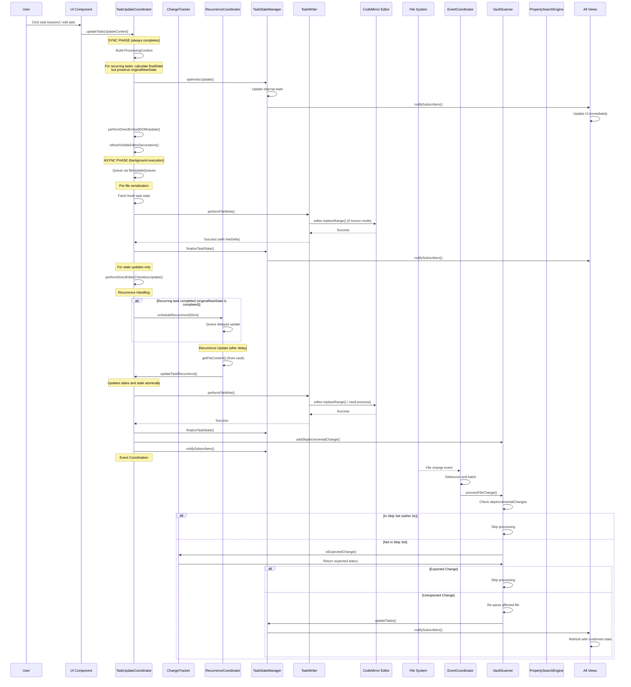

# Architecture Documentation

## Overview

TODOseq is a lightweight, keyword-based task tracker for Obsidian that provides advanced task management capabilities while preserving users' original Markdown formatting. The architecture is designed around principles of **centralized state management**, **event-driven updates**, and **layered separation of concerns**.

### Core Philosophy

1. **Non-intrusive Integration**: Tasks exist as plain text in Markdown files - no special syntax required
2. **Performance First**: Incremental scanning, optimistic updates, and efficient parsing
3. **Reactive UI**: Immediate feedback with async persistence for smooth user experience
4. **Type Safety**: Comprehensive TypeScript interfaces throughout the codebase

## High-Level System Architecture


```mermaid
graph TB
    subgraph "Obsidian Platform"
        ObsidianAPI["Obsidian APIs"]
        Workspace["Workspace Manager"]
        FileSystem["File System"]
        Editor["Editor (CodeMirror)"]
    end

    subgraph "TODOseq Plugin"
        Main[Main Plugin Class<br/>TodoTracker]

         subgraph "Service Layer"
             StateManager["TaskStateManager<br/>Central State"]
             VaultScanner["VaultScanner<br/>File Monitoring"]
             UpdateCoordinator["TaskUpdateCoordinator<br/>Update Pipeline"]
             EditorController["EditorController<br/>Editor Operations"]
             TaskWriter["TaskWriter<br/>File Operations"]
             EventCoordinator["EventCoordinator<br/>Unified Event Handling"]
             PropertySearchEngine["PropertySearchEngine<br/>Property Search"]
             StateTransitionManager["TaskStateTransitionManager<br/>State Transitions"]
             ChangeTracker["ChangeTracker<br/>Expected Change Tracking"]
             RecurrenceCoordinator["RecurrenceCoordinator<br/>Recurrence Coordination + Date Math"]
             TransitionParser["TransitionParser<br/>State Transition Syntax"]
             SmartDateProcessor["SmartDateProcessor<br/>Date Conversion"]
             SavedSearchManager["SavedSearchManager<br/>Saved Searches"]
         end

        subgraph "UI Layer"
            UIManager["UIManager<br/>UI Coordination"]
            TaskListView["TaskListView<br/>Main Task Panel"]
            ReaderFormatter["ReaderViewFormatter<br/>Reader Mode"]
            StatusBarManager["StatusBarManager<br/>Status Bar"]
            EditorKeywordMenu["EditorKeywordMenu<br/>Keyword Menu"]
            StateMenuBuilder["StateMenuBuilder<br/>State Menu"]
            EmbeddedProcessor["TodoseqCodeBlockProcessor<br/>Embedded Lists"]
            SearchOptionsDropdown["SearchOptionsDropdown<br/>Search Options"]
            SearchSuggestionDropdown["SearchSuggestionDropdown<br/>Search Suggestions"]
            DatePicker["DatePicker<br/>Date Picker Dialog"]
            SavedSearchDialog["SavedSearchDialog<br/>Saved Search Dialog"]
            TaskContextMenu["TaskContextMenu<br/>Task Context Menu"]
            TaskDragDropHandler["TaskDragDropHandler<br/>Drag & Drop"]
            TaskItemRenderer["TaskItemRenderer<br/>Task Item Rendering"]
            TaskListFilter["TaskListFilter<br/>View Mode & Sort"]
            ChunkedRenderQueue["ChunkedRenderQueue<br/>Chunked Rendering"]
            TaskElementCache["TaskElementCache<br/>Element Caching"]
            EmbeddedTaskItemRenderer["EmbeddedTaskItemRenderer<br/>Embedded Item Rendering"]
            EmbeddedTaskListManager["EmbeddedTaskListManager<br/>Embedded Filtering"]
            EmbeddedTaskListEventHandler["EmbeddedTaskListEventHandler<br/>Embedded Events"]
        end

        subgraph "Parser Layer"
            TaskParser["TaskParser<br/>Markdown Engine"]
            OrgModeParser["OrgModeTaskParser<br/>Org-mode Engine"]
            CodeCommentParser["CodeCommentTaskParser<br/>Code File Parser"]
            ParserRegistry["ParserRegistry<br/>Parser Router"]
            LanguageRegistry["LanguageRegistry<br/>Comment Syntax"]
            DateParser["DateParser<br/>Date Recognition"]
            NaturalDateParser["NaturalDateParser<br/>Natural Date Parsing"]
        end

        subgraph "Search Layer"
            Search["Search System<br/>Query Engine"]
            SearchParser["Search Parser<br/>AST Builder"]
            SearchEvaluator["Search Evaluator<br/>Task Filtering"]
            SearchTokenizer["SearchTokenizer<br/>Lexical Analysis"]
            SearchSuggestions["SearchSuggestions<br/>Auto-complete"]
        end

        subgraph "Utilities"
            TaskUtils["Task Utilities"]
            KeywordManager["KeywordManager<br/>Keyword Classification"]
            SettingsMigration["SettingsMigration<br/>Settings Migration"]
            DateUtils["Date Utilities"]
            SettingsUtils["Settings Utils"]
            RegexCache["RegexCache<br/>Pattern Caching"]
            Patterns["Regex Patterns"]
            TaskSort["Task Sorting"]
            TaskUrgency["Task Urgency"]
            DailyNoteUtils["Daily Note Utils"]
            TaskSubBullets["TaskSubBullets<br/>Subtask Operations"]
            PropertyEvaluator["PropertyEvaluator<br/>Property Evaluation"]
            MobileUtils["MobileUtils<br/>Mobile Detection"]
            OrgPatterns["OrgPatterns<br/>Org-mode Patterns"]
            DateRepeater["DateRepeater<br/>Date Repeat Logic"]
            TaskFormat["TaskFormat<br/>Task Formatting"]
        end

        subgraph "Lifecycle"
            LifecycleManager["PluginLifecycleManager<br/>Plugin Lifecycle"]
        end
    end

    subgraph "External Dependencies"
        DailyNotes["Daily Notes Interface"]
        ChronoNode["chrono-node<br/>Date Parsing Library"]
    end

    %% Connections
    Main --> StateManager
    Main --> VaultScanner
    Main --> UpdateCoordinator
    Main --> UIManager
    Main --> EventCoordinator
    Main --> PropertySearchEngine
    Main --> ChangeTracker
    Main --> RecurrenceCoordinator
    Main --> SmartDateProcessor

    StateManager --> TaskListView
    StateManager --> EmbeddedProcessor
    StateManager --> Search

    VaultScanner --> ParserRegistry
    ParserRegistry --> TaskParser
    ParserRegistry --> OrgModeParser
    ParserRegistry --> CodeCommentParser
    CodeCommentParser --> LanguageRegistry
    TaskParser --> LanguageRegistry
    TaskParser --> DateParser
    OrgModeParser --> DateParser
    VaultScanner --> FileSystem

    SmartDateProcessor --> Editor
    SmartDateProcessor --> NaturalDateParser
    NaturalDateParser --> ChronoNode

    UpdateCoordinator --> StateManager
    UpdateCoordinator --> TaskWriter
    UpdateCoordinator --> UIManager
    UpdateCoordinator --> ChangeTracker
    UpdateCoordinator --> RecurrenceCoordinator

    EventCoordinator --> VaultScanner
    EventCoordinator --> PropertySearchEngine
    EventCoordinator --> FileSystem

    PropertySearchEngine --> Search
    Search --> SearchParser
    Search --> SearchEvaluator
    Search --> StateManager

    UIManager --> Editor
    UIManager --> TaskListView
    UIManager --> ReaderFormatter

    TaskListView --> Search
    TaskWriter --> FileSystem

    TaskParser --> DateParser
    TaskParser --> LanguageRegistry
    TaskParser --> TaskUtils
    TaskParser --> KeywordManager
    TaskWriter --> KeywordManager
    EditorController --> KeywordManager

    %% Keyword and State Management
    KeywordManager --> TaskStateTransitionManager
    TaskStateTransitionManager --> TaskWriter
    TaskStateTransitionManager --> EditorController

    %% Search dropdown connections
    TaskListView --> SearchOptionsDropdown
    TaskListView --> SearchSuggestionDropdown
    SearchOptionsDropdown --> SearchSuggestionDropdown

    %% External connections
    Main --> ObsidianAPI
    Main --> Workspace
    VaultScanner --> FileSystem
    TaskWriter --> FileSystem
    DateUtils --> DailyNotes

    %% Styling
    classDef pluginLayer fill:#e1f5fe
    classDef serviceLayer fill:#f3e5f5
    classDef uiLayer fill:#e8f5e8
    classDef parserLayer fill:#fff3e0
    classDef searchLayer fill:#fce4ec
    classDef external fill:#f5f5f5

    class Main pluginLayer
    class StateManager,VaultScanner,UpdateCoordinator,EditorController,TaskWriter,EventCoordinator,PropertySearchEngine,TaskStateTransitionManager,ChangeTracker,RecurrenceCoordinator,SmartDateProcessor,SavedSearchManager serviceLayer
    class UIManager,TaskListView,TaskWriter,ReaderFormatter,EmbeddedProcessor,SearchOptionsDropdown,SearchSuggestionDropdown,DatePicker,SavedSearchDialog,TaskContextMenu,TaskDragDropHandler,TaskItemRenderer,TaskListFilter,ChunkedRenderQueue,TaskElementCache,EmbeddedTaskItemRenderer,EmbeddedTaskListManager,EmbeddedTaskListEventHandler uiLayer
    class TaskParser,OrgModeParser,CodeCommentParser,ParserRegistry,LanguageRegistry,DateParser,NaturalDateParser parserLayer
    class Search,SearchParser,SearchEvaluator searchLayer
    class TaskUtils,KeywordManager,DateUtils,SettingsUtils,Patterns,RegexCache,TaskSort,TaskUrgency,DailyNoteUtils,TaskSubBullets,PropertyEvaluator,MobileUtils,OrgPatterns,DateRepeater,TaskFormat utilityLayer
    class ObsidianAPI,Workspace,FileSystem,Editor,DailyNotes,ChronoNode external
```

### Component initialization

**Core Services (created in main.ts):**

- These are fundamental services that must be created early and are used by multiple components
- `TaskStateManager` - Central state management
- `KeywordManager` - Keyword classification
- `ChangeTracker` - Expected change tracking (shared across components)

**Dependent Services (created in PluginLifecycleManager):**

- These are services that depend on core services and are managed together as a lifecycle group
- `VaultScanner` - File monitoring (receives `TaskStateManager`, `KeywordManager`, `ChangeTracker`)
- `TaskUpdateCoordinator` - Update pipeline (receives `TaskStateManager`, `KeywordManager`, `ChangeTracker`)
- `EmbeddedTaskListProcessor` - Embedded lists (receives `TaskUpdateCoordinator`)
- `EventCoordinator` - Event handling (receives `VaultScanner`, `PropertySearchEngine`)
- `SmartDateProcessor` - Automatic date conversion (created with main plugin instance; `setEnabled()` controlled by setting)
- `CodeCommentTaskParser` - Code file scanning (conditionally registered with `ParserRegistry` when `scanCodeFiles` setting enabled)
- Other UI and lifecycle components

**Benefits of this pattern:**

1. **Clear separation**: Core services vs dependent services
2. **Avoids circular dependencies**: Core services created first, dependent services can safely reference them
3. **Centralized lifecycle**: `PluginLifecycleManager` handles all dependent service initialization and cleanup
4. **Shared state**: `ChangeTracker` is a single shared instance, not duplicated across components
5. **Consistent ownership**: Each component has a clear owner responsible for its lifecycle

## Component Layering and Separation of Concerns

### 1. Service Layer (Business Logic)

**TaskStateManager** (`src/services/task-state-manager.ts`)

- **Responsibility**: Single source of truth for all task data
- **Key Patterns**: Observer pattern for reactive updates, defensive copying
- **Interface**: `getTasks()` (returns shallow copy), `setTasks()`, `subscribe(callback)`, `findTaskByPathAndLine()`
- **Mutation Policy**: External consumers receive shallow copies; internal methods may mutate task objects for performance

**VaultScanner** (`src/services/vault-scanner.ts`)

- **Responsibility**: File system monitoring, incremental scanning, owns KeywordManager
- **Key Patterns**: Event-driven architecture, performance optimization, yielding to event loop
- **Interface**: `scanVault()`, `updateSettings()`, `getKeywordManager()`, `getParserRegistry()`, `getParser()`, event emission
- **Ownership**: Receives and uses KeywordManager instance; receives fully configured ParserRegistry via constructor
- **Skip Set**: Uses timestamp-based expiration for `skipIncrementalChanges` set (5-second window) to handle chained rapid updates properly

**TaskUpdateCoordinator** (`src/services/task-update-coordinator.ts`)

- **Responsibility**: Centralized, unified update pipeline with optimistic UI and race condition prevention
- **Key Patterns**: Command pattern, optimistic updates, sync/async phase separation, per-task locking, file queue management
- **Interface**: `updateTask(context)`, `updateTaskState()`, `updateTaskPriority()`, `updateTaskScheduledDate()`, `updateTaskDeadlineDate()`, `updateTaskRecurrence()`, `updateTaskByPath()`
- **Architecture**:
  - **Single Entry Point**: `updateTask(UpdateContext)` is the unified entry point for all task updates
  - **Sync Phase**: Always completes immediately - optimistic update, DOM manipulation, UI refresh
  - **Async Phase**: Background execution - file write, recurrence scheduling, state finalization
  - **Update Types**: `state`, `scheduled-date`, `deadline-date`, `priority`, `closed-date`, `recurrence`
  - **Update Sources**: `editor`, `reader`, `task-list`, `embedded`
- **Change Tracking**: Uses `ChangeTracker` to register expected file changes with content hashing
- **Recurrence Handling**: Uses `originalNewState` to track user's requested completion state, schedules `RecurrenceCoordinator` for date advancement
- **Per-Task Locking**: Uses `pendingTaskUpdates` Map to serialize rapid updates to the same task (path + line)
- **File Queue**: Uses `fileUpdateQueues` Map to serialize updates per file, preventing race conditions when multiple tasks in the same file are updated rapidly
- **Editor Checkbox Updates**: `performDirectEditorCheckboxUpdate()` updates checkbox visual state after markdown has been updated

**EditorController** (`src/services/editor-controller.ts`)

- **Responsibility**: Editor operations, task parsing under cursor, intent detection
- **Key Patterns**: Bridge pattern, command delegation
- **Interface**: Task cycling, priority changes, keyword toggling
- **Command Palette Actions**: Provides three editor-specific commands that use `editorCheckCallback`:
  - **Open context menu** (`open-context-menu`, icon: `more-horizontal`): Opens the task context menu at cursor position, providing access to priority, scheduled date, deadline date, and copy/move to today options. Uses CodeMirror editor API (`cmEditor.coordsAtPos()`) to get screen coordinates for positioning the menu. Only appears when cursor is on a valid task line.
  - **Open scheduled date picker** (`open-scheduled-date-picker`, icon: `calendar-clock`): Opens the date picker dialog for setting the scheduled date at cursor position. Uses CodeMirror editor API for positioning. Only appears when cursor is on a valid task line.
  - **Open deadline date picker** (`open-deadline-date-picker`, icon: `calendar-range`): Opens the date picker dialog for setting the deadline date at cursor position. Uses CodeMirror editor API for positioning. Only appears when cursor is on a valid task line.
- **Implementation Details**: All three commands delegate to methods in EditorController: `handleOpenContextMenuAtCursor()`, `handleOpenScheduledDatePickerAtCursor()`, and `handleOpenDeadlineDatePickerAtCursor()`. These methods use the standard Obsidian `editorCheckCallback` signature `(checking: boolean, editor: Editor, view: MarkdownView)` and integrate with `TaskUpdateCoordinator` for task updates.

**TaskWriter** (`src/services/task-writer.ts`)

- **Responsibility**: Atomic file operations, state preservation, formatting, editor-aware writes
- **Key Patterns**: Strategy pattern, atomic operations, editor/vault API handling
- **Interface**: `updateTaskState()`, `applyLineUpdate()`, `writeLines()`, `generateTaskLine()`, file persistence, date update methods
- **Inline Date-Line Helpers**: SCHEDULED/DEADLINE/CLOSED line insertion/removal is inlined as private methods on `TaskWriter` (`updateOrInsertDateLine`, `removeDateLine`, `calcDateLineInsertIndex`, `getEffectiveDateLineIndent`, `getExistingDateLineIndent` — formerly a separate `DateLineOperator` module). Insertion rules: SCHEDULED before DEADLINE; DEADLINE after SCHEDULED; CLOSED after both. Both Editor-API and Vault-API paths route through these shared helpers for consistent indent preservation.
- **Editor Awareness**: Uses Editor API (`editor.replaceRange()`) for active files in source mode to preserve cursor/selection/folds; falls back to Vault API for inactive files or preview mode
- **Multiple Line Writes**: `writeLines()` method for writing multiple lines while maintaining editor awareness
- **Atomic CLOSED Date Handling**: For non-source mode, CLOSED date is handled atomically with task line update in a single `vault.process()` operation
- **Line Delta Returns**: Date update methods (`updateTaskScheduledDate()`, `removeTaskScheduledDate()`, `updateTaskDeadlineDate()`, `removeTaskDeadlineDate()`) return `Task & { lineDelta?: number }` for line index adjustments
- **Checkbox Preservation**: Preserves list marker character (`-`, `*`, `+`) and checkbox state when changing to archived states

**EventCoordinator** (`src/services/event-coordinator.ts`)

- **Responsibility**: Unified vault event handling with debouncing and batching
- **Key Patterns**: Event aggregation, debouncing, batch processing
- **Interface**: `onFileChange()`, `initialize()`, `setVaultScanner()`, `setPropertySearchEngine()`, event coordination

**PropertySearchEngine** (`src/services/property-search-engine.ts`)

- **Responsibility**: Property-based search with caching and optimization
- **Key Patterns**: Singleton, caching, async initialization
- **Interface**: `searchProperties()`, `isReady()`, `onFileChanged()`, property cache management

**TransitionParser** (`src/services/transition-parser.ts`)

- **Responsibility**: Parser for declarative state transition syntax, supporting chain transitions, group alternatives, and terminal states
- **Key Patterns**: Parser combinators, syntax tree construction, error handling
- **Interface**: `parse()`, `isTerminalState()` (static), supports syntax like `TODO -> DOING -> DONE` or `(WAIT | WAITING) -> IN-PROGRESS`
- **Used by**: TaskStateTransitionManager
- **Output**: Returns `ParsedTransitionResult` with transitions map and errors

**KeywordManager** (`src/utils/keyword-manager.ts`)

- **Responsibility**: Single source of truth for keyword classification and detection
- **Key Patterns**: Reads directly from settings (no caching), static builtin sets
- **Interface**: `isCompleted()`, `isActive()`, `isWaiting()`, `isInactive()`, `isArchived()`, `getGroup()`, `getAllKeywords()`, `getKeywordsForGroup()`, `getBuiltinActiveKeywords()`, `getBuiltinInactiveKeywords()`, `getBuiltinWaitingKeywords()`, `getBuiltinCompletedKeywords()`, `getBuiltinArchivedKeywords()`, `getDefaultInactive()`, `getDefaultActive()`, `getDefaultCompleted()`
- **Default Keywords**: Provides methods to get default keywords for each group (`getDefaultInactive()`, `getDefaultActive()`, `getDefaultCompleted()`) which prefer standard keywords (TODO, DOING, DONE) when available
- **Used by**: TaskParser, OrgModeTaskParser, VaultScanner (owns instance), TaskWriter, EditorController, RecurrenceCoordinator, UI components (task-list-view, task-renderer), task-sort, task-urgency
- **Ownership**: VaultScanner creates and owns the KeywordManager instance; components get it via `vaultScanner.getKeywordManager()`

**TaskStateTransitionManager** (`src/services/task-state-transition-manager.ts`)

- **Responsibility**: State transition logic for task cycling and toggling
- **Key Patterns**: State machine, immutable archived states
- **Interface**: `getNextState()`, `getCycleState()`, `canTransition()`, `isArchivedState()`
- **Used by**: TaskWriter, EditorController, UI components

**ChangeTracker** (`src/services/change-tracker.ts`)

- **Responsibility**: Track expected file changes to prevent race conditions
- **Key Patterns**: Content hashing, automatic expiration, per-file tracking
- **Interface**: `registerExpectedChange()`, `isExpectedChange()`, `cleanup()`, `destroy()`
- **Cross-Platform Hashing**: Uses a consistent hash function (not Node.js crypto) for all platforms to ensure compatibility
- **Used by**: TaskUpdateCoordinator, VaultScanner

**RecurrenceCoordinator** (`src/services/recurrence-coordinator.ts`)

- **Responsibility**: Centralized coordination for recurrence updates (date advancement for recurring tasks) **and** owns the recurrence date math (next-date calculation + warning-period carry-over for repeats)
- **Key Patterns**: Per-task tracking, delayed updates, vault-based file operations, pure-math date calculation
- **Interface**: `scheduleRecurrence()`, `cancelRecurrence()`, `performRecurrenceUpdate()`, `calculateNextDates()`, `destroy()`, `setTaskUpdateCoordinator()`, `setKeywordManager()`
- **Inline Date Math**: `calculateNextDates()` is an inlined public method on `RecurrenceCoordinator` (the previous delegation to a separate `RecurrenceManager` service has been removed). It accepts the structural `RecurrenceDateLineParser` interface — which replaces the deleted `DateLineParser` interface — and any object satisfying its `getDateLineType(line, indent)` shape is accepted. The pure-math result is typed as `RecurrenceDateCalculationResult`, while the orchestration result (`performRecurrenceUpdate`) is typed as `RecurrenceUpdateResult`. The two result types are intentionally separate shapes (no field overlap — cross-assignment is a compile error) to prevent accidental confusion between math output and orchestration outcome. Warning-period semantics: `-Nd` (non-firstOnly) is preserved across repeats; `--Nd` (isFirstOnly) is stripped after first occurrence (returned as `null` to signal stripping downstream).
- **Vault-Based Reads**: `getFileContent()` always reads from vault (not editor buffer) to ensure latest content
- **TaskUpdateCoordinator Integration**: Uses `setTaskUpdateCoordinator()` to avoid circular dependency, delegates all updates to `TaskUpdateCoordinator`
- **State Independence**: For recurring tasks (those with repeat dates), advances dates regardless of current task state (since DONE state is intentionally skipped during completion)
- **Used by**: TaskUpdateCoordinator, VaultScanner

**SmartDateProcessor** (`src/services/smart-date-processor.ts`)

- **Responsibility**: Automatic conversion of natural language dates in task text (e.g., "today", "next Monday") to structured org-mode date lines (SCHEDULED/DEADLINE) when the user finishes typing a task line
- **Key Patterns**: Debounce strategy, cursor-leave detection, editor dispatch
- **Interface**: `handleEditorUpdate(view, update)`, `handleCursorLeave(view, previousLine)`, `setEnabled(state)`, `destroy()`
- **Trigger Sources**: Two triggers — `'debounce'` (user presses Enter/Down/Right, cursor leaves line) and `'cursorLeave'` (user presses Up/Left/clicks away)
- **Implementation**: Uses 1500ms debounce per editor line via `Map<string, number>`; when triggered, consumes `ParsedDateInfo` from `NaturalDateParser` and applies the date transformation via `EditorView.dispatch()` (single CM6 change)
- **Dependencies**: Uses `NaturalDateParser` for date extraction; `formatOrgDate()` for date formatting; `getDateLineIndent()` for indentation
- **Ownership**: Created and owned by `PluginLifecycleManager`; stored on main plugin as `smartDateProcessor`
- **Lifecycle**: `setEnabled()` controlled by `smartDateParsing.enabled` setting; `destroy()` clears all debounce timers

**SavedSearchManager** (`src/services/saved-search-manager.ts`)

- **Responsibility**: CRUD operations for saved searches (create, read, update, delete, reorder)
- **Key Patterns**: Pure functions operating on settings, validation, unique ID generation
- **Interface**: `createSavedSearch()`, `addSavedSearch()`, `updateSavedSearch()`, `deleteSavedSearch()`, `getSavedSearches()`, `findSavedSearch()`, `findSavedSearchByQuery()`, `reorderSavedSearches()`, `validateSavedSearchName()`
- **Validation**: Name length capped at 50 characters; empty names rejected
- **Used by**: SearchOptionsDropdown, settings UI

### 2. UI Layer (User Interaction)

**UIManager** (`src/ui-manager.ts`)

- **Responsibility**: Central UI coordination, extension registration, checkbox handling
- **Key Patterns**: Extension system, event delegation, default behavior prevention
- **Interface**: UI component lifecycle, event coordination
- **Checkbox Handling**: `handleCheckboxToggle()` prevents default Obsidian checkbox behavior and uses `updateTaskByPath()` for full control of updates

**TaskListView** (`src/view/task-list/task-list-view.ts`)

- **Responsibility**: Main task panel with search, filtering, sorting
- **Key Patterns**: Observer pattern, component-based rendering
- **Interface**: Obsidian View API implementation
- **Task Updates**: Uses `updateTaskState()` directly through `TaskUpdateCoordinator` with task object

**ReaderViewFormatter** (`src/view/markdown-renderers/reader-formatting.ts`)

- **Responsibility**: Task keyword formatting in reader/preview mode
- **Key Patterns**: Double-click detection, settings change detection
- **Interface**: `registerPostProcessor()`, `updateSettings()`, `cleanup()`, keyword styling, state menus
- **Task Updates**: Uses `updateTaskByPath()` through `TaskUpdateCoordinator`

**StatusBarManager** (`src/view/editor-extensions/status-bar.ts`)

- **Responsibility**: Status bar integration with task count display
- **Key Patterns**: Event subscription, UI updates
- **Interface**: `setupStatusBarItem()`, task count display

**EditorKeywordMenu** (`src/view/editor-extensions/editor-keyword-menu.ts`)

- **Responsibility**: In-editor keyword interaction and menu display
- **Key Patterns**: Context menu, keyword detection
- **Interface**: Keyword menu management

**StateMenuBuilder** (`src/view/components/state-menu-builder.ts`)

- **Responsibility**: Context menu generation for task state changes
- **Key Patterns**: Dynamic menu building, state categorization
- **Interface**: `getSelectableStatesForMenu()`, menu generation

**TodoseqCodeBlockProcessor** (`src/view/embedded-task-list/code-block-processor.ts`)

- **Responsibility**: Embedded task list processing in markdown blocks
- **Key Patterns**: Post-processor registration, separate lifecycle
- **Interface**: Code block parsing, embedded list rendering
- **Task Updates**: Uses `updateTaskByPath()` directly through `TaskUpdateCoordinator`

**SearchOptionsDropdown** (`src/view/components/search-options-dropdown.ts`)

- **Responsibility**: Search options and history management with dropdown UI
- **Key Patterns**: Dropdown UI, search history, debounced updates
- **Interface**: Search history management, options display, debounce control

**SearchSuggestionDropdown** (`src/view/components/search-suggestion-dropdown.ts`)

- **Responsibility**: Search query suggestions and autocomplete
- **Key Patterns**: Prefix matching, suggestion ranking, dropdown UI
- **Interface**: Suggestion generation, prefix filtering, keyboard navigation

**TaskContextMenu** (`src/view/components/task-context-menu.ts`)

- **Responsibility**: Right-click context menu for tasks in the main task list, providing quick access to common actions
- **Key Patterns**: Single-instance pattern, keyboard navigation, mobile long-press support
- **Interface**: `show(task, position)`, `showAtMouseEvent()`, `hide()`, `isVisible()`, `cleanup()`
- **Features**: Go to task, priority selection, scheduled date shortcuts, deadline date picker, copy/move to today
- **Used by**: TaskListView, EmbeddedTaskItemRenderer

**DatePicker** (`src/view/components/date-picker-menu.ts`)

- **Responsibility**: Comprehensive date and time picker with repeat options, calendar grid, and warning period support
- **Key Patterns**: Single-instance pattern, submenu overlay, quick select options, calendar navigation
- **Interface**: `show(position, mode, initialDate?, initialRepeat?, initialWarningPeriod?)`, `hide()`, `isVisible()`, `cleanup()`
- **Features**: Quick date selections (Today, Tomorrow, Next weekend, Next week); calendar grid with month navigation; time picker with 30-minute increments; repeat options (Daily, Weekly, Monthly, Yearly, Custom); custom repeat dialog; warning period selection; scheduled/deadline modes
- **Single-instance**: Only one picker open at a time via `BaseDialog.closeAnyActiveDialog()`
- **Mobile Support**: Centers dialog on phones, adds backdrop for focus
- **Used by**: TaskContextMenu, TaskListView

**SavedSearchDialog** (`src/view/components/saved-search-dialog.ts`)

- **Responsibility**: Modal dialog for creating or editing saved searches with form fields for name, query, view mode, sort method, and future task sorting
- **Key Patterns**: Backdrop management, form validation, edit/create modes
- **Interface**: `open()`, `close()`
- **Features**: Pre-filled fields from current view state; validation for name and query; delete button in edit mode; keyboard navigation (Enter to save, Escape to cancel)
- **Used by**: SearchOptionsDropdown

**BaseDialog** (`src/view/components/base-dialog.ts`)

- **Responsibility**: Abstract base class for modal dialogs providing common functionality for dialog management
- **Key Patterns**: Single-instance active dialog management, backdrop handling, keyboard navigation, positioning logic
- **Interface**: `hide()`, `isVisible()`, `cleanup()`, `positionDialog()`, `attachGlobalListeners()`, `detachGlobalListeners()`, `moveFocus()`
- **Features**: Global menu management (only one menu open at a time); phone-specific backdrop and centered positioning; desktop cursor-based positioning with viewport bounds checking; arrow key navigation; scroll-to-hide behavior; mobile touch suppression delay
- **Subclasses**: DatePicker, StateMenuBuilder, TaskContextMenu

**BaseDropdown** (`src/view/components/base-dropdown.ts`)

- **Responsibility**: Abstract base class for dropdown components providing common positioning, event handling, and keyboard navigation
- **Key Patterns**: Input-relative positioning, visibility change callbacks, blur handling
- **Interface**: `show()`, `hide()`, `isVisible()`, `handleKeyDown()`, `updatePosition()`, `setOnVisibilityChange()`, `cleanup()`
- **Features**: Positioned below input element; tracks visibility state; keyboard navigation (ArrowDown, ArrowUp, Enter, Escape, Tab); resize and scroll repositioning
- **Subclasses**: SearchOptionsDropdown, SearchSuggestionDropdown

**TaskDragDropHandler** (`src/view/task-list/task-drag-drop.ts`)

- **Responsibility**: Drag and drop support for tasks between files in the task list view
- **Key Patterns**: Modifier key detection (copy/move/migrate), editor drop positioning, drag overlay UI
- **Interface**: `initialize(callbacks)`, `destroy()`
- **Features**: Copy (default), Move (Alt), Migrate (Alt+Ctrl) actions; custom drag overlay showing task text and action label; editor drop position detection via CodeMirror `posAtCoords()`; source file modification (removal for move, keyword replacement for migrate)
- **Desktop Only**: Disabled on mobile via `Platform.isMobile` check
- **Used by**: TaskListView

**TaskItemRenderer** (`src/view/task-list/task-item-renderer.ts`)

- **Responsibility**: Handles rendering individual task items for the Task List View, encapsulating all DOM building logic
- **Key Patterns**: Component-based rendering, link detection, state menu integration, context menu handlers
- **Interface**: `buildTaskListItem(task)`, `updateTaskElementContent(task, element)`, `buildCheckbox()`, `buildKeyword()`, `buildText()`, `buildDateDisplay()`, `buildSubtaskIndicator()`, `renderTaskTextWithLinks()`
- **Features**: Checkbox with extended style support; keyword button with state menu (click, keyboard, context menu, long-press); priority badge; date display with warning period arrows and repeat icons; subtask indicator; file info with source chip; text with clickable wiki links, markdown links, URLs, and tags
- **Smart Diff**: `updateTaskElementContent()` only rebuilds text portion when rawText actually changes
- **Used by**: TaskListView

**TaskListFilter** (`src/view/task-list/task-list-filter.ts`)

- **Responsibility**: View mode and sort method management for the task list, including three-block sorting (active, future, completed)
- **Key Patterns**: Cached keyword sort config, three-block sorting system
- **Interface**: `getViewMode()`, `setViewMode()`, `getSortMethod()`, `setSortMethod()`, `filterTasksByViewMode()`, `transformForView()`, `getKeywordSortConfig()`
- **Sort Methods**: default, sortByScheduled, sortByDeadline, sortByClosedDate, sortByPriority, sortByUrgency, sortByKeyword
- **View Modes**: showAll, sortCompletedLast, hideCompleted
- **Used by**: TaskListView

**ChunkedRenderQueue** (`src/view/task-list/chunked-render-queue.ts`)

- **Responsibility**: Chunked rendering with yielding for large task lists to prevent UI freezing
- **Key Patterns**: Batch processing, generation tracking, yield-to-event-loop
- **Interface**: `enqueue(tasks, renderFn, container)`, `clear()`, `renderToFragment(tasks, renderFn, yieldDuringRender?)`
- **Configuration**: 15 tasks per batch, yields every 5 tasks, prioritizes first 10 tasks
- **Generation Tracking**: New `enqueue()` calls invalidate previous renders via generation counter
- **Used by**: TaskListView

**TaskElementCache** (`src/view/task-list/task-element-cache.ts`)

- **Responsibility**: DOM element caching for task items to avoid redundant re-rendering
- **Key Patterns**: Path:line key-based cache, Map storage
- **Interface**: `get(task)`, `set(task, element)`, `invalidate(task)`, `invalidateByKey(key)`, `clear()`, `has(task)`
- **Cache Key**: `${task.path}:${task.line}`
- **Used by**: TaskListView

**EmbeddedTaskItemRenderer** (`src/view/embedded-task-list/embedded-task-item-renderer.ts`)

- **Responsibility**: Renders individual task items within embedded task lists (code blocks)
- **Key Patterns**: State menu integration, context menu handlers, navigation to task source
- **Interface**: `createTaskListItem(task, index, params)`
- **Features**: Three layout modes: default (compact), wrap (full-width with date info rows), dynamic (wrap with inline date badges); checkbox with extended style support; state menu on keyword (click, keyboard, context menu, long-press); priority badge; clickable tags and links; subtask indicator; date badges; repeat icons; file info with urgency display; warning period arrows
- **Navigation**: Click-to-navigate with support for new tab (Ctrl/Cmd+click), split (Shift+click), and middle-click
- **Used by**: EmbeddedTaskListRenderer

**EmbeddedTaskListManager** (`src/view/embedded-task-list/task-list-manager.ts`)

- **Responsibility**: Manages task filtering and sorting for embedded task lists with caching
- **Key Patterns**: Cache with TTL, version-based invalidation, search-based filtering
- **Interface**: `filterAndSortTasks(tasks, params)`, `getTotalTasksCount(tasks, params)`, `filterAndSortTasksWithCount(tasks, params)`, `clearCache()`, `invalidateCache()`, `updateSettings()`
- **Cache**: 5-second TTL with version-based invalidation; cache key includes task count, search hash, sort method, and all parameters
- **Used by**: EmbeddedTaskListEventHandler, TodoseqCodeBlockProcessor

**EmbeddedTaskListEventHandler** (`src/view/embedded-task-list/event-handler.ts`)

- **Responsibility**: Handles real-time updates for embedded task lists, monitoring vault events and triggering re-rendering
- **Key Patterns**: Code block tracking, collapse state management, file-based refresh
- **Interface**: `trackCodeBlock()`, `untrackCodeBlock()`, `toggleCollapse()`, `getCollapseState()`, `refreshAllCodeBlocks()`, `handleFileDeleted()`, `handleFileRenamed()`, `updateSettings()`
- **Features**: Tracks active code blocks by ID; collapse/expand toggle; refreshes code blocks on file open, delete, and rename
- **Used by**: TodoseqCodeBlockProcessor

### 3. Parser Layer (Data Extraction)

**ITaskParser Interface** (`src/parser/types.ts`)

- **Responsibility**: Defines the contract for all task parsers
- **Key Patterns**: Interface segregation, strategy pattern
- **Interface**: `parseFile()`, `parseLine()`, `supportsFile()`, `getFileExtensions()`

**ParserRegistry** (`src/parser/parser-registry.ts`)

- **Responsibility**: Manages multiple parsers and routes files to appropriate parser
- **Key Patterns**: Registry pattern, factory pattern, file extension routing
- **Interface**: `registerParser()`, `getParserForExtension()`, `getParser()`, `getAllParsers()`, `hasParserForExtension()`, `getSupportedExtensions()`, `unregister()`

**TaskParser** (`src/parser/task-parser.ts`)

- **Responsibility**: Complex regex-based task extraction for Markdown files
- **Key Patterns**: State machine, builder pattern, security-first design
- **Interface**: Implements `ITaskParser`, `parseFile()`, `parseLine()`, language-aware parsing
- **Creation**: TaskParser.create(keywordManager, app, urgencyCoefficients, parserSettings) - first parameter must be KeywordManager
- **Subtasks**: Supports subtask detection via indented checkbox lines (see [Subtasks](#subtasks) section)

**OrgModeTaskParser** (`src/parser/org-mode-task-parser.ts`)

- **Responsibility**: Parse tasks from Org-mode files (`.org` extension)
- **Key Patterns**: Headline-based parsing, org-mode syntax support
- **Interface**: Implements `ITaskParser`, supports priorities, scheduled/deadline dates
- **Creation**: OrgModeTaskParser.create(keywordManager, app, urgencyCoefficients) - first parameter must be KeywordManager

**LanguageRegistry** (`src/parser/language-registry.ts`)

- **Responsibility**: Defines per-language comment syntax patterns (single-line, multi-line, string literals) used by `CodeCommentTaskParser` to scan code files for TODOseq keywords
- **Key Patterns**: Registry pattern, factory pattern
- **Interface**: `LanguageDefinition`, `LanguageCommentPatterns`, `RegexPair`
- **Used by**: `CodeCommentTaskParser` for language-specific comment detection and string-literal exclusion

**NaturalDateParser** (`src/parser/natural-date-parser.ts`)

- **Responsibility**: Parses natural language date expressions from task text using chrono-node
- **Key Patterns**: Two-pass parsing (recurrence overlay + chrono-node fallback)
- **Interface**: `parse(text, referenceDate?)` returns `ParsedDateInfo | null` with date, type (SCHEDULED/DEADLINE), recurrence info, and matched text range
- **Output**: Consumed by `SmartDateProcessor` for automatic date line insertion in editor
- **Dependency**: Uses `chrono-node` library (`chrono.casual.parse()`) for general date expressions

**CodeCommentTaskParser** (`src/parser/code-comment-task-parser.ts`)

- **Responsibility**: Parses tasks from programming language files by detecting TODOseq keywords inside code comments
- **Key Patterns**: State-machine based line scanning with per-line comment/string context tracking
- **Interface**: Implements `ITaskParser`; `supportsFile()` matches ~40 file extensions; `parseFile()` scans lines with comment-aware keyword detection
- **String Literal Exclusion**: Detects and skips keywords found inside string literals to prevent false positives
- **Registration**: Conditionally registered with `ParserRegistry` in `PluginLifecycleManager` when `scanCodeFiles` setting is enabled (disabled by default)
- **Language Support**: Covers JS, TS, Python, Ruby, Java, Rust, Go, C/C++, C#, Swift, Kotlin, Shell, YAML, TOML, SQL, INI, R, Dockerfile, PowerShell, and more

### 4. Search Layer (Query Processing)

**Search System** (`src/search/search.ts`)

- **Responsibility**: Thin façade over SearchParser and SearchEvaluator — single public entry point for query parsing and evaluation used by views, dropdowns, and the saved-search manager
- **Key Patterns**: Compiler pattern (parsing → AST → evaluation), façade pattern
- **Interface**: `parse()`, `evaluate()`, `validate()`, `getError()`, `clearCache()` (delegates to `SearchParser.clearCache()`), query validation, error handling
- **Note**: All AST caching lives in SearchParser (see below). The cache is transparent — `Search.validate()` and `Search.getError()` pre-warm the cache transparently, so subsequent `Search.evaluate()` calls hit warm ASTs without re-parsing.

**SearchParser** (`src/search/search-parser.ts`)

- **Responsibility**: AST building from query tokens, **and** owns the parsed-AST cache (formerly a private field on `Search`)
- **Key Patterns**: Parser combinators, syntax tree construction, AST caching with FIFO eviction
- **Interface**: Query parsing, AST generation, property filter parsing, `clearCache()` for AST cache invalidation
- **AST Cache**: `astCache: Map<string, SearchNode>` capped at 50 entries (`AST_CACHE_MAX_SIZE`) with strict FIFO eviction on insertion (`astCache.keys().next().value → delete`) when the size cap is reached. Repeat calls for the same query string return the identical AST instance — the AST is immutable post-parse (SearchEvaluator never mutates it), so sharing is safe. Invalid queries are not cached: the parser throws `SearchError` before reaching the cache-write branch, so invalid-query evaluation still re-parses on each call.

**SearchEvaluator** (`src/search/search-evaluator.ts`)

- **Responsibility**: Task matching and filtering based on query AST
- **Key Patterns**: Visitor pattern, filter chain execution, property search integration
- **Interface**: Task evaluation, result filtering, `evaluatePropertyFilter()`

**SearchTokenizer** (`src/search/search-tokenizer.ts`)

- **Responsibility**: Lexical analysis of search queries
- **Key Patterns**: Tokenization, pattern matching, property token detection
- **Interface**: Token generation, lexical analysis, property token handling

**SearchSuggestions** (`src/search/search-suggestions.ts`)

- **Responsibility**: Auto-complete functionality for search queries
- **Key Patterns**: Suggestion ranking, prefix matching
- **Interface**: Suggestion generation, completion lists

### 5. Editor Extensions (CodeMirror Plugins)

**smartDateHighlightPlugin** (`src/view/editor-extensions/smart-date-extension.ts`)

- **Responsibility**: Highlights natural-language date expressions on the active task line using a subtle outline and background
- **Key Patterns**: ViewPlugin, Decoration marks, rightmost isolated match
- **Interface**: CodeMirror ViewPlugin via `buildSmartDateDecorations()`
- **Features**: Rebuilds decorations on every document change and selection move; finds rightmost isolated occurrence of matched date expression; skips when inline structured dates are present; case-insensitive matching for naturally-capitalized expressions
- **Dependencies**: Uses `NaturalDateParser`, `SmartDateProcessor.hasInlineStructuredDates()`, `TaskParser.isTaskLine()`

**smartDatePlugin** (`src/view/editor-extensions/smart-date-extension.ts`)

- **Responsibility**: Monitors editor changes and cursor movements to trigger smart date conversion via `SmartDateProcessor`
- **Key Patterns**: ViewPlugin, cursor line tracking, cursor-leave detection
- **Interface**: CodeMirror ViewPlugin
- **Features**: Tracks cursor line across document changes and cursor movements; calls `SmartDateProcessor.handleCursorLeave()` when cursor leaves a line; calls `SmartDateProcessor.handleEditorUpdate()` on document changes
- **Lifecycle**: Does NOT call `smartDateProcessor.destroy()` in `destroy()` — global lifecycle cleanup is handled by `PluginLifecycleManager.onunload()`

**taskKeywordPlugin** (`src/view/editor-extensions/task-formatting.ts`)

- **Responsibility**: CodeMirror extension for task keyword formatting, priority pills, and date line styling in the editor
- **Key Patterns**: ViewPlugin, Decoration marks and widgets, state machine for block tracking
- **Interface**: `TaskKeywordDecorator` class, `PriorityWidget` widget
- **Features**: Keyword highlighting with CSS classes (completed, archived, code block, comment, quote, callout, footnote); priority pills rendered as widgets in Live Preview (raw text when cursor is near); SCHEDULED/DEADLINE/CLOSED date line decoration; language-aware keyword detection in code blocks; code block, comment block, quote block, and footnote state tracking
- **Settings Change Detection**: Uses `SettingsChangeDetector` to detect when formatting settings change
- **Mode Detection**: Handles Source mode vs Live Preview mode transitions

**DateAutocompleteExtension** (`src/view/editor-extensions/date-autocomplete.ts`)

- **Responsibility**: Automatically inserts current date after SCHEDULED: and DEADLINE: keywords when the user types a colon
- **Key Patterns**: Keymap extension, colon detection, context validation
- **Interface**: `dateAutocompleteExtension(settings)` returns CodeMirror Extension
- **Features**: Detects colon after SCHEDULED or DEADLINE; validates keyword position (start of line with optional indentation); validates line context (must follow a task line or another date line); inserts date in YYYY-MM-DD format with selection highlighting
- **Used by**: EditorController (registered as editor extension)

## Component Dependency Diagram


```mermaid
graph TD
    subgraph "Core Components"
        Main[TodoTracker<br/>Main Plugin]
    end

    subgraph "Service Layer Dependencies"
    StateManager[TaskStateManager]
    VaultScanner[VaultScanner]
    UpdateCoordinator[TaskUpdateCoordinator]
    EventCoordinator[EventCoordinator]
    PropertySearchEngine[PropertySearchEngine]
    ChangeTracker[ChangeTracker]
    RecurrenceCoordinator[RecurrenceCoordinator]
    SmartDateProcessor[SmartDateProcessor]
end

     subgraph "UI Layer Dependencies"
         UIManager[UIManager]
         TaskListView[TaskListView]
         ReaderFormatter[ReaderViewFormatter]
         StatusBar[StatusBarManager]
         EditorKeywordMenu[EditorKeywordMenu]
         StateMenuBuilder[StateMenuBuilder]
         EmbeddedProcessor[TodoseqCodeBlockProcessor]
         SearchOptionsDropdown[SearchOptionsDropdown]
         SearchSuggestionDropdown[SearchSuggestionDropdown]
         DatePickerComp[DatePicker]
         SavedSearchDialogComp[SavedSearchDialog]
         TaskContextMenuComp[TaskContextMenu]
         TaskDragDrop[TaskDragDropHandler]
         TaskItemRendererComp[TaskItemRenderer]
         TaskListFilterComp[TaskListFilter]
         ChunkedRender[ChunkedRenderQueue]
         ElementCache[TaskElementCache]
         EmbeddedItemRenderer[EmbeddedTaskItemRenderer]
         EmbeddedListManager[EmbeddedTaskListManager]
         EmbeddedEventHandler[EmbeddedTaskListEventHandler]
     end

    subgraph "Parser Dependencies"
        TaskParser[TaskParser]
        OrgModeParser[OrgModeTaskParser]
        CodeCommentParser[CodeCommentTaskParser]
        ParserRegistry[ParserRegistry]
        LanguageRegistry[LanguageRegistry]
        DateParser[DateParser]
        NaturalDateParser[NaturalDateParser]
    end

    subgraph "Search Dependencies"
        Search[Search]
        SearchParser[SearchParser]
        SearchEvaluator[SearchEvaluator]
        SearchTokenizer[SearchTokenizer]
        SearchSuggestions[SearchSuggestions]
    end

    subgraph "Utility Dependencies"
        TaskUtils[TaskUtils]
        KeywordManager[KeywordManager]
        DateUtils[DateUtils]
        SettingsUtils[SettingsUtils]
        Patterns[Patterns]
        RegexCache[RegexCache]
        TaskSort[TaskSort]
        TaskUrgency[TaskUrgency]
        DailyNoteUtils[DailyNoteUtils]
        TaskSubBulletsComp[TaskSubBullets]
        PropertyEvaluatorComp[PropertyEvaluator]
        MobileUtilsComp[MobileUtils]
        OrgPatternsComp[OrgPatterns]
        DateRepeaterComp[DateRepeater]
        TaskFormatComp[TaskFormat]
    end

    subgraph "Service Layer Dependencies"
        EditorController[EditorController]
        TaskWriter[TaskWriter]
        SavedSearchMgr[SavedSearchManager]
    end

    subgraph "Lifecycle Dependencies"
        LifecycleManager[PluginLifecycleManager]
    end

    subgraph "External APIs"
        Obsidian[Obsidian API]
        DailyNotes[Daily Notes Interface]
        ChronoNode[chrono-node]
    end

    %% Dependency arrows (A depends on B)
    Main --> StateManager
    Main --> VaultScanner
    Main --> UpdateCoordinator
    Main --> UIManager
    Main --> EditorController
    Main --> TaskWriter
    Main --> LifecycleManager
    Main --> EventCoordinator
    Main --> PropertySearchEngine
    Main --> ChangeTracker
    Main --> RecurrenceCoordinator
    Main --> SmartDateProcessor

    StateManager -.-> Main
    VaultScanner -.-> Main
    UpdateCoordinator -.-> Main
    UIManager -.-> Main
    EditorController -.-> Main
    TaskWriter -.-> Main
    LifecycleManager -.-> Main
    EventCoordinator -.-> Main
    PropertySearchEngine -.-> Main
    SmartDateProcessor -.-> Main

    UpdateCoordinator --> StateManager
    UpdateCoordinator --> TaskWriter
    UpdateCoordinator --> ChangeTracker
    UpdateCoordinator --> RecurrenceCoordinator

    UIManager --> TaskListView
    UIManager --> ReaderFormatter
    UIManager --> StatusBar
    UIManager --> EditorKeywordMenu
    UIManager --> StateMenuBuilder

     TaskListView --> StateManager
     TaskListView --> Search
     TaskListView --> SearchOptionsDropdown
     TaskListView --> SearchSuggestionDropdown
     SearchOptionsDropdown --> SearchSuggestionDropdown

    VaultScanner --> ParserRegistry
    ParserRegistry --> TaskParser
    ParserRegistry --> OrgModeParser
    ParserRegistry --> CodeCommentParser
    CodeCommentParser --> LanguageRegistry
    TaskParser --> LanguageRegistry
    TaskParser --> DateParser
    OrgModeParser --> DateParser
    TaskParser --> TaskUtils
    TaskParser --> Patterns

    Search --> SearchParser
    Search --> SearchEvaluator
    SearchParser --> SearchTokenizer
    Search --> SearchSuggestions
    Search --> StateManager
    SearchEvaluator --> PropertySearchEngine

    EventCoordinator --> VaultScanner
    EventCoordinator --> PropertySearchEngine

    EditorController --> TaskWriter
    EditorController --> StateManager

    SmartDateProcessor --> NaturalDateParser
    NaturalDateParser --> ChronoNode

    TaskWriter --> Obsidian
    VaultScanner --> Obsidian
    DateUtils --> DailyNotes
    PropertySearchEngine --> Obsidian

    TaskListView --> Obsidian
    ReaderFormatter --> Obsidian

    %% Utility dependencies
    TaskWriter --> TaskUtils
    TaskListView --> TaskUtils
    SearchEvaluator --> TaskUtils
    EditorController --> Patterns

    %% RegexCache dependencies
    VaultScanner --> RegexCache
    SearchEvaluator --> RegexCache

    %% Lifecycle dependencies
    LifecycleManager --> VaultScanner
    LifecycleManager --> TaskWriter
    LifecycleManager --> EditorKeywordMenu
    LifecycleManager --> StatusBar
    LifecycleManager --> TaskListView

    %% Styling for dependency direction
    linkStyle 0,1,2,3,4,5,6 stroke:#2196f3,stroke-width:2px
    linkStyle 7,8,9,10,11,12 stroke:#4caf50,stroke-width:2px
    linkStyle 13,14,15,16,17,18,19,20,21,22 stroke:#ff9800,stroke-width:2px
    linkStyle 23,24,25,26,27,28,29,30,31 stroke:#9c27b0,stroke-width:2px
    linkStyle 32,33,34,35,36 stroke:#f44336,stroke-width:2px
    linkStyle 37,38,39,40,41 stroke:#607d8b,stroke-width:2px

    %% Class styling for component types
    class Main,LifecycleManager pluginLayer
    class StateManager,VaultScanner,UpdateCoordinator,EditorController,TaskWriter,EventCoordinator,PropertySearchEngine,TaskStateTransitionManager,ChangeTracker,RecurrenceCoordinator,SmartDateProcessor,SavedSearchMgr serviceLayer
     class UIManager,TaskListView,ReaderFormatter,StatusBar,EditorKeywordMenu,StateMenuBuilder,EmbeddedProcessor,SearchOptionsDropdown,SearchSuggestionDropdown,DatePickerComp,SavedSearchDialogComp,TaskContextMenuComp,TaskDragDrop,TaskItemRendererComp,TaskListFilterComp,ChunkedRender,ElementCache,EmbeddedItemRenderer,EmbeddedListManager,EmbeddedEventHandler uiLayer
    class TaskParser,OrgModeParser,CodeCommentParser,ParserRegistry,LanguageRegistry,DateParser,NaturalDateParser parserLayer
    class Search,SearchParser,SearchEvaluator,SearchTokenizer,SearchSuggestions searchLayer
    class TaskUtils,KeywordManager,DateUtils,SettingsUtils,Patterns,RegexCache,TaskSort,TaskUrgency,DailyNoteUtils,TaskSubBulletsComp,PropertyEvaluatorComp,MobileUtilsComp,OrgPatternsComp,DateRepeaterComp,TaskFormatComp utilityLayer
    class Obsidian,DailyNotes,ChronoNode external
```

## Data Flow Architecture: Task Updates


```mermaid
sequenceDiagram
    participant User
    participant UI as UI Component
    participant Coordinator as TaskUpdateCoordinator
    participant ChangeTrack as ChangeTracker
    participant RecurCoord as RecurrenceCoordinator
    participant StateMgr as TaskStateManager
    participant TaskWriter as TaskWriter
    participant Editor as CodeMirror Editor
    participant FileSys as File System
    participant EventCoord as EventCoordinator
    participant VaultScan as VaultScanner
    participant PropertySearch as PropertySearchEngine
    participant Views as All Views
User->>UI: Click task keyword / edit task
UI->>Coordinator: updateTask(UpdateContext)

Note over Coordinator: SYNC PHASE (always completes)
Coordinator->>Coordinator: Build ProcessingContext
Note over Coordinator: For recurring tasks: calculate finalState<br/>but preserve originalNewState
Coordinator->>StateMgr: optimisticUpdate()
StateMgr->>StateMgr: Update internal state
StateMgr->>Views: notifySubscribers()
Views->>Views: Update UI immediately
Coordinator->>Coordinator: performDirectEmbedDOMUpdate()
Coordinator->>Coordinator: refreshVisibleEditorDecorations()

Note over Coordinator: ASYNC PHASE (background execution)
Coordinator->>Coordinator: Queue via fileUpdateQueues
Note over Coordinator: Per-file serialization
Coordinator->>Coordinator: Fetch fresh task state
Coordinator->>TaskWriter: performFileWrite()
TaskWriter->>Editor: editor.replaceRange() (if source mode)
Editor-->>TaskWriter: Success
TaskWriter-->>Coordinator: Success (with lineDelta)
Coordinator->>StateMgr: finalizeTaskState()
StateMgr->>Views: notifySubscribers()
Note over Coordinator: For state updates only
Coordinator->>Coordinator: performDirectEditorCheckboxUpdate()

Note over Coordinator: Recurrence Handling
alt Recurring task completed (originalNewState is completed)
    Coordinator->>RecurCoord: scheduleRecurrence(50ms)
    RecurCoord->>RecurCoord: Queue delayed update
end

Note over RecurCoord: Recurrence Update (after delay)
RecurCoord->>RecurCoord: getFileContent() (from vault)
RecurCoord->>Coordinator: updateTaskRecurrence()
Note over Coordinator: Updates dates and state atomically
Coordinator->>TaskWriter: performFileWrite()
TaskWriter->>Editor: editor.replaceRange() / vault.process()
Editor-->>TaskWriter: Success
TaskWriter-->>Coordinator: Success
Coordinator->>StateMgr: finalizeTaskState()
Coordinator->>VaultScan: addSkipIncrementalChange()
Coordinator->>StateMgr: notifySubscribers()

Note over Coordinator: Event Coordination
FileSys-->>EventCoord: File change event
EventCoord->>EventCoord: Debounce and batch
EventCoord->>VaultScan: processFileChange()
VaultScan->>VaultScan: Check skipIncrementalChanges
alt In Skip Set (within 5s)
    VaultScan->>VaultScan: Skip processing
else Not in Skip Set
    VaultScan->>ChangeTrack: isExpectedChange()
    ChangeTrack->>VaultScan: Return expected status
    alt Expected Change
        VaultScan->>VaultScan: Skip processing
    else Unexpected Change
        VaultScan->>VaultScan: Re-parse affected file
        VaultScan->>StateMgr: updateTasks()
        StateMgr->>Views: notifySubscribers()
        Views->>Views: Refresh with confirmed state
    end
end
```

## Search System Architecture

```mermaid
graph LR
    subgraph "Query Input"
        UserInput[User Search Query]
        PrefixFilters[Prefix Filters<br/>title:, tag:, etc.]
        PropertyFilters[Property Filters<br/>[key:value]]
        SearchHistory[Search History<br/>Recent Queries]
        SearchOptions[Search Options<br/>Case sensitivity, etc.]
    end

    subgraph "Parsing Pipeline"
        Tokenizer[SearchTokenizer<br/>Lexical Analysis]
        Parser[SearchParser<br/>AST Building]
        Validator[Query Validator<br/>Error Checking]
    end

    subgraph "Evaluation Engine"
        Evaluator[SearchEvaluator<br/>Task Matching]
        FilterChain[Filter Chain<br/>Multi-criteria]
        SortEngine[Sort Engine<br/>Results Ordering]
        PropertySearch[PropertySearchEngine<br/>Property Lookup]
    end

    subgraph "UI Components"
        SearchDropdown[SearchOptionsDropdown<br/>Options & History]
        SearchSuggestions[SearchSuggestionDropdown<br/>Autocomplete]
        ViewUpdater[TaskListView<br/>UI Updates]
        EmbeddedUpdater[EmbeddedTaskLists<br/>In-note Updates]
    end

    UserInput --> Tokenizer
    PrefixFilters --> Tokenizer
    PropertyFilters --> Tokenizer

    Tokenizer --> Parser
    Parser --> Validator
    Validator --> Evaluator

    TaskSource[TaskStateManager<br/>Task Data Source] --> Evaluator
    Evaluator --> FilterChain
    Evaluator --> PropertySearch
    PropertySearch --> Evaluator
    FilterChain --> SortEngine
    SortEngine --> ViewUpdater
    SortEngine --> EmbeddedUpdater

    SearchOptions --> Evaluator
    SearchHistory --> SearchDropdown
    SearchDropdown --> SearchSuggestions
    SearchSuggestions --> UserInput

    subgraph "AST Node Types"
        AND[AND Operation]
        OR[OR Operation]
        NOT[NOT Operation]
        TEXT[Text Match]
        TAG[Tag Match]
        DATE[Date Range]
        PRIORITY[Priority Filter]
        STATE[State Filter]
        PROPERTY[Property Filter]
        PROPERTY_OR[Property OR Operation]
        PROPERTY_COMP[Property Comparison]
    end

    Parser -.-> AND
    Parser -.-> OR
    Parser -.-> NOT
    Parser -.-> TEXT
    Parser -.-> TAG
    Parser -.-> DATE
    Parser -.-> PRIORITY
    Parser -.-> STATE
    Parser -.-> PROPERTY
    Parser -.-> PROPERTY_OR
    Parser -.-> PROPERTY_COMP

    classDef input fill:#e3f2fd
    classDef parser fill:#f3e5f5
    classDef evaluator fill:#e8f5e8
    classDef integration fill:#fff3e0
    classDef ast fill:#fce4ec
    classDef ui fill:#ffecb3

    class UserInput,PrefixFilters,PropertyFilters,SearchHistory,SearchOptions input
    class Tokenizer,Parser,Validator parser
    class Evaluator,FilterChain,SortEngine,PropertySearch evaluator
    class TaskSource,ViewUpdater,EmbeddedUpdater integration
    class AND,OR,NOT,TEXT,TAG,DATE,PRIORITY,STATE,PROPERTY,PROPERTY_OR,PROPERTY_COMP ast
    class SearchDropdown,SearchSuggestions ui
```

## Core Architectural Patterns

### 1. Centralized State Management

- **Single Source of Truth**: `TaskStateManager` holds all task data
- **Observer Pattern**: Components subscribe to state changes
- **Immutable Updates**: State changes return new arrays, prevent mutation
- **Optimistic Updates**: UI updates immediately, persists asynchronously

### 2. Event-Driven Architecture

- **File Change Events**: `VaultScanner` monitors vault for changes
- **State Change Events**: `TaskStateManager` notifies subscribers
- **UI Events**: `UIManager` coordinates user interactions
- **Error Events**: Graceful error handling and recovery

### 3. Repeating Task System

- **Inline State Skipping**: When completing a recurring task, TODOseq writes the final inactive state (e.g., TODO) directly instead of DONE. The `TaskUpdateCoordinator` tracks `originalNewState` to detect user's completion intent and schedules `RecurrenceCoordinator` for date advancement.
- **Delayed Updates**: Recurring tasks use 50ms delay via `RecurrenceCoordinator` before advancing dates (scheduled by `TaskUpdateCoordinator`)
- **Vault-Based Reads**: `RecurrenceCoordinator.getFileContent()` always reads from vault (not editor buffer) to ensure latest content
- **File Write Consistency**: `TaskWriter.writeLines()` ensures all file writes are editor-aware
- **Atomic CLOSED Date**: For non-source mode, CLOSED date is handled atomically with task line update in a single `vault.process()` operation
- **Line Delta Tracking**: Date update methods return `Task & { lineDelta?: number }` to allow `TaskUpdateCoordinator` to adjust subsequent task indices
- **Recovery Processing**: `VaultScanner` identifies completed recurring tasks on vault reload and coordinates with `RecurrenceCoordinator` to prevent duplicate updates
- **Date Repeater Logic**: Supports three types: `+` (plain), `.+` (delay from now), `++` (catch-up) with units h, d, w, m, y
- **Time Preservation**: Always writes day of week before time; supports quoted, indented, checkbox, and callout blocks
- **First-Only Updates**: Only first SCHEDULED and first DEADLINE lines are updated; subsequent occurrences are ignored
- **Race Condition Prevention**: Per-task locking in `TaskUpdateCoordinator` serializes rapid updates; per-file queueing ensures serialized writes; timestamp-based skip set in `VaultScanner` handles chained updates
- **Change Tracking**: `ChangeTracker` uses cross-platform content hashing (not Node.js crypto) to track expected file changes

### 4. Plugin Architecture

- **Language Registry**: Extensible language support via `LanguageRegistry`
- **Editor Extensions**: Pluggable CodeMirror decorations and commands
- **Search Extensions**: Customizable search filters and evaluators
- **Format Extensions**: Configurable task formatting options
- **Property Search**: Extensible property-based search via `PropertySearchEngine`

### 5. Utility Components

**TaskSubBullets** (`src/utils/task-sub-bullets.ts`)

- **Responsibility**: Subtask/sub-bullet operations for drag-and-drop migration and task block extraction
- **Key Patterns**: Line range calculation, indentation-based hierarchy
- **Interface**: `taskHasCheckbox()`, `buildRemovalRange()`, `findSubtaskEnd()`, `extractSubtaskLines()`, `getTaskRemovalRange()`, `modifyLinesForMigration()`, `readTaskBlockFromLines()`, `readTaskBlockFromVault()`, `readSubtaskLinesFromVault()`
- **Used by**: TaskDragDropHandler, TaskUpdateCoordinator

**PropertyEvaluator** (`src/utils/property-evaluator.ts`)

- **Responsibility**: Utility class for evaluating property values in search queries, centralizing date parsing, comparison, and evaluation logic
- **Key Patterns**: Static utility methods, date parsing, comparison operators
- **Interface**: `parsePropertyValueAsDate()`, `parseDateForComparison()`, `compareDate()`, `evaluateDateComparison()`
- **Date Formats**: YYYY-MM-DD, YYYY-MM, YYYY, relative dates (today, tomorrow, overdue), date ranges
- **Used by**: SearchEvaluator, PropertySearchEngine

**MobileUtils** (`src/utils/mobile-utils.ts`)

- **Responsibility**: Mobile device detection utilities for distinguishing phones from tablets
- **Key Patterns**: Viewport-based detection, platform check
- **Interface**: `isPhoneDevice()`
- **Logic**: Phone = `Platform.isMobile` AND viewport width ≤ 768px (TABLET_BREAKPOINT)
- **Used by**: BaseDialog, DatePicker, TaskContextMenu

**OrgPatterns** (`src/utils/org-patterns.ts`)

- **Responsibility**: Org-mode regex patterns for task parsing (headlines, priorities, date lines, properties drawers)
- **Key Patterns**: RegexCache-aware pattern building, capture groups
- **Interface**: `buildOrgHeadlineRegex()`, `extractOrgPriority()`, `getNestingLevel()`, `isInPropertiesDrawer()`, and regex constants for headlines, priorities, scheduled/deadline lines, properties drawers, closed timestamps, and file directives
- **Used by**: OrgModeTaskParser

**DateRepeater** (`src/utils/date-repeater.ts`)

- **Responsibility**: Date repeater utility functions for org-mode compatible repeating dates (+, .+, ++) with warning period support
- **Key Patterns**: Regex parsing, date calculation, three repeat types
- **Interface**: `parseRepeater()`, `extractRepeaterFromDate()`, `extractDateMetadata()`, `buildWarningPeriodString()`, `calculateNextRepeatDate()`, `hasRepeater()`, `getEffectiveDate()`, `formatDateLine()`, `formatRepeatDescription()`
- **Repeat Types**: `+` (plain), `.+` (delay from now), `++` (catch-up) with units h, d, w, m, y
- **Warning Periods**: `-Nd` (recurring), `--Nd` (first-only only)
- **Used by**: DateParser, TaskParser, TaskUpdateCoordinator, RecurrenceCoordinator

**TaskFormat** (`src/utils/task-format.ts`)

- **Responsibility**: Task line formatting utilities for generating formatted task lines with date lines
- **Key Patterns**: Template-based formatting, org-mode date formatting
- **Interface**: `formatTaskLines(task)`, `formatOrgDate(date, repeat?, time?)`
- **Used by**: TaskWriter, search export features

**SettingsUtils** (`src/utils/settings-utils.ts`)

- **Responsibility**: Settings change detection and keyword input parsing utilities
- **Key Patterns**: Fingerprint-based change detection, comma-separated parsing
- **Interface**: `SettingsChangeDetector` class (`initialize()`, `hasFormattingSettingsChanged()`, `updatePreviousState()`, `reset()`), `parseKeywordInput()`, `formatKeywordsForInput()`, `validateKeywordGroupsDetailed()`
- **Settings Fingerprint**: Tracks formatTaskKeywords, includeCodeBlocks, includeCalloutBlocks, includeCommentBlocks, languageCommentSupport, additional keywords, and smart date settings
- **Used by**: TaskKeywordDecorator, ReaderViewFormatter, settings UI

### 6. Performance Patterns

- **Incremental Scanning**: Only re-scan changed files
- **Yielding to Event Loop**: Prevent UI freezing during large operations
- **Lazy Loading**: Components created on-demand
- **Efficient Parsing**: Optimized regex patterns and caching
- **Regex Caching**: `RegexCache` utility caches compiled regex patterns to avoid repeated compilation during vault scans and searches
- **Property Caching**: `PropertySearchEngine` caches frontmatter properties for fast lookup with lazy initialization
- **Event Debouncing**: `EventCoordinator` debounces file change events to avoid unnecessary processing with configurable delay
- **Batch Processing**: `EventCoordinator` batches events for efficient handling with interrupt pattern
- **Chunked Rendering**: TaskListView uses chunked rendering with lazy loading for large task lists
- **Scroll Position Preservation**: TaskListView preserves scroll position across refreshes using anchor-based restoration
- **Element Caching**: TaskListView caches DOM elements to avoid redundant re-rendering
- **Debounced Refresh**: TaskListView uses debounced refresh to handle rapid state changes

### 7. Security Patterns

- **Input Validation**: All user inputs validated before processing
- **Regex Injection Prevention**: User input sanitized before regex compilation
- **File Path Validation**: Prevents path traversal attacks
- **Type Safety**: Comprehensive TypeScript interfaces

## Parser Architecture

The parser layer uses a strategy pattern with a registry to support multiple file formats. This allows TODOseq to parse tasks from both Markdown and Org-mode files using a unified interface.

### ITaskParser Interface

All parsers implement the `ITaskParser` interface defined in [`src/parser/types.ts`](src/parser/types.ts):

```typescript
interface ITaskParser {
  parseFile(content: string, filePath: string): Task[];
  parseLine(line: string, lineNumber: number, filePath: string): Task | null;
  supportsFile(filePath: string): boolean;
  getFileExtensions(): string[];
}
```

### ParserRegistry

The [`ParserRegistry`](src/parser/parser-registry.ts) manages multiple parsers and routes files to the appropriate parser based on file extension:

- **Registration**: Parsers are registered with `registerParser(parser: ITaskParser)`
- **Routing**: `getParserForFile(filePath)` returns the appropriate parser
- **Delegation**: `parseFile()` and `parseLine()` delegate to the correct parser

### Parser Lifecycle

1. **Initialization**: VaultScanner creates KeywordManager and TaskParser internally during construction. TaskParser.create() receives KeywordManager as the first argument.
2. **Settings Updates**: When settings change, VaultScanner creates a new KeywordManager and updates parsers via `updateConfig()`
3. **File Scanning**: `VaultScanner` uses `ParserRegistry` to parse files based on extension
4. **Parser Registration**: Additional parsers (e.g., OrgModeTaskParser) are created with KeywordManager via `OrgModeTaskParser.create(keywordManager, app, coefficients)` and registered via `vaultScanner.registerParser()`
5. **Parser Access**: Use `vaultScanner.getParser()` to access the shared parser instance

### Supported Parsers

| Parser                  | File Extensions                                                                          | Features                                                                                                                                                    |
| ----------------------- | ---------------------------------------------------------------------------------------- | ----------------------------------------------------------------------------------------------------------------------------------------------------------- |
| `TaskParser`            | `.md`, `.markdown`                                                                       | Markdown tasks, checkboxes, code blocks, comments                                                                                                           |
| `OrgModeTaskParser`     | `.org`                                                                                   | Org-mode headlines, priorities, scheduled/deadline dates                                                                                                    |
| `CodeCommentTaskParser` | `.js`, `.ts`, `.py`, `.rs`, `.go`, `.java`, `.cpp`, `.sh`, `.yaml`, `.sql`, and ~30 more | Scans code file comments for TODOseq keywords; uses `LanguageRegistry` for comment syntax; conditionally registered when `scanCodeFiles` setting is enabled |

> **Note**: The `OrgModeTaskParser` is registered conditionally based on the `detectOrgModeFiles` experimental feature setting. When disabled (default), `.org` files are not parsed. Enable it in Settings → TODOseq → Experimental features.
> **Note**: The `CodeCommentTaskParser` is registered conditionally based on the `scanCodeFiles` experimental feature setting. When disabled (default), code files are not scanned. Enable it in Settings → TODOseq → Experimental features.

### Extending with New Parsers

To add support for a new file format:

1. Implement the `ITaskParser` interface
2. Register the parser in `PluginLifecycleManager.registerParsers()`
3. Add tests following the patterns in `tests/org-mode-parser.test.ts`

## Data Models and Type System

### Core Task Interface

```typescript
interface Task {
  path: string; // File path in vault
  line: number; // Line number in file
  rawText: string; // Original full line
  indent: string; // Leading whitespace
  listMarker: string; // List marker (+ space)
  footnoteMarker?: string; // Footnote marker
  text: string; // Task content (without keywords/priority)
  textDisplay?: string; // Lazy-computed markdown-stripped text for display
  state: string; // Current state (TODO, DOING, etc.)
  completed: boolean; // Completion status
  priority: 'high' | 'med' | 'low' | null;
  scheduledDate: Date | null;
  scheduledDateRepeat: DateRepeatInfo | null; // Repeat info for scheduled date
  deadlineDate: Date | null;
  deadlineDateRepeat: DateRepeatInfo | null; // Repeat info for deadline date
  closedDate: Date | null; // Closed date (for completed tasks)

  // Date repeat info (org-mode compatible repeating dates)
  scheduledDateRepeat: DateRepeatInfo | null; // Repeat info for scheduled date
  deadlineDateRepeat: DateRepeatInfo | null; // Repeat info for deadline date

  // Warning periods
  scheduledWarningPeriod: number | null; // Warning period for scheduled date
  deadlineWarningPeriod: number | null; // Warning period for deadline date
  scheduledFirstOnlyWarningPeriod: number | null; // First-only warning period for scheduled
  deadlineFirstOnlyWarningPeriod: number | null; // First-only warning period for deadline
  tail?: string; // Trailing characters
  urgency: number | null; // Calculated urgency score
  file?: TFile; // Obsidian file reference
  tags?: string[]; // Extracted tags
  isDailyNote: boolean; // Daily note detection
  dailyNoteDate: Date | null;
  embedReference?: string;
  footnoteReference?: string;
  quoteNestingLevel?: number; // Number of nested quote levels (e.g., 1 for "> ", 2 for "> > ")
  subtaskCount: number; // Total number of subtasks (checkbox lines indented under this task)
  subtaskCompletedCount: number; // Number of completed subtasks
}
```

### Search Types and Interfaces

```typescript
// Search query AST node types
interface SearchNode {
  type:
    | 'AND'
    | 'OR'
    | 'NOT'
    | 'TEXT'
    | 'TAG'
    | 'DATE'
    | 'PRIORITY'
    | 'STATE'
    | 'PROPERTY';
  value?: string;
  left?: SearchNode;
  right?: SearchNode;
}

// Property search configuration
interface PropertySearchQuery {
  key: string;
  value: string;
  caseSensitive: boolean;
}

// Search sort methods
type SortMethod =
  | 'default'
  | 'sortByScheduled'
  | 'sortByDeadline'
  | 'sortByClosedDate'
  | 'sortByPriority'
  | 'sortByUrgency'
  | 'sortByKeyword';

// View modes for task list
type TaskListViewMode = 'showAll' | 'sortCompletedLast' | 'hideCompleted';

// Future task sorting options
type FutureTaskSorting =
  | 'showAll'
  | 'showUpcoming'
  | 'sortToEnd'
  | 'hideFuture';
```

### Key Type Definitions

- **State Transitions**: `TaskStateTransitionManager` class handles all state transitions (see `src/services/task-state-transition-manager.ts`)
- **Search AST**: `SearchNode` interface for query representation
- **Event Types**: Typed event interfaces for file changes and state updates
- **Configuration**: `TodoTrackerSettings` with validation

## Extension Points and Plugin Architecture

### Subtasks

TODOseq supports subtasks through indented checkbox detection. When a task has checkbox items immediately indented below it (one level deeper), those are treated as subtasks.

#### Subtask Detection Rules

1. **Indentation**: Subtasks must be indented from the parent task by at least one space or tab (one level deeper)
2. **Checkbox only**: Only markdown checkbox items (`- [ ]`, `- [x]`, `- [X]`) are considered subtasks
3. **Same file**: Subtasks are detected within the same file as the parent task
4. **Date lines**: Subtasks can appear after SCHEDULED/DEADLINE lines
5. **Nested tasks stop detection**: When another task keyword appears at the same or lesser indentation, subtask detection stops

#### Display Format

Tasks with subtasks display a subtask count indicator in the format `[x/y]` where:

- `x` = number of completed subtasks
- `y` = total number of subtasks

Example: `TODO my task [1/3]`

The indicator uses monospace font and appears in both the main task list and embedded task lists.

#### Implementation

- **Task interface** ([`src/types/task.ts`](src/types/task.ts)): Added `subtaskCount` and `subtaskCompletedCount` fields
- **TaskParser** ([`src/parser/task-parser.ts`](src/parser/task-parser.ts)): Added `isSubtaskLine()` and `extractSubtasks()` methods
- **TaskUtils** ([`src/utils/task-utils.ts`](src/utils/task-utils.ts)): Added `hasSubtasks()` and `getSubtaskDisplayText()` functions
- **TaskRenderer** ([`src/view/task-list/task-renderer.ts`](src/view/task-list/task-renderer.ts)): Added `buildSubtaskIndicator()` method
- **Embedded lists** ([`src/view/embedded-task-list/task-list-renderer.ts`](src/view/embedded-task-list/task-list-renderer.ts)): Added subtask indicator rendering

### 1. Language Support Extensions

- **Language Definition**: Add new programming languages to `LanguageRegistry`
- **Comment Patterns**: Define language-specific comment syntax
- **Keyword Mappings**: Map language-specific keywords to standard states

### 2. Search Extension Points

- **Custom Filters**: Implement new search criteria
- **AST Node Types**: Add new query syntax elements
- **Evaluation Functions**: Custom task matching logic
- **Property Search**: Extend property-based search capabilities via `PropertySearchEngine`

### 3. UI Extension Points

- **Editor Decorations**: Add new visual indicators
- **Context Menu Items**: Extend task interaction menus
- **View Modes**: Create new task display formats

### 4. Parser Extensions

- **ITaskParser Interface**: Implement new parsers for different file formats
- **ParserRegistry**: Register custom parsers for file extensions
- **Format Handlers**: Support new task formats
- **Date Parsers**: Add new date format recognition
- **Priority Systems**: Custom priority token parsing

### 5. Property Search Extensions

- **Property Extractors**: Add support for custom property types
- **Search Operators**: Implement new property comparison operators
- **Cache Strategies**: Custom property cache invalidation and refresh strategies
- **Property Comparators**: Extend property comparison logic for dates, numbers, and strings
- **OR Operation Support**: Implement OR operations for property values
- **Case Insensitive Search**: Customize case sensitivity behavior for property keys and values

### 6. Search UI Extensions

- **Search Options**: Add new search options to SearchOptionsDropdown
- **Search Suggestions**: Customize search suggestion generation in SearchSuggestionDropdown
- **Search History**: Implement custom search history management
- **Search Filters**: Extend prefix filter suggestions and behavior

## Development Guidelines

### For Developers

1. **State Management**: Always use `TaskStateManager` for task data access
2. **File Operations**: Use `TaskWriter` for atomic file updates
3. **Event Handling**: Subscribe to state changes via EventCoordinator, don't poll
4. **Error Handling**: Implement proper error boundaries and recovery
5. **Performance**: Use `yieldToEventLoop()` for long-running operations
6. **Property Search**: Use `PropertySearchEngine` for efficient frontmatter property searches
7. **Event Coordination**: Use `EventCoordinator` for unified vault event handling

### For AI Coding Assistants

1. **Dependency Injection**: Components receive dependencies via constructors
2. **Interface Compliance**: Implement required interfaces for new components
3. **Type Safety**: Use TypeScript interfaces for all public APIs
4. **Testing Patterns**: Mock `Obsidian` API using provided test utilities
5. **Build Process**: Use `npm run build`

### Critical Gotchas

1. **Circular Dependencies**: Avoid importing components that depend on each other
2. **Parser Recreation**: When settings change, `VaultScanner.updateSettings()` updates all registered parsers via `parser.updateConfig()` without recreating them.
3. **State Consistency**: Use `TaskUpdateCoordinator` for all state changes
4. **Editor Operations**: Use `EditorController` for intent detection and `TaskWriter` for file operations
5. **File Race Conditions**: Use `ChangeTracker` to track expected file changes with content hashing; use `RecurrenceCoordinator` for centralized recurrence management; use per-task locking in `TaskUpdateCoordinator` for rapid update handling
6. **Rapid Update Handling**: `TaskUpdateCoordinator` uses per-task locking (`pendingTaskUpdates` Map) to serialize rapid updates to the same task. Per-file queueing (`fileUpdateQueues` Map) ensures serialized writes to same file.
7. **Editor/File Sync**: When reading file content for recurrence updates, use `RecurrenceCoordinator.getFileContent()` which always reads from vault to ensure latest content
8. **Skip Set Expiration**: The vault scanner's `skipIncrementalChanges` uses timestamp-based expiration (5 seconds) instead of setTimeout to handle chained rapid updates
9. **Cross-Platform Hashing**: `ChangeTracker` uses a consistent hash function (not Node.js crypto) for cross-platform compatibility
10. **Performance Testing**: Test with large vaults (1000+ files, 10000+ tasks)
11. **Embedded Lists**: Use `TodoseqCodeBlockProcessor` with separate lifecycle from main plugin
12. **Parser Registry**: All parsers are created and registered in `PluginLifecycleManager` before `VaultScanner` creation; `VaultScanner` receives fully configured `ParserRegistry` via constructor
13. **Org-Mode Limitations**: Org-mode files support vault scanning only; editor styling is not supported
14. **Property Search Initialization**: `PropertySearchEngine` initializes lazily - ensure to await `initialize()` before using
15. **Event Debouncing**: `EventCoordinator` handles debouncing of file change events automatically
16. **Property Cache Invalidation**: File changes automatically invalidate the property cache via EventCoordinator
17. **Task List Performance**: TaskListView uses chunked rendering - avoid synchronous DOM updates for large task sets
18. **Scroll Position Management**: TaskListView preserves scroll position - use anchor-based restoration for state changes
19. **Search Debouncing**: SearchOptionsDropdown and SearchSuggestionDropdown use debounced updates - handle search history with care
20. **Visibility Detection**: TaskListView detects panel visibility using ResizeObserver - refresh UI only when visible
21. **Dropdown Coordination**: SearchOptionsDropdown and SearchSuggestionDropdown coordinate visibility - ensure proper cleanup
22. **Keyword Sorting**: Keyword-based sorting requires configuration - use `buildKeywordSortConfig()` for setup
23. **Keyword Classification**: Use `KeywordManager` for all keyword detection - do not check keywords directly in components
24. **State Transitions**: Use `TaskStateTransitionManager` for state cycling - handles custom keywords and archived states correctly
25. **KeywordManager Ownership**: Components should get KeywordManager from `vaultScanner.getKeywordManager()` rather than creating new instances
26. **Parser Keyword Parameter**: TaskParser.create() and OrgModeTaskParser.create() require KeywordManager as first argument - never pass settings object
27. **Default Keyword Methods**: Use `KeywordManager.getDefaultInactive()`, `getDefaultActive()`, `getDefaultCompleted()` to get default keywords for each group instead of accessing settings directly
28. **Keyword Group Access**: Use `getKeywordsForGroup('groupName', settings)` for all keyword groups - do not use separate getInactiveKeywords()
29. **Urgency Calculation**: task-urgency functions require keyword sets to be passed via UrgencyContext - no fallback defaults
30. **Subtask Detection**: Subtasks are only detected when indented one level deeper than the parent task; deeper nesting is not supported
31. **Mobile Async Context**: On mobile (Android/iPad), async contexts may be destroyed after UI elements close (command palette, menus). Avoid awaits before critical operations like optimistic updates. Use `taskStateManager.optimisticUpdate()` synchronously first, then `taskEditor.updateTaskState()` for async file writes.

### Testing Architecture

- **Unit Tests**: Comprehensive Jest test suite in `/tests` directory
- **Mock Setup**: Global test setup in `tests/test-setup.ts`
- **Language Tests**: Separate test files for each supported language
- **Performance Tests**: Utility tests for parsing and scanning performance
- **Coverage**: Excludes `src/main.ts` from coverage reporting

## Performance Characteristics

### Optimizations Built Into Architecture

1. **Incremental Updates**: Only re-scan changed files
2. **Optimistic UI**: Immediate feedback with async persistence
3. **Efficient Parsing**: Optimized regex patterns and state machines
4. **Yielding**: `yieldToEventLoop()` prevents UI freezing during vault scans
5. **Lazy Loading**: Components created when needed
6. **Regex Caching**: `RegexCache` utility caches compiled regex patterns to avoid repeated compilation during vault scans and searches
7. **Shared Parser**: Single parser instance reused across vault scans, recreated only when settings change
8. **Chunked Rendering**: TaskListView uses chunked rendering with lazy loading for large task lists
9. **Element Caching**: TaskListView caches DOM elements to avoid redundant re-rendering
10. **Scroll Position Preservation**: Anchor-based scroll position restoration across refreshes
11. **Debounced Updates**: Search and task refresh operations use debouncing to prevent excessive processing
12. **Visibility Detection**: UI updates only occur when the panel is visible
13. **Property Caching**: PropertySearchEngine caches frontmatter properties with lazy initialization
14. **Batch Processing**: EventCoordinator batches file change events for efficient handling

### Performance Bottlenecks to Monitor

1. **Large Vault Scans**: Initial vault scan can be slow
2. **Regex Compilation**: Complex regex patterns for parsing (mitigated by `RegexCache` utility)
3. **DOM Updates**: Frequent view updates can impact performance
4. **File I/O**: Synchronous file operations during updates
5. **Search Evaluation**: Complex queries on large task sets
6. **Editor Refresh**: Complex `requestMeasure()` + `dispatch()` + `setTimeout` sequence for decoration updates

This architecture provides a robust, maintainable, and extensible foundation for task management while ensuring optimal performance and user experience through careful design patterns, performance optimizations, and a well-structured component hierarchy.
