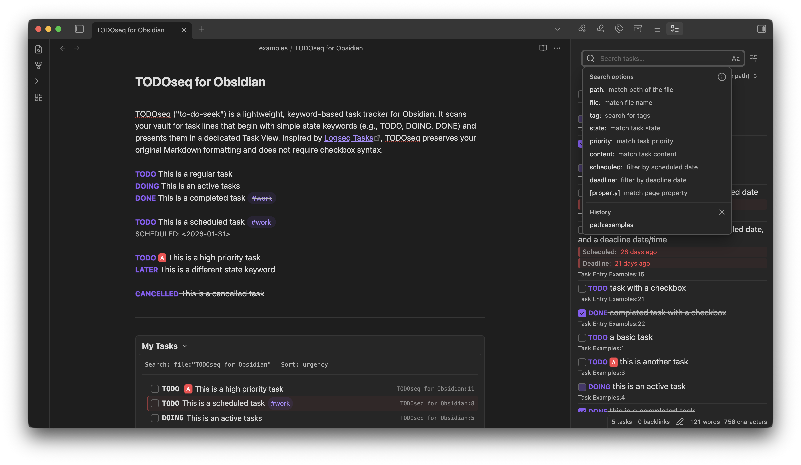

# TODOseq for Obsidian

TODOseq ("to-do-seek") is a lightweight, keyword-based task tracker for
Obsidian. It scans your vault for task lines that begin with simple state
keywords (e.g., TODO, DOING, DONE) and presents them in a dedicated Task View.
It preserves your original Markdown formatting and does not require checkbox
syntax. Inspired by [Logseq Tasks](https://docs.logseq.com/#/page/tasks).

TODOseq is designed to be compatible with Logseq's task format, allowing for
dual use or migratation of your task management workflow between Logseq and
Obsidian.



*Why use task keyworks instead of markdown checkboxes?* Personal preference. It
can be easiler and quicker to type `TODO`, `DOING` or `DONE` when making notes
or journaling than ackwardliy typing `- [ ]` to create a task checkbox.

## Features

- Scans all Markdown files in your vault for lines beginning with a task keyword
  (e.g., TODO, DOING, DONE, NOW, LATER, WAIT, WAITING, IN-PROGRESS, CANCELED,
  CANCELLED).
- Supports tasks inside bullet and numbered lists and preserves the original
  list marker (e.g., "- ", "1. ", "(a) ") on update.
- Displays all detected tasks in a single Task View, sorted by file path and
  line number.
- Toolbar search field filters tasks live by matching raw text and file
  path/filename
- View modes: Default, Sort completed last, Hide completed (toggle via toolbar
  icons).
- Update tasks in two ways:
  1. Click the state keyword to cycle it using defined sequences.
  1. Use the checkbox to toggle only between DONE and TODO, saving back to the
     source file.
- Optional Logseq style priority tokens immediately after the state keyword:
  [#A] high, [#B] medium, [#C] low. Displayed as badges in the Task View.
- Optional code block task extraction with language-aware (e.g., Python, JavaScript, Java, etc.) tasks detection from within comments using proper comment syntax for each language.
- Supports Logseq-style SCHEDULED and DEADLINE dates for task organization and
  sorting.

## Installation

1. From Obsidian Community Plugins

   - Open Settings → Community plugins → Browse.
   - Search for TODOseq.
   - Install and enable the plugin.

1. Manual (development build)

   - Clone this repository into your vaults .obsidian/plugins directory (folder
     name can be anything, e.g., todoseq).
   - Run `npm install` and `npm run build` in the repository root.
   - In Obsidian, go to Settings → Community plugins and enable the plugin.

## Quick Start

- Open the TODOseq Task View via the ribbon icon or command palette.
- Click a tasks keyword to cycle its state, or tick the checkbox to toggle
  TODO/DONE.
- Click a task row (not the checkbox or keyword) to jump to its source file and
  line.

## How Tasks Are Recognized

A task is a line that starts with optional indentation, an optional list marker,
then a keyword and at least one space. TODOseq supports both traditional keyword
format and markdown checkbox format.

### Traditional Keyword Format

Examples:

- `TODO Write documentation`
- `DOING Update sync script`
- `DONE Triage customer feedback`
- `- TODO inside bullet`
- `(a) TODO in parenthesized marker`

### Markdown Checkbox Format

TODOseq also supports tasks that use markdown checkboxes combined with state
keywords:

- `- [ ] TODO this is a task`
- `- [ ] DOING this is an in progress task`
- `- [x] DONE this is a completed task`

The checkbox state is automatically synchronized with the task's completion
state:

- Empty checkbox `[ ]` = incomplete task
- Checked checkbox `[x]` = completed task

When you toggle a task's state in the TODOseq view, the checkbox will be updated
accordingly, maintaining proper spacing (e.g., `- [x] DONE`).

Supported keywords by default:

- TODO, DOING, DONE, NOW, LATER, WAIT, WAITING, IN-PROGRESS, CANCELED,
  CANCELLED.

### Additional Task Keywords

You can add extra capitalised keywords that are treated as tasks. Enter a
comma‑separated list under "Additional Task Keywords", for example:

- `FIXME, HACK`

Notes:

- Matching is case-sensitive. Only capitalised forms match.
- Additional Task Keywords are additive; they do not replace or disable default
  keywords.
- Completion is determined only by the built-in completed states: `DONE`,
  `CANCELED`, `CANCELLED`.

## Priority Tokens

Add a single priority token immediately after the state keyword:

- `[#A]` = high
- `[#B]` = medium
- `[#C]` = low

Only the first occurrence on the line is recognized for display. Example:

- `TODO [#A] Ship v1`

## SCHEDULED and DEADLINE dates

TODOseq supports Logseq-style SCHEDULED and DEADLINE date formats, allowing you
to organize tasks by their scheduled dates and deadlines.

### Date Format

Dates can be specified in several formats after the `SCHEDULED:` or `DEADLINE:`
prefix:

**Date only:**

```
SCHEDULED: <2025-01-15>
DEADLINE: <2025-01-20>
```

**Date with time:**

```
SCHEDULED: <2025-01-15 14:30>
DEADLINE: <2025-01-20 17:00>
```

**Date with day of week and time:**

```
SCHEDULED: <2025-01-15 Wed 14:30>
DEADLINE: <2025-01-20 Mon 17:00>
```

### Usage

Place the SCHEDULED or DEADLINE lines immediately after your task line, with
matching indentation:

```markdown
TODO Write documentation
SCHEDULED: <2025-01-15>

- DOING Review pull requests
  DEADLINE: <2025-01-20 17:00>
```

### Date Parsing

- Dates are parsed in local time (timezone independent)
- Only the first occurrence of each type (SCHEDULED/DEADLINE) is recognized per
  task
- Dates must be at the same indent level or more indented than the task (Logseq
  style)
- Invalid date formats are ignored and logged to console

### In Code Blocks

When "Include tasks inside code blocks" is enabled, TODOseq can also detect tasks
within language-specific code blocks using the appropriate comment syntax for
each programming language.

#### Language-Aware Comment Tasks

TODOseq supports extracting tasks from comments in over 20 programming languages.
When it encounters a fenced code block (e.g., ```python, ```javascript), it
automatically detects the language and uses the appropriate comment syntax:

- **Python, Ruby, Shell, YAML, TOML, Dockerfile**: `# TODO Write documentation`
- **JavaScript, Java, C++, C#, Go, Swift, Kotlin, Rust, PowerShell**: `// TODO Fix this bug`
- **SQL**: `-- TODO Add index to this query`
- **INI**: `; TODO Configure this setting`

Examples:
```python
# TODO Write unit tests
# FIXME Handle edge cases
# HACK Temporary workaround
```

```javascript
// TODO Implement error handling
// DOING Refactor authentication logic
// DONE Fix memory leak issue
```

```sql
-- TODO Add proper indexing
-- DOING Optimize slow queries
```

## Task View Interactions

The state of a task can be modified directly in the task view. The line is
rewritten in the source page preserving indentation, the original list marker
(if any), the priority token (if present), and the remaining text.

The task view visually marks tasks as completed when state is DONE, CANCELED, or
CANCELLED.

The view refreshes when files are changed or when settings are updated.

**Context Menu**: Right-click any task keyword to see all available state options in a popup menu.

**Search**: Use the search field in the toolbar (top of the Task View) to filter
tasks as you type.

- Matches against the task's raw text, the full file path, and the file name.
- Toggle case sensitivity using the case icon (A/a) next to the search field.
- Slash (/) focuses the search field unless you are already typing in another
  input.
- Escape clears the current search and removes focus.
- The search field expands to fill available toolbar space.
- Search results are displayed as "X of Y tasks" in the toolbar.

**View modes (toolbar icons)**: Adjust the sort and filter.

- Default: Show all tasks in detected order (sorted by file path and line
  number).
- Sort completed last: Completed tasks are moved to the end of the list; pending
  tasks remain on top, with both groups sorted by the selected sort method.
- Hide completed: Completed tasks are completely hidden from the list.

**Sort methods (dropdown in toolbar)**: Choose how tasks are ordered.

- Default: Sort by file path, then by line number within each file.
- Scheduled Date: Sort by scheduled date (tasks without dates appear at the
  end).
- Deadline Date: Sort by deadline date (tasks without dates appear at the end).
- Priority: Sort by priority (high > medium > low > no priority), then by file
  path and line number for ties.

**Checkbox**: Checked means the task is considered completed.

- If you check it, the task is changed to DONE in the source file.
- If you uncheck it, the task is changed to TODO in the source file.

**Keyword click**: Clicking the colored keyword cycles the state using these
sequences:

- TODO → DOING → DONE → TODO
- LATER → NOW → DONE
- WAIT or WAITING → IN-PROGRESS → DONE
- CANCELED or CANCELLED → TODO

**Open source location**: Click anywhere on the task row (except the checkbox or
keyword) to jump to the exact file and line.

## Logseq Task Format Compatibility

TODOseq is designed to be compatible with Logseq's task format, ensuring a
seamless experience for users migrating from Logseq or using both platforms.

### Complete Feature Parity

All Logseq task features work exactly as expected:

- **Priority tokens**: `[#A]` high, `[#B]` medium, `[#C]` low
- **List markers**: Preserves original markers (`- `, `1.`, `(a)`, etc.)
- **State cycling**: Automatic progression through defined state sequences
- **Date handling**: Support for SCHEDULED and DEADLINE date formats

### Migration from Logseq

If you're migrating from Logseq, your existing task files will work immediately
without any modifications. TODOseq recognizes and processes all the same
patterns:

```markdown
- TODO [#A] Write documentation
  SCHEDULED: <2025-01-15>
- DOING Review pull requests
  DEADLINE: <2025-01-20>
- DONE Fix critical bug
```

## Settings

**Refresh Interval**: How frequently the vault is scanned for tasks (10-300 seconds, default: 60).

**Additional Task Keywords**: Capitalised, comma-separated extra keywords to treat as tasks (not completed). Examples: `FIXME, HACK`. These are additive and do not replace built-in keywords.

**Include tasks inside code blocks**: When enabled, tasks inside fenced code blocks (``` or ~~~) are included. Disabled by default.

**Language comment support**: When enabled and "Include tasks inside code blocks" is active, TODOseq automatically detects the programming language and uses appropriate comment syntax to find tasks. Supports 20+ programming languages including:

- **C-style languages**: C, C++, C#, Java, JavaScript, TypeScript, Go, Swift, Kotlin
- **Scripting languages**: Python, Ruby, Shell/Bash, PowerShell, R
- **Configuration languages**: YAML, TOML, INI
- **Other**: SQL, Dockerfile, Rust

**Task view mode**: Choose how completed items are shown by default:

- Default: Show all tasks in detected order
- Sort completed to end: Move completed tasks to the end
- Hide completed: Completely hide completed tasks

## Commands and Ribbon

- Ribbon: Click the "Open TODOseq" icon to open the task view.
- Command Palette: Run "TODOseq: Show TODO tasks" to open the task view.

## Development

Requirements:

- Node.js and npm

Scripts:

- `npm run dev` — run the esbuild bundler in watch mode for development.
- `npm run build` — type-check and build for production.

Contributing:

- Issues and pull requests are welcome. Please describe changes clearly and
  include steps to reproduce when filing bugs.
