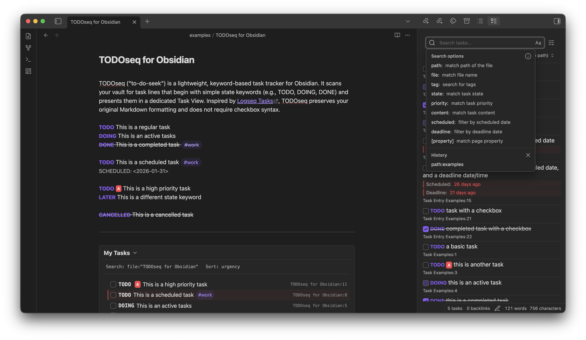

# TODOseq for Obsidian

[](https://obsidian.md/plugins?id=todoseq)
[](https://github.com/scross01/obsidian-todoseq/releases/latest)
[](LICENSE)

**Keyword-based task management for Obsidian. No checkboxes required.**

TODOseq ("to-do-seek") scans your vault for tasks marked with simple state keywords like `TODO`, `DOING`, and `DONE`, then presents them in a unified Task List view. Inspired by [Logseq](https://logseq.com/) and [Org-mode](https://orgmode.org/), it lets you capture tasks naturally within your notes without disrupting your writing flow.



## Why TODOseq?

Most task managers force you into a separate system. TODOseq meets you where you already work—inside your Obsidian notes. Type `TODO Write report` anywhere in your vault, and it appears instantly in your Task List. No switching contexts, no special syntax to remember, no checkboxes to click.

## Core Features

**Natural Task Capture** — Write tasks as plain text using keywords: `TODO`, `DOING`, `DONE`, `LATER`, `NOW`, `WAIT`, and more. Add priorities `[#A]`, `[#B]`, `[#C]` and dates `SCHEDULED: <2025-03-15>` using familiar Logseq-style syntax.

**Unified Task List** — See all tasks from across your vault in one searchable, sortable panel. Filter by state, priority, date, tags, or use advanced boolean queries. Sort by urgency to surface what matters most right now.

**Works Everywhere** — Tasks remain functional in both Edit mode and Reader view. Click any keyword to cycle through states. Right-click for direct state selection. Use `Ctrl+Enter` to toggle tasks from your keyboard.

**Code-Aware** — Extracts tasks from code block comments in 20+ languages. Capture `// TODO Refactor this` from JavaScript, `# TODO Optimize query` from SQL, or `<!-- TODO Update docs -->` from HTML.

**Embedded Lists** — Render filtered task lists directly in your notes using `todoseq` code blocks. Create dynamic dashboards showing "High Priority Work Tasks" or "Overdue Items" that update automatically.

**Subtasks** — Break down complex tasks with indented checkbox items. The Task List shows subtask progress as `[1/3]` indicating completed and total subtasks.

**Repeating Tasks** — Automatically advance scheduled and deadline dates when completed. Use `.+1d`, `++1w`, or `+1m` syntax to create recurring tasks.

**Logseq Compatible** — Use the same task format across both tools. Existing Logseq tasks work without modification. Dual-use your vault or migrate at your own pace.

**Experimental Features** — Additional capabilities including Org-mode file support are available as experimental features. See [documentation](docs/experimental-features.md) for details.

## Quick Start

```markdown
TODO [#A] Finish quarterly report #work
SCHEDULED: <2025-03-15>

DOING [#B] Review pull requests #coding

DONE Submit expense report
DEADLINE: <2025-03-10>
```

1. **Install** from Obsidian Community Plugins (search "TODOseq")
2. **Create tasks** by typing `TODO`, `DOING`, `DONE`, etc. in any note
3. **Open Task List** — it appears automatically in the right sidebar (or use Command Palette → "TODOseq: Show task list")
4. **Click keywords** to cycle states, or click task text to jump to source
5. **Search** using natural language or advanced filters like `priority:high deadline:this week`

## Installation

### From Obsidian Community Plugins (Recommended)

Settings → Community plugins → Browse → Search "TODOseq" → Install → Enable

### Manual Installation

```bash
cd /path/to/your/vault/.obsidian/plugins
git clone https://github.com/scross01/obsidian-todoseq.git todoseq
cd todoseq
npm install
npm run build
```

Then enable "TODOseq" in Settings → Community plugins.

## Documentation

Comprehensive documentation is available at **[scross01.github.io/obsidian-todoseq](https://scross01.github.io/obsidian-todoseq/)**

- [Introduction & Philosophy](https://scross01.github.io/obsidian-todoseq/introduction.html) — Task management approach and Logseq compatibility
- [Task List](https://scross01.github.io/obsidian-todoseq/task-list.html) — Using the dedicated task panel
- [Task Entry](https://scross01.github.io/obsidian-todoseq/task-entry.html) — Task syntax, keywords, and lifecycle
- [Editor Integration](https://scross01.github.io/obsidian-todoseq/editor.html) — Working with tasks in Edit mode
- [Reader View](https://scross01.github.io/obsidian-todoseq/reader.html) — Working with tasks in Reading mode
- [Search](https://scross01.github.io/obsidian-todoseq/search.html) — Advanced search syntax and filters
- [Embedded Lists](https://scross01.github.io/obsidian-todoseq/embedded-task-lists.html) — Dynamic task lists in notes
- [Settings](https://scross01.github.io/obsidian-todoseq/settings.html) — Configuration and customization

## Examples

### Basic Tasks

```markdown
TODO Draft proposal
DOING Review feedback
DONE Submit final version
```

### With Priorities and Dates

```markdown
TODO [#A] Critical security patch
DEADLINE: <2025-03-12>

DOING [#B] Update documentation
SCHEDULED: <2025-03-15>
```

### In Code Blocks

```python
# TODO Add input validation
# FIXME Handle edge case when user is null
def process_user(user):
    pass
```

### In Org-Mode Files _(Experimental)_

> **Note**: Org-mode support is an experimental feature. Enable it in Settings → TODOseq → Experimental Features.

```org
* TODO [#A] Critical security patch
  DEADLINE: <2025-03-12>

** DOING [#B] Update documentation
   SCHEDULED: <2025-03-15>

*** DONE Submit expense report
```

### Embedded Task List

````markdown
```todoseq
search: tag:work priority:high
sort: urgency
show-completed: hide
limit: 10
title: High Priority Work
```
````

## Support

- ⭐ Star this repo if you find it useful
- 🐛 [Report issues](https://github.com/scross01/obsidian-todoseq/issues) or request features
- 📝 [Contribute](CONTRIBUTING.md) improvements via pull requests

## License

MIT License — see [LICENSE](LICENSE) for details.
