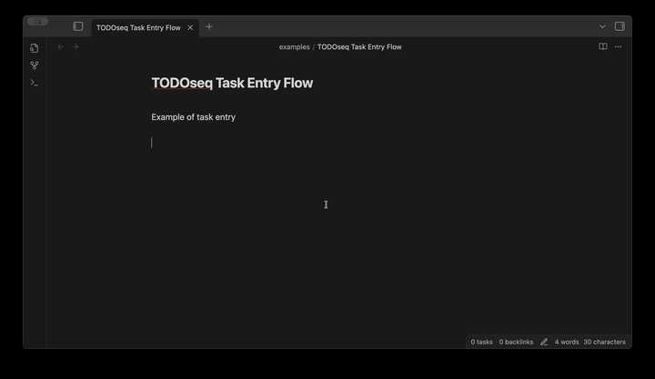

# TODOseq for Obsidian

[](https://obsidian.md/plugins?id=todoseq)
[](https://github.com/scross01/obsidian-todoseq/releases/latest)
[](LICENSE)

**Keyword-based task management for Obsidian. No checkboxes required.**

TODOseq ("to-do-seek") scans your vault for plain lines that start with `TODO`, `DOING`, and `DONE`, then collects them into one Task List. Keep writing in ordinary notes — inspired by Emacs Org-mode and Logseq. Free and open source (MIT).

[Install from Community Plugins](https://obsidian.md/plugins?id=todoseq) · [Documentation](https://scross01.github.io/obsidian-todoseq/) · [Report an issue](https://github.com/scross01/obsidian-todoseq/issues)



## Why TODOseq?

Most task managers force you into a separate system. TODOseq meets you where you already work — inside your Obsidian notes. Type `TODO Write report` anywhere, and it appears in the Task List. No second app, no checkbox ceremony.

- Plain keywords instead of `- [ ]` checkbox syntax
- Logseq / Org-mode compatible, including natural-language dates
- Vault-wide Task List: search, urgency, priorities, embedded lists

## What you get

- Keywords `TODO` / `DOING` / `DONE` / … with `[#A]` priorities
- Natural language dates converted to structured Org dates
- Unified Task List with filters, urgency sort, and advanced queries
- Works in Edit and Reading views; click a keyword or `Ctrl+Enter`
- Code-comment TODOs in 20+ languages
- `todoseq` embedded lists in notes
- Subtasks, repeating tasks, optional CLOSED dates
- Logseq-compatible format for dual-use vaults

More detail in the [documentation](https://scross01.github.io/obsidian-todoseq/).

## Quick start

1. **Install:** Settings → Community plugins → Browse → search **TODOseq** → Install → Enable
2. **Type a task** in any note:

```markdown
TODO [#A] Finish quarterly report #work tomorrow
DOING Review pull requests #coding
DONE Submit expense report
```

3. **Open the Task List** — right sidebar, or Command Palette → “TODOseq: Show task list”

## Documentation

Full guides: **[scross01.github.io/obsidian-todoseq](https://scross01.github.io/obsidian-todoseq/)**

Start here:

- [Introduction](https://scross01.github.io/obsidian-todoseq/introduction.html) — approach and Logseq compatibility
- [Task List](https://scross01.github.io/obsidian-todoseq/task-list.html) — using the panel
- [Task Entry](https://scross01.github.io/obsidian-todoseq/task-entry.html) — syntax and lifecycle
- [Search](https://scross01.github.io/obsidian-todoseq/search.html) — filters and advanced queries

## Development

Requires Node.js 20+.

| Command | Purpose |
| --- | --- |
| `npm install` | Install dependencies |
| `npm run dev` | esbuild watch mode |
| `npm run build` | Typecheck + production bundle |
| `npm test` | Unit tests |
| `npm run lint` / `npm run format` | ESLint / Prettier |
| `npm run docs:dev` | VitePress docs dev server |

Integration tests, CDP debugging, and PR expectations: see [CONTRIBUTING.md](CONTRIBUTING.md) and [AGENTS.md](AGENTS.md).

## Contributing

Issues and pull requests are welcome. See [CONTRIBUTING.md](CONTRIBUTING.md).

- [Report issues](https://github.com/scross01/obsidian-todoseq/issues) or request features
- Star the repo if TODOseq is useful to you

## License

MIT — see [LICENSE](LICENSE).
