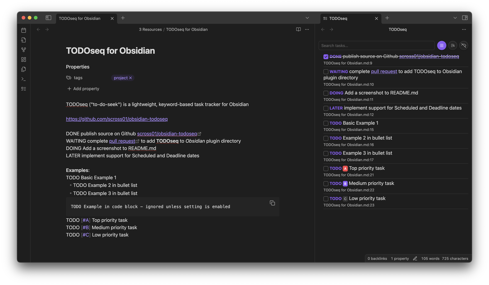

# TODOseq for Obsidian

TODOseq ("to-do-seek") is a lightweight, keyword-based task tracker for Obsidian. It scans your vault for task lines that begin with simple state keywords (e.g., TODO, DOING, DONE) and presents them in a dedicated Task List view. Inspired by the task capture styles of [Emacs Org-mode](https://orgmode.org/) and [Logseq Tasks](https://docs.logseq.com/#/page/tasks) TODOseq preserves your original Markdown formatting and does not require checkbox syntax.



## Key Features

- **Keyword-based task management**: Use simple keywords like `TODO`, `DOING`, `DONE` instead of checkboxes
- **Logseq compatibility**: Full support for Logseq task format including priority tokens and dates
- **Flexible task recognition**: Works with traditional keywords and markdown checkboxes
- **Powerful search**: Advanced search with boolean logic, prefix filters, and date expressions
- **Task List View**: Dedicated panel showing all tasks across your vault
- **Editor integration**: Interactive task management with visual styling directly in the Markdown editor
- **Code block support**: Extract tasks from comments in 20+ programming languages
- **State cycling**: Click keywords to cycle through task states
- **Priority system**: Use `[#A]`, `[#B]`, `[#C]` for high, medium, low priority
- **Date management**: Support for SCHEDULED and DEADLINE dates
- **Urgency sorting**: Smart task ranking based on due dates, priority, tags, and task state

## Installation

### From Obsidian Community Plugins

1. Open Settings → Community plugins → Browse
2. Search for "TODOseq"
3. Install and enable the plugin

### Manual (development build)

1. Clone this repository into your vault's `.obsidian/plugins` directory
2. Run `npm install` and `npm run build` in the repository root
3. In Obsidian, go to Settings → Community plugins and enable the plugin

## Quick Start

1. **Open Task List**: The TODOseq task view automatically opens in the right sidebar when the plugin is enabled, and can also be opened via the command palette.
2. **Create tasks**: Add lines starting with `TODO`, `DOING`, `DONE`, etc. in your notes
3. **Manage tasks**: Click task keywords to cycle states or use checkboxes for TODO/DONE toggle
4. **Navigate**: Click task rows to jump to source files
5. **Search**: Use the search field to filter tasks with powerful query syntax

**Note**: The ribbon icon has been removed since v0.7.0. Use the command palette to reopen the right sidebar panel to access tasks.

## Examples

```markdown
TODO [#A] Finish project proposal #work
SCHEDULED: <2026-01-31>

DOING [#B] Review code changes #coding

DONE Buy groceries
DEADLINE: <2023-12-20>
```

## Documentation

For detailed information, see the documentation:

[TODOseq Documentation](https://scross01.github.io/obsidian-todoseq/)

- [Introduction & Philosophy](https://scross01.github.io/obsidian-todoseq/introduction.html) - Task management approach and Logseq compatibility
- [Task List](https://scross01.github.io/obsidian-todoseq/task-list.html) - Using the dedicated task panel
- [Task Entry](https://scross01.github.io/obsidian-todoseq/task-entry.html) - Task syntax, keywords, and lifecycle
- [Editor Integration](https://scross01.github.io/obsidian-todoseq/editor.html) - Task display and interaction in the Markdown editor
- [Search Functionality](https://scross01.github.io/obsidian-todoseq/search.html) - Advanced search syntax and filters
- [Settings](https://scross01.github.io/obsidian-todoseq/settings.html) - Configuration options and customization
