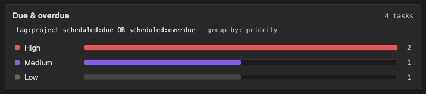
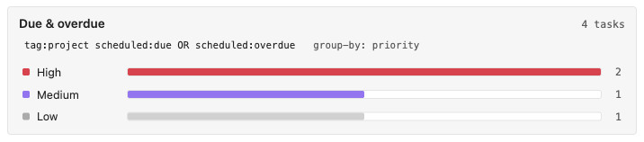
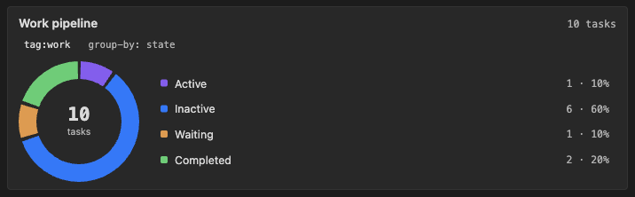
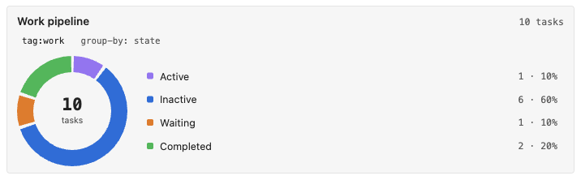
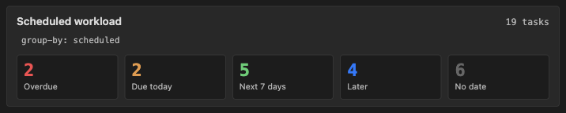
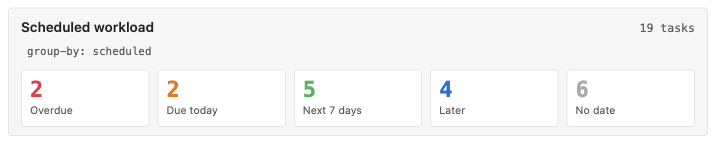
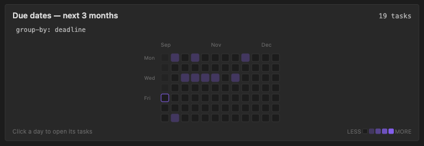
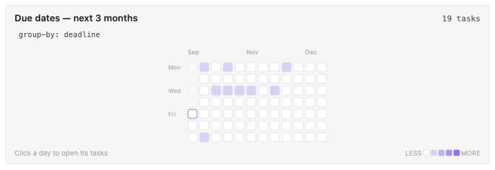
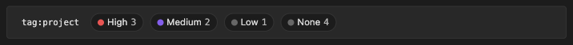
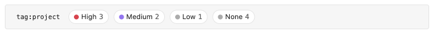

# Dashboards

Dashboard cards embed aggregated task counts directly in any note. Where an
[embedded task list](/embedded-task-lists) shows the tasks themselves, a
dashboard answers "where is my work concentrated?" — counts grouped by state,
priority, keyword, tag, or date bucket, with one-click drill-through into the
Task List.

Because cards aggregate with the same search engine the Task List uses, the
counts always agree with what the Task List shows for the same filter.

## Basic Usage

Create a code block with the `todoseq-dashboard` language:

````txt
```todoseq-dashboard
search: tag:project scheduled:due OR scheduled:overdue
group-by: priority
display: bar
title: Due & overdue
```
````

The card lists one row per group with a proportional bar and count. Click a
row to open the Task List with that group's filter applied; Cmd/Ctrl-click
opens it in a new tab.

{.ts-img-wide .ts-img-dark}
{.ts-img-wide .ts-img-light}

## Code Block Parameters

| Parameter         | Description                                                                                                                                                                                                                                                                  | Default    |
| ----------------- | ---------------------------------------------------------------------------------------------------------------------------------------------------------------------------------------------------------------------------------------------------------------------------- | ---------- |
| `search:`         | Any valid search string (see [search](/search)). Tasks that do not match are excluded from the card before grouping                                                                                                                                                          | all tasks  |
| `group-by:`       | One of `priority`, `state`, `keyword`, `tag`, `scheduled`, or `deadline` (`group:` is an alias)                                                                                                                                                                              | `state`    |
| `display:`        | One of `bar`, `column`, `donut`, `tiles`, `heatmap`, or `strip`. `heatmap` requires `group-by: scheduled` or `deadline`. `strip` drops the header and renders the query chip and group pills inline — it cannot be combined with `title:`, `heatmap-window:`, or `collapse:` | `bar`      |
| `title:`          | Adds a custom title displayed above the card                                                                                                                                                                                                                                 | —          |
| `show-query:`     | `show`, `hide`, `true`, or `false`. Controls the query chip under the title                                                                                                                                                                                                  | `show`     |
| `sort:`           | `fixed`, `count-desc`, `count-asc`, or `label`. Priority, state, and date buckets default to `fixed` (urgency order); keyword and tag default to `count-desc`                                                                                                                | —          |
| `show-empty:`     | `show`, `hide`, `true`, or `false`. When enabled, groups with zero tasks are shown at `0` instead of being omitted                                                                                                                                                           | `hide`     |
| `max-groups:`     | A positive integer. Truncates long tag/keyword lists and appends an "N more" footer                                                                                                                                                                                          | `8`        |
| `color:`          | `semantic` or `mono`. Semantic maps each attribute to its theme color (High red, overdue red, completed green, …); `mono` collapses all fills to accent steps                                                                                                                | `semantic` |
| `collapse:`       | `true` or `false`. Starts the card collapsed behind its header (same option and behavior as embedded task lists). Requires either `title:` to be set or `show-query: true`                                                                                                   | `false`    |
| `heatmap-window:` | Number of weeks for the heatmap window, 4–52. The heatmap's first column follows the plugin's **Week starts on** setting (Monday or Sunday)                                                                                                                                  | `26`       |

Lines starting with `#` inside the block are treated as comments.

## Grouping

- **priority** — High / Medium / Low / None, from the task's `[#A]`/`[#B]`/`[#C]` token
- **state** — Active / Inactive / Waiting / Completed, using your
  [keyword settings](/settings) (never hardcoded). Archived tasks are excluded
  from dashboards (same as the Task List and vault scan) — they are styled in
  notes but do not appear in card counts or groups.
- **keyword** — one column per task state actually present in the matched tasks
- **tag** — one group per tag. Tags can overlap, so column sums may exceed the
  card total; the header total explains this in its tooltip. The `#A`/`#B`/`#C`
  priority tags are excluded
- **scheduled** / **deadline** — five buckets in urgency order: Overdue,
  Due today, Next 7 days, Later, No date. Clicking a bucket opens the Task
  List with the matching date filter

## Display Forms

Every form below has a worked example with a screenshot further down this
page.

- **bar** — the default: one row per group with a color swatch, label, and a
  track filled proportionally to the largest group
- **column** — centered columns with the count above a rounded bar
- **donut** — an SVG ring with a legend; both slices and legend rows are
  clickable
- **tiles** — a responsive grid of tiles with the count in the group color
- **heatmap** — a GitHub-style calendar of upcoming due work (requires
  `group-by: scheduled` or `deadline`). Past days are dimmed, today is
  outlined, and each day is clickable. The first column follows the plugin's
  **Week starts on** setting. Use `heatmap-window:` to control how
  many weeks ahead are shown
- **strip** — a compact headerless row of pills (color dot, label, count),
  with the query chip inline — fits a daily note or a narrow pane. Cannot be
  combined with `title:` or `collapse:`

Cards update automatically when tasks change anywhere in the vault — from the
editor, the Task List, other pages, or
[auto-archive](/auto-archive). When only counts change, the card patches its
numbers in place instead of redrawing, so hover, focus, and scroll survive.

On narrow panes and phones the layout adapts: labels truncate, the donut
legend drops below the ring, tiles wrap, and the heatmap scrolls horizontally.

## Examples

State pipeline as a donut:

````txt
```todoseq-dashboard
search: tag:work
group-by: state
display: donut
title: Work pipeline
```
````

{.ts-img-wide .ts-img-dark}
{.ts-img-wide .ts-img-light}

Scheduled workload as tiles:

````txt
```todoseq-dashboard
group-by: scheduled
display: tiles
title: Scheduled workload
show-empty: show
```
````

{.ts-img-wide .ts-img-dark}
{.ts-img-wide .ts-img-light}

Upcoming deadlines heatmap:

````txt
```todoseq-dashboard
group-by: deadline
display: heatmap
heatmap-window: 12
title: Due dates — next 3 months
```
````

{.ts-img-wide .ts-img-dark}
{.ts-img-wide .ts-img-light}

Compact strip inline in a project note:

````txt
```todoseq-dashboard
search: tag:project
group-by: priority
display: strip
```
````

{.ts-img-wide .ts-img-dark}
{.ts-img-wide .ts-img-light}
