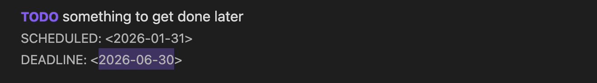

# Editor Integration

TODOseq seamlessly integrates with Obsidian's Markdown editor, providing visual feedback and interactive controls for managing your tasks directly within your notes. This guide explains how tasks are displayed and how you can interact with them in the editor.

## Task Display in the Editor

When you create tasks using TODOseq's keyword-based format, they appear in your Markdown editor with special styling that helps you quickly identify and manage them.

### Visual Task Representation

As you type or when you open a note containing tasks, TODOseq automatically applies visual styling to make tasks stand out:

```markdown
TODO [#A] Write documentation for new feature
DOING [#B] Implement authentication system
DONE [#C] Fix critical bug in payment processing
```

**What you see in the editor:**


- **State keywords** (TODO, DOING, DONE, etc.) are highlighted with bold font and your theme's accent color
- **Completed tasks** (DONE, CANCELED, CANCELLED) display with a line-through decoration
- **Checkboxes** (when used) are synchronized with the task state
- SCHEDULED and DEADLINE date lines are formatted with special styling
- The styling is applied in real-time as you type

## Interactive Task Management

TODOseq provides several ways to interact with tasks directly in the editor:

### Clicking Task Keywords

The most intuitive way to update task states is by clicking on the state keyword.
Click on any state keyword (e.g., `TODO`) to cycle through the task states.
Tasks follow logical state sequences:

- `TODO` → `DOING` → `DONE` → `TODO`
- `LATER` → `NOW` → `DONE`
- `WAIT` → `IN-PROGRESS` → `DONE`

### Right-Click Context Menu

For more control over task state transitions, right-click on any task keyword to see all available next states.
A context menu appears showing all possible next states. Select the desired state from the menu.

This is particularly useful when you want to jump to a specific state without cycling through all intermediate states.

### Keyboard Shortcut

For power users who prefer keyboard navigation:

1. Place your cursor on any line containing a valid task
2. Press **Ctrl+Enter** (default shortcut) to toggle the task state
3. The task cycles through its state sequence

**Customizing the shortcut:**

You can change this keyboard shortcut in Obsidian's settings:

1. Go to **Settings → Hotkeys**
2. Find "TODOseq: Toggle task state"
3. Assign your preferred key combination

For more details on editor integration settings, see the [Settings documentation](settings.md#editor-integration-settings).

### Checkbox Interaction

When tasks use the checkbox format, you have additional interaction options:

```markdown
- [ ] TODO Task with empty checkbox
- [x] DONE Task with checked checkbox
```


Clicking the checkbox toggles between empty `[ ]` and checked `[x]` states.
The task keyword is automatically synchronized with the checkbox state.

### Entering scheduled and deadline dates

When adding a `SCHEDULED:` or `DEADLINE:` date after a task, the editor will autocomplete after the keyword with the required date format, e.g. `<2026-01-01>`, with the date auto-filled to the current date and selected for easy replacement or editing.



## Task State Synchronization

TODOseq ensures that the task state and checkbox are always in sync:

- Changing the task keyword updates the checkbox
- Checking/unchecking the checkbox updates the task keyword
- Both methods update the task's completion date if applicable

This synchronization happens automatically as you interact with tasks in the editor or the [Task List](task-list.md).
