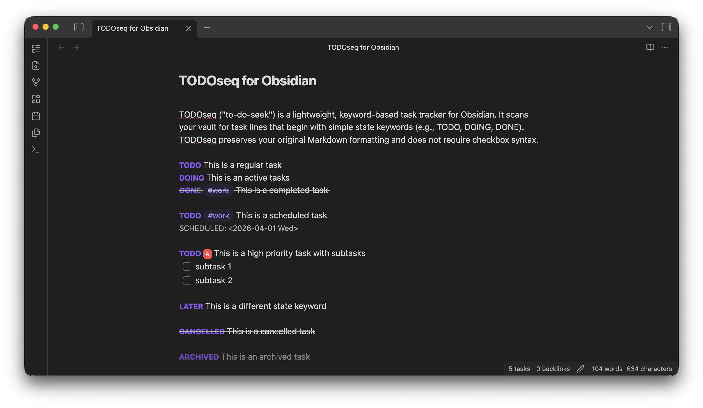

# Editor Integration

TODOseq seamlessly integrates with Obsidian's Markdown editor, providing visual feedback and interactive controls for managing your tasks directly within your notes. This guide explains how tasks are displayed and how you can interact with them in the editor.

For information about task display and interaction in Reader view (Reading/Preview mode), see the [Reader View documentation](reader.md).



## Task Display in the Editor

When you create tasks using TODOseq's keyword-based format, they appear in your Markdown editor with special styling that helps you quickly identify and manage them.

### Visual Task Representation

As you type or when you open a note containing tasks, TODOseq automatically applies visual styling to make tasks stand out:

```markdown
TODO [#A] Write documentation for new feature
DOING [#B] Implement authentication system
DONE [#C] Fix critical bug in payment processing
```

**What you see in the editor:**


- **State keywords** (TODO, DOING, DONE, etc.) are highlighted with bold font and your theme's accent color
- **Completed tasks** (DONE, CANCELED, CANCELLED) display with a line-through decoration
- **Checkboxes** (when used) are synchronized with the task state
- SCHEDULED and DEADLINE date lines are formatted with special styling
- The styling is applied in real-time as you type

## Interactive Task Management

TODOseq provides several ways to interact with tasks directly in the editor:

### Clicking Task Keywords

The most intuitive way to update task states is by clicking on the state keyword. Click on any state keyword (e.g., `TODO`) to cycle through the task states.

Tasks follow logical state sequences:

- `TODO` → `DOING` → `DONE` → `TODO`
- `LATER` → `NOW` → `DONE`
- `WAIT` → `IN-PROGRESS` → `DONE`

### Right-Click Context Menu

For more control over task state transitions, right-click on any task keyword to see all available next states. A context menu appears showing all possible next states. Select the desired state from the menu.

This is particularly useful when you want to jump to a specific state without cycling through all intermediate states.

### Keyboard Shortcut

For power users who prefer keyboard navigation:

1. Place your cursor on any line containing a valid task
2. Press **Ctrl+Enter** (default shortcut) to toggle the task state
3. The task cycles through its state sequence

**Customizing the shortcut:**

You can change this keyboard shortcut in Obsidian's settings:

1. Go to **Settings → Hotkeys**
2. Find "TODOseq: Toggle task state"
3. Assign your preferred key combination

For more details on editor integration settings, see the [Settings documentation](settings.md#editor-integration-settings).

### Checkbox Interaction

When tasks use the checkbox format, you have additional interaction options:

```markdown
- [ ] TODO Task with empty checkbox
- [x] DONE Task with checked checkbox
```


Clicking the checkbox toggles between empty `[ ]` and checked `[x]` states. The task keyword is automatically synchronized with the checkbox state.

### Entering Scheduled and Deadline Dates

TODOseq provides multiple ways to add scheduled and deadline dates to your tasks:

#### Manual Date Entry

When adding a `SCHEDULED:` or `DEADLINE:` date after a task, the editor will autocomplete after the keyword with the required date format, e.g. `<2026-01-01>`, with the date auto-filled to the current date and selected for easy replacement or editing.


#### Smart Date Recognition

When smart date recognition is enabled in settings, you can type natural language dates directly on your task lines. TODOseq automatically converts them to structured Org-mode dates when you finish typing. The supported date patterns are listed below.

**One-time Dates:**

```markdown
TODO Call John today
DOING Review PR tomorrow
LATER Submit report on Friday
LATER Meeting next week
```

**Recurring Dates:**

```markdown
TODO Daily standup daily
TODO Team meeting every Friday
TODO Monthly review monthly
```

**With Time:**

```markdown
TODO Conference call tomorrow at 16:00
TODO Evening review 9pm
TODO Daily meeting daily 20:00
TODO Standup at 8:00am
TODO Call on Friday at 15:30
```

**DEADLINE Detection:**

The system automatically detects whether dates should be SCHEDULED or DEADLINE based on context:

```markdown
TODO Project due tomorrow → DEADLINE
TODO Submit by deadline Friday → DEADLINE
TODO Call John tomorrow → SCHEDULED
TODO Meeting on Monday → SCHEDULED
```

**Supported Date Expressions:**

- **Simple**: today, tomorrow, yesterday
- **Relative**: in 5 days, in 2 weeks, in 3 months, in 2 hours, day before yesterday
- **Next / last / this**: next week, last week, next month, last month, next year, last year
- **Weekdays**: Monday, Tuesday, Friday, next Friday, last Monday, this Friday
- **With time**: 6pm, 9am, at 8:00am, at 16:00, at 5:30pm, tomorrow at 14:00
- **With day and time**: on Friday at 2pm, on Thursday at 8:30am
- **Time-of-day**: morning (→ 08:00), afternoon (→ 14:00), evening (→ 19:00), noon (→ 12:00), midnight (→ 00:00)
- **Recurring**: daily, every day, weekly, every week, monthly, every month, every Friday
- **Specific dates**: January 27, 27 January, 2026-08-11, 8/11/2026, 27th

**Re-typing a date or moving the cursor away** triggers the conversion.

**Input:**

```markdown
TODO Call John tomorrow
```

**Output:**

```markdown
TODO Call John
SCHEDULED: <2026-05-19 Mon>
```

**Configuration:**

See [Settings → Smart Date Recognition](settings.md#smart-date-recognition) for:

- Enable/disable the feature
- Adjust parse delay to prevent false positives
- Choose whether to remove the natural language text after conversion

This feature helps you capture tasks quickly without breaking your writing flow, while ensuring dates are stored in a consistent, structured format that works across all TODOseq features.

## Task State Synchronization

TODOseq ensures that the task state and checkbox are always in sync:

- Changing the task keyword updates the checkbox
- Checking/unchecking the checkbox updates the task keyword
- Both methods update the task's completion date if applicable

This synchronization happens automatically as you interact with tasks in the editor or the [Task List](task-list.md).

## Editor-Specific Features

While many task interactions work similarly in both Edit mode and Reader view, the editor offers some unique capabilities:

### Real-time Styling

Task formatting appears as you type in Edit mode. As soon as you type a valid task keyword, it receives styling immediately. This instant feedback helps you confirm that TODOseq recognizes your task syntax.

### Code Block Styling

When "Include tasks inside code blocks" is enabled, TODOseq can apply styling to task keywords within code blocks in the editor. This makes tasks in code examples visually distinct. Note that code block styling is only applied in Edit mode; Reader view always displays code blocks without task formatting to preserve code readability.

### Cursor Position Awareness

Editor interactions respect your cursor position. The Ctrl+Enter keyboard shortcut works based on where your cursor is placed, allowing you to toggle task states without precisely clicking on keywords.

### Command Palette Commands

TODOseq provides several editor-specific commands to modify task that can be accessed through Obsidian's Command Palette (Ctrl/Cmd+P) and keyboard shortcuts. Task specific commands only appear when your cursor is on a valid task line

See [Command Palette](command-palette.md) for more details.
