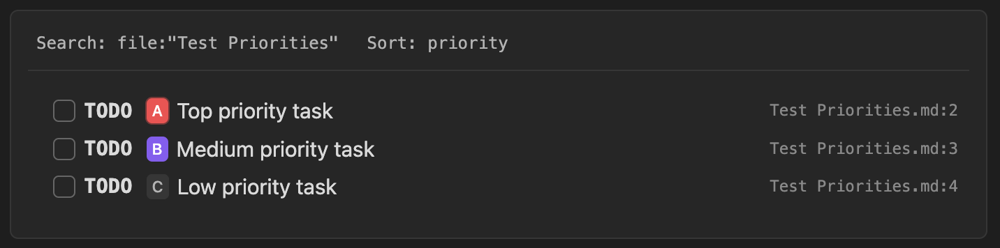
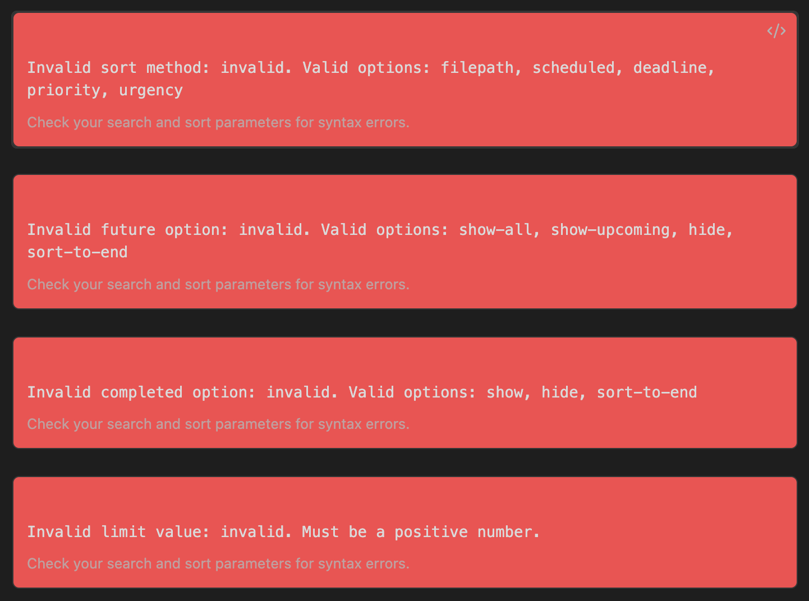

# Embedded Task Lists

The TODOseq plugin supports rendering filtered task lists directly within your notes using special code blocks. This feature allows you to create dynamic, interactive task lists that are filtered and sorted according to your specifications.

## Basic Usage

To create an embedded task list, use a code block with the `todoseq` language:

````txt
```todoseq
search: file:"Test Priorities"
sort: priority
```
````



## Code Block Parameters

Using the following parameters within the `todoseq` code block you define which tasks are displayed.

- `search:` any valid search string (see [search](/search.html))
- `title:` (optional) adds a custom title displayed above the task list.
- `sort:` (optional) one of `filepath`, `scheduled`, `deadline`, `priority` or `urgency`. Default is `filepath`.
- `limit:` (optional) set the display limit to result the number of results shown.
- `show-completed:` (optional) one of `show`, `hide`, `sort-to-end`. Controls how completed tasks are displayed. Defaults to `show`. (`completed:` is an alternative alias for this parameter)
- `show-file:` (optional) `show`, `hide`, or `true`, `false`. Controls whether to show the source file info column. Defaults to `show` (responsive layout).
- `show-future:` (optional) one of `show-all`, `show-upcoming`, `hide`, `sort-to-end`. Controls how future-dated tasks are displayed. Defaults to `show-all`. (`future:` is an alternative alias for this parameter)
- `show-query:` (optional) `show`, `hide`, or `true`, `false`. Controls whether to show the search query and filter parameters in the header. Defaults to `show`.
- `wrap-content:` (optional) `true`, `false`, `wrap`, or `truncate`. Controls whether task text wraps to multiple lines or truncates with ellipsis. Defaults to `false` (truncate). When enabled, file info moves to a new row with full filename.

Example:

````txt
```todoseq
search: file:Project1 OR tag:project1
sort: filepath
show-completed: hide
show-future: show-upcoming
limit: 5
title: Project Tasks
show-query: show
```
````

### Search Query

The `search:` parameter accepts any valid TODOseq search query:

Example:

````txt
```todoseq
search: tag:project1 AND content:"example"
```

```todoseq
search: state:TODO OR state:DOING
```

```todoseq
search: priority:high AND due:today
```
````

### Sort Method

The `sort:` parameter controls how tasks are ordered. Valid options are:

- `filepath` - Sort by file path (default)
- `scheduled` - Sort by scheduled date
- `deadline` - Sort by deadline date
- `priority` - Sort by priority (high → low)
- `urgency` - Sort by urgency score (high → low)

Example:

````txt
```todoseq
search: scheduled:today
sort: priority
```
````

### Completed Tasks

The `show-completed:` parameter controls how completed tasks are displayed. This overrides the global "Completed tasks" setting:

- `show` - Show all completed tasks (default)
- `hide` - Hide completed tasks
- `sort-to-end` - Sort completed tasks to the end of the list

> **Note:** `completed:` is an alternative alias for `show-completed:` and works the same way.

````txt
```todoseq
search: scheduled:due OR deadline:due OR priority:high
show-completed: sort-to-end
```
````

### Future Tasks

The `show-future:` parameter controls how future-dated tasks are displayed. This overrides the global "Future dated tasks" setting:

- `show-all` - Show all future tasks (default)
- `show-upcoming` - Show only upcoming tasks (within 7 days)
- `hide` - Hide all future tasks
- `sort-to-end` - Sort future tasks to the end of the list

> **Note:** `future:` is an alternative alias for `show-future:` and works the same way.

````txt
```todoseq
search: tag:project1 OR tag:project1
show-future: show-upcoming
```
````

### Limit Results

The `limit:` parameter limits the number of tasks displayed:

````txt
```todoseq
search: file:Project1 OR tag:project1
limit: 10
```
````

### Show File Info

The `show-file:` parameter controls whether to display the source file information column:

- `true` or `show` - Show file info (default, responsive layout)
- `false` or `hide` - Always hide file info

````txt
```todoseq
search: tag:project1
show-file: false
```
````

### Title

The `title:` parameter adds a custom title displayed above the task list:

````txt
```todoseq
search: tag:urgent
sort: priority
title: Urgent Tasks
```
````

The title appears at the top of the embedded task list, above the search query and other parameters.

### Show Query Header

The `show-query:` parameter controls whether the search query and filter parameters are displayed in the header:

- `true` or `show` - Show the query header (default)
- `false` or `hide` - Hide the query header

This is useful when you want a cleaner look, especially when combined with a title:

````txt
```todoseq
search: tag:urgent
sort: priority
title: Urgent Tasks
show-query: false
```
````

When `show-query: false` is set without a `title:`, the task list will display without any header at all.

### Wrap Content

The `wrap-content:` parameter controls how task text is displayed when it exceeds the available width:

- `false` or `truncate` - Truncate task text with ellipsis (default)
- `true` or `wrap` - Wrap task text to multiple lines

When wrapping is enabled, the file information moves to a new row below the task text and displays the full filename without truncation.

````txt
```todoseq
search: tag:project1
wrap-content: true
```
````

This is particularly useful if your tasks have long descriptions that need to be fully visible
or if you need to display the task list on mobile devices or narrow windows where truncation would hide important context.

### Combined Parameters

You can combine multiple parameters:

````txt
```todoseq
search: (file:Project1 OR tag:project1) AND content:"example"
sort: priority
show-completed: hide
show-future: show-all
show-file: false
limit: 10
```
````

## Visual Date Indicators

The task lists provides subtle visual cues to help you quickly identify task urgency based on scheduled and deadline dates. When a task has either a scheduled or deadline date, you'll see a gentle background color that indicates its time sensitivity without being distracting.

Tasks with dates that have passed appear with a soft red background, making it easy to spot what needs immediate attention. Tasks due today show a warm orange background, helping you focus on today's priorities. For tasks coming up within the next week, you'll see a soft green background that signals they're on your radar. Tasks with dates further out in the future maintain their default appearance, keeping your view clean and uncluttered.

## Interactive Features

### Toggle Task State

Click the checkbox next to a task to toggle its state between TODO and DONE:
The task will be updated in the original file, and the embedded list will refresh automatically.

### Change Task State

Right click on the task keyword to select the desired state. The task will be updated in the original file, and the embedded list will refresh automatically.

### Navigate to Task

Click on the task text to navigate to the task's location in the original file.

**Simple click** opens the file in the current active page or brining the existing open page into focus.

**Shift-click** creates a new split pane and opens the file there. This is perfect for when you want to reference the task while working on something else in your main workspace.

**Ctrl/Cmd-click** always opens the file in a brand new tab, ensuring you have a fresh workspace for the task without disrupting your current view.

In all cases, TODOseq navigates to the exact line containing the task and focuses the editor for immediate editing.

## Error Handling

If no tasks are found of the search query is invalid  

If there's an with one of the sort or filters options, an error message will be displayed accordingly. The error message indicate what went wrong and suggest how to fix it.

