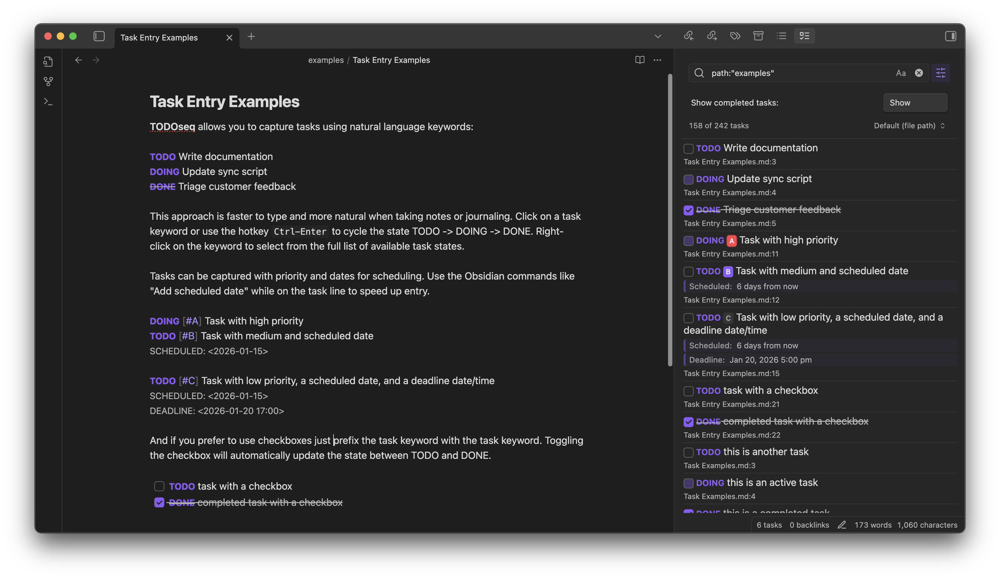

# TODOseq for Obsidian

TODOseq ("to-do-seek") is a lightweight, keyword-based task tracker for Obsidian. It scans your vault for task lines that begin with simple state keywords (e.g., TODO, DOING, DONE) and presents them in a dedicated Task List view. Inspired by the task capture styles of [Emacs Org-mode](https://orgmode.org/) and [Logseq Tasks](https://docs.logseq.com/#/page/tasks), TODOseq preserves your original Markdown formatting and does not require checkbox syntax.



## Key Features

TODOseq provides keyword-based task management with Logseq compatibility, supporting both traditional keywords and markdown checkboxes. You get powerful search with boolean logic, prefix filters, and date expressions, all presented in a dedicated Task List view. Tasks receive inline styling in both the Markdown editor and reader views, with interactive state updates available in both modes.

The plugin also supports code block task extraction from 20+ programming languages, state cycling via click interactions, priority markers using `[#A]`, `[#B]`, `[#C]`, and full date management with SCHEDULED and DEADLINE dates.

## Quick Start

The TODOseq task view automatically opens in the right sidebar when the plugin is enabled. You can also reopen it via the command palette using "TODOseq: Show task list".

Create tasks by adding lines starting with `TODO`, `DOING`, `DONE`, or other supported keywords in your notes. Click task keywords to cycle through states, or use checkboxes for TODO/DONE toggle. Click task rows to jump to source files, and use the search field to filter tasks with powerful query syntax.

## Examples

```markdown
TODO [#A] Finish project proposal #work
SCHEDULED: <2026-01-31>

DOING [#B] Review code changes #coding

DONE Buy groceries
DEADLINE: <2023-12-20>
```

## Installation

### From Obsidian Community Plugins

Open Settings → Community plugins → Browse, search for "TODOseq", then install and enable the plugin.

### Manual (development build)

1. Clone this repository into your vault's `.obsidian/plugins` directory
2. Run `npm install` and `npm run build` in the repository root
3. In Obsidian, go to Settings → Community plugins and enable the plugin

## Documentation

- [Introduction & Philosophy](introduction.md) - Task management approach and Logseq compatibility
- [Task List](task-list.md) - Using the dedicated task panel
- [Task Entry Structure](task-entry.md) - Task syntax, keywords, and lifecycle
- [Editor Integration](editor.md) - Task display and interaction in the Markdown editor
- [Reader View](reader.md) - Task styling and interaction in Reading mode
- [Search Functionality](search.md) - Advanced search syntax and filters
- [Settings](settings.md) - Configuration options and customization
- [Task Urgency](urgency.md) - Urgency sorting philosophy, calculation, and configuration

## Support

If you find TODOseq useful, please consider:

- ⭐ Starring the project on [GitHub](https://github.com/scross01/todoseq)
- 🐛 Reporting bugs or requesting features
- 📝 Contributing improvements via pull requests

## License

MIT License - see [LICENSE](https://github.com/scross01/todoseq/blob/main/LICENSE) for details.
