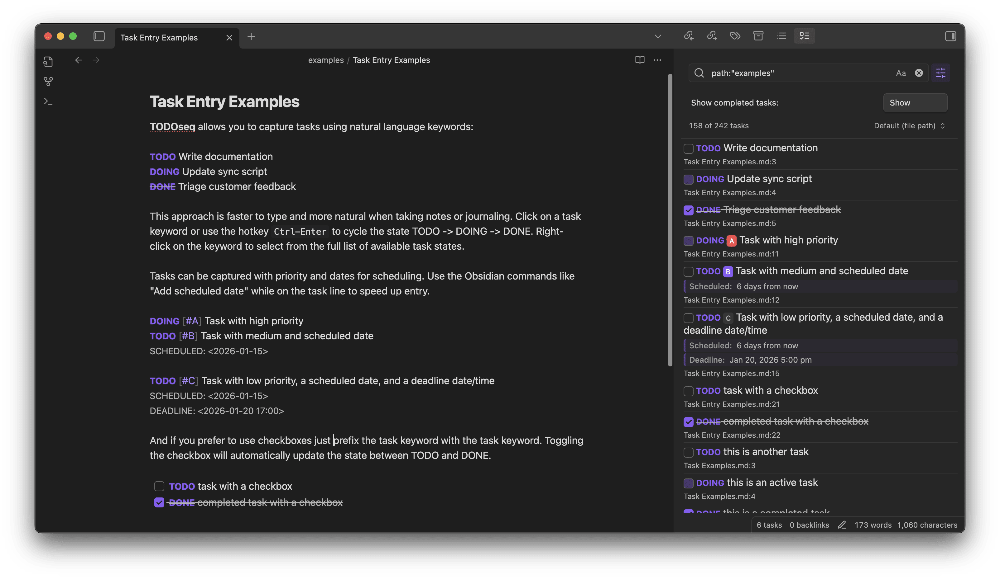

# TODOseq for Obsidian

<div class="ts-hero">

<p class="ts-tagline">Keyword-based task management for Obsidian. No checkboxes required.</p>

<p class="ts-sub">TODOseq ("to-do-seek") scans your vault for plain-text lines that start with state keywords like <code>TODO</code>, <code>DOING</code>, and <code>DONE</code>, then collects them into a unified Task List panel. Inspired by Emacs Org-mode and Logseq, it turns your existing notes into a real task system — without the checkbox ceremony. Free and open source.</p>

<p class="ts-ctas">
  <a class="ts-btn ts-btn-primary" href="https://obsidian.md/plugins?id=todoseq">Install TODOseq</a>
  <a class="ts-btn ts-btn-ghost" href="https://github.com/scross01/obsidian-todoseq">Star on GitHub</a>
</p>

</div>

<div class="ts-shot">

{.ts-shot-img}

</div>

## Why TODOseq?

<div class="ts-grid">

<div class="ts-card">
<h3>No checkbox syntax</h3>
<p>Write <code>TODO Write report</code> as a plain line anywhere in your vault. No <code>- [ ]</code> prefixes to remember — the keyword is the task.</p>
</div>

<div class="ts-card">
<h3>Logseq &amp; Org-mode compatible</h3>
<p>Existing Logseq task lines work as-is, and Org-style <code>SCHEDULED:</code> / <code>DEADLINE:</code> dates are supported. Dual-use a vault or migrate at your own pace.</p>
</div>

<div class="ts-card">
<h3>Natural-language dates</h3>
<p>Type <em>tomorrow</em>, <em>every Friday</em>, or <em>daily 20:00</em> and TODOseq converts it to a structured date as you finish typing.</p>
</div>

<div class="ts-card">
<h3>Finds TODOs in code</h3>
<p>Comments like <code>// TODO Refactor this</code> are collected as tasks across 20+ programming languages — no extra setup.</p>
</div>

<div class="ts-card">
<h3>Embedded task lists</h3>
<p>Drop a <code>todoseq</code> code block into any note to render a live, filtered view of your tasks — a dynamic in-note dashboard.</p>
</div>

<div class="ts-card">
<h3>Priorities, subtasks, repeats</h3>
<p>Mark <code>[#A]</code>/<code>[#B]</code>/<code>[#C]</code> priorities, track subtask progress as <code>[1/3]</code>, and let repeating tasks advance their dates automatically.</p>
</div>

</div>

## Examples

Tasks are just lines in your notes:

```markdown
TODO [#A] Finish quarterly report #work tomorrow
SCHEDULED: <2026-01-31>

DOING [#B] Review pull requests #coding

DONE Submit expense report
```

Click any task keyword (or press `Ctrl+Enter`) to cycle its state in both Edit and Reading views, right in your note.

## Installation

### From Obsidian Community Plugins

1. Open **Settings → Community plugins** and make sure community plugins are enabled
2. Click **Browse**, search for **"TODOseq"**
3. Click **Install**, then **Enable**

Once enabled, the Task List opens in the right sidebar. You can always reopen it with the command palette: **TODOseq: Show task list**.

<a class="ts-btn ts-btn-primary" href="https://obsidian.md/plugins?id=todoseq">Install TODOseq from Obsidian</a>

### Manual (development build)

1. Clone the repository into your vault's `.obsidian/plugins` directory
2. Run `npm install` and `npm run build` in the repository root
3. Enable the plugin in **Settings → Community plugins**

## Documentation

<div class="ts-grid ts-grid-docs">

<div class="ts-doc"><a href="introduction.html">Introduction &amp; Philosophy</a><p>Task management approach and Logseq compatibility</p></div>
<div class="ts-doc"><a href="task-list.html">Task List</a><p>Using the dedicated task panel</p></div>
<div class="ts-doc"><a href="task-entry.html">Task Entry</a><p>Task syntax, keywords, and lifecycle</p></div>
<div class="ts-doc"><a href="editor.html">Editor Integration</a><p>Task display and interaction in the Markdown editor</p></div>
<div class="ts-doc"><a href="reader.html">Reader View</a><p>Task styling and interaction in Reading mode</p></div>
<div class="ts-doc"><a href="command-palette.html">Command Palette</a><p>Commands for common actions</p></div>
<div class="ts-doc"><a href="embedded-task-lists.html">Embedded Task Lists</a><p>Render live task lists inside notes</p></div>
<div class="ts-doc"><a href="search.html">Search</a><p>Advanced search syntax and filters</p></div>
<div class="ts-doc"><a href="settings.html">Settings</a><p>Configuration options and customization</p></div>
<div class="ts-doc"><a href="sort-methods.html">Sort Methods</a><p>How tasks are ordered in the panel</p></div>
<div class="ts-doc"><a href="urgency.html">Task Urgency</a><p>Urgency sorting and configuration</p></div>
<div class="ts-doc"><a href="warning-periods.html">Warning Periods</a><p>Control when tasks appear before their dates</p></div>
<div class="ts-doc"><a href="import.html">Import</a><p>Bring tasks in from other formats</p></div>
<div class="ts-doc"><a href="moving-tasks.html">Moving Tasks</a><p>Move tasks between notes and dates</p></div>
<div class="ts-doc"><a href="experimental-features.html">Experimental Features</a><p>Org-mode file support and more</p></div>

</div>

## Support

TODOseq is free, open-source software. If it saves you time, the best support is:

<a class="ts-btn ts-btn-primary" href="https://github.com/scross01/obsidian-todoseq">Star TODOseq on GitHub</a>

- Found a bug? Open an [issue](https://github.com/scross01/obsidian-todoseq/issues)
- Want to improve it? See [Contributing](https://github.com/scross01/obsidian-todoseq/blob/main/CONTRIBUTING.md)
- Questions? The [documentation](#documentation) covers everything from task syntax to urgency sorting

## License

MIT License - see [LICENSE](https://github.com/scross01/obsidian-todoseq/blob/main/LICENSE) for details.

<style>
.ts-hero { text-align:center; padding: 2.25rem 0 0.5rem; }
.ts-tagline { font-size: 1.9rem; line-height: 1.35; font-weight: 700; letter-spacing: -0.02em; margin: 0 0 1.1rem; color: var(--vp-c-text-1); }
.ts-sub { max-width: 44rem; margin: 0 auto 1.75rem; font-size: 1.02rem; line-height: 1.6; color: var(--vp-c-text-2); }
.ts-sub code { color: var(--vp-c-text-code); }
.ts-ctas { display: flex; gap: 0.75rem; justify-content: center; flex-wrap: wrap; }
.ts-btn { display: inline-flex; align-items: center; gap: 0.4rem; padding: 0.62rem 1.35rem; border-radius: 8px; font-weight: 600; font-size: 0.95rem; text-decoration: none; transition: background-color .2s, border-color .2s, color .2s; }
.ts-btn-primary { background: var(--vp-c-brand-1); color: #fff; }
.ts-btn-primary:hover { background: var(--vp-c-brand-2); color: #fff; text-decoration: none; }
.ts-btn-ghost { background: var(--vp-c-bg-alt); color: var(--vp-c-text-1); border: 1px solid var(--vp-c-divider); }
.ts-btn-ghost:hover { border-color: var(--vp-c-brand-1); color: var(--vp-c-brand-1); text-decoration: none; }
.ts-shot { margin: 2.25rem 0 2.75rem; }
.ts-shot img.ts-shot-img { width: 100%; border-radius: 10px; border: 1px solid var(--vp-c-divider); box-shadow: 0 14px 44px rgba(0,0,0,.14); display: block; }
.ts-grid { display: grid; grid-template-columns: repeat(auto-fit, minmax(250px, 1fr)); gap: 1rem; margin: 1.5rem 0 2rem; }
.ts-card { background: var(--vp-c-bg-soft); border: 1px solid var(--vp-c-divider); border-radius: 10px; padding: 1.2rem 1.25rem; }
.ts-card h3 { margin: 0 0 0.4rem; font-size: 1.02rem; }
.ts-card p { margin: 0; color: var(--vp-c-text-2); font-size: 0.92rem; line-height: 1.55; }
.ts-card code, .ts-doc code { font-size: 0.85em; }
.ts-grid-docs { grid-template-columns: repeat(auto-fit, minmax(280px, 1fr)); gap: 0.75rem 1.75rem; }
.ts-doc a { font-weight: 600; }
.ts-doc p { margin: 0.15rem 0 0; color: var(--vp-c-text-2); font-size: 0.88rem; line-height: 1.45; }
@media (max-width: 640px) {
  .ts-tagline { font-size: 1.55rem; }
  .ts-grid, .ts-grid-docs { grid-template-columns: 1fr; }
}
</style>