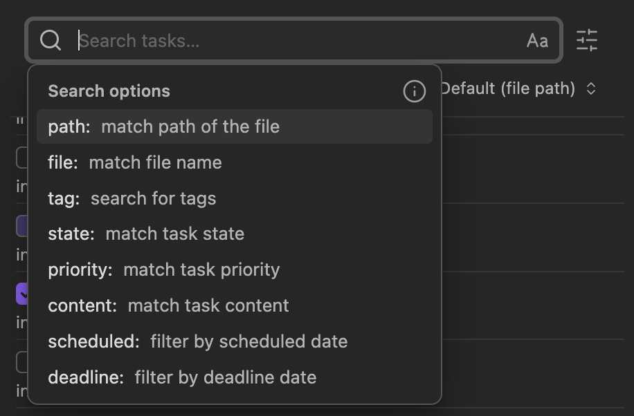

# Search Functionality

The search field in the TODOseq Task List provides a powerful search system that allows you to quickly find and filter tasks across your entire vault. This guide covers all aspects of the search functionality, from basic filtering to advanced query syntax.



## Basic Search

### Search Field Overview

The search field is located in the Task List toolbar and provides live filtering as you type. Basic search matches the entered text against task text, file path, and filename

### Search Shortcuts

**Focus Search Field:**

- Press `/` to focus the search field (unless already typing in another input)

**Clear Search:**

- Press `Escape` to clear the current search and remove focus

**Toggle Case Sensitivity:**

- Click the "A/a" button in the toolbar to toggle case-sensitive matching

## Advanced Search Syntax

TODOseq supports sophisticated search queries with boolean logic and grouping.

### Exact Phrase Search

Use double quotes to search for exact phrases:

```txt
"write documentation"
```

This will only match tasks containing the exact sequence "write documentation".

### OR Logic

Use `OR` to match either term:

```txt
meeting OR call
```

This will match tasks containing "meeting" OR "call".

### AND Logic (Implicit)

Multiple terms without operators use implicit AND:

```txt
meeting work
```

This will match tasks containing BOTH "meeting" AND "work".

### Exclusion (NOT Logic)

Use `-` to exclude terms:

```txt
meeting -personal
```

This will match tasks containing "meeting" but NOT "personal".

### Grouping with Parentheses

Use parentheses for complex expressions:

```txt
(meeting OR call) -personal
```

This will match tasks containing "meeting" OR "call" but NOT "personal".

### Multiple Exclusions

You can exclude multiple terms:

```txt
project -personal -home
```

This will match tasks containing "project" but excluding both "personal" and "home".

### Advanced Search Examples

```txt
"send email" (projectX OR projectY) -external
```

Find "send email" tasks that mentions either "projectX" or "projectY" but excludes "external".

```txt
(meeting OR call) project -weekend
```

Find project-related meetings or calls that don't mention "weekend".

```txt
work (home OR office) -phone
```

Find work tasks related to home or office, excluding phone related ones.

## Prefix Filters

TODOseq supports filters keywords similar to Obsidians general vault search for targeted searching.

### Available Prefix Filters

| Prefix       | Description                             | Example                |
| ------------ | --------------------------------------- | ---------------------- |
| `path:`      | Find tasks in specific file paths       | `path:Journal`         |
| `file:`      | Find tasks in files with matching names | `file:meeting.md`      |
| `tag:`       | Find tasks containing specific tags     | `tag:urgent`           |
| `state:`     | Find tasks with specific states         | `state:DOING`          |
| `priority:`  | Find tasks with specific priorities     | `priority:high`        |
| `content:`   | Find tasks with specific content        | `content:project`      |
| `scheduled:` | Find tasks with scheduled dates         | `scheduled:due`        |
| `deadline:`  | Find tasks with deadline dates          | `deadline:"this week"` |
| `property:`  | Find tasks based on page properties     | `property:[type:Project]` |

### Using Search filters

Search filters can be used alone or combined with other search terms:

```txt
path:projects
```

Find all tasks in the "projects" folder.

```txt
file:meeting content:project
```

Find tasks in with "project" in the task detailns only in files containing "meeting" in the file name.

```txt
state:TODO priority:high
```

Find high priority tasks that are in TODO state.

```txt
property:[type:Project]
```

Find tasks on pages marked as projects.

### Combining Multiple Prefixes

```txt
path:work tag:urgent state:TODO
```

Find #urgent tagged TODO tasks in the work folder.

```txt
file:report scheduled:"this week" priority:high
```

Find high priority tasks scheduled for this week in files with "report" in the file name.

```txt
property:[type:Project] state:TODO priority:high
```

Find high priority TODO tasks on pages marked as projects.

## Property Search

You can search for tasks based on page properties (frontmatter/YAML metadata). This allows you to filter tasks by the properties set on your markdown files, providing a powerful way to organize and find tasks based on document context.

### Basic Property Search

To search for tasks on pages with a specific property, use brackets with the property name and value separated by a colon. For example, to find all tasks on pages marked as a "Project", you would use `["type":Project]`. The property name and value are separated by a colon within the brackets. You can use quotes around either the property name or value for exact matching. Without quotes, the search will match partially (case insensitive by default).

```txt
["type":Project]
```

This syntax follows Obsidian's native property search format, making it familiar if you've used Obsidian's property search before. The quotes are optional but recommended for exact matching.

### Key-Only Search

You can also search for pages that have a specific property regardless of its value. Use `[type:]` or just `[type]` to find all pages with the `type` property set. This is useful when you want to see all tasks on pages of a certain category, regardless of their specific status or other property values.

```txt
[type:]
```

This will match all pages that have a `type` property, whether it's set to "Project", "Personal", "Note", or any other value.

### Exact vs Partial Matching

By default, property searches match partially. The search `[type:ject]` would match "Project" because "ject" is contained within "Project". For exact matching, use quotes around the value: `["type":"Project"]`. This will only match pages where the property value is exactly "Project".

```txt
["type":"Project"]
```

Exact matching is case sensitive, while partial matching is case insensitive by default. You can also toggle case sensitivity using the A/a button in the toolbar.

### Negation

You can exclude pages with specific properties using the minus sign. For example, `-[type:Personal]` will exclude all pages where the type property is "Personal".

```txt
-[type:Personal]
```

This is particularly useful when you want to focus on work-related tasks and exclude personal ones.

### Null Values

You can search for properties that exist but have no value using `[type:null]` or `[type:]`. This is different from searching for pages where the property doesn't exist at all. Null value matching is useful for finding pages where a property has been initialized but not yet filled in.

```txt
[type:null]
```

This will match pages where the `type` property exists but has no value assigned to it.

### OR Operator

You can combine multiple values using the OR operator within a property search. For example, `[status:Draft OR Published]` will match pages where the status is either "Draft" or "Published".

```txt
[status:Draft OR Published]
```

This allows you to search for tasks across multiple related categories without needing separate searches.

### Type-Aware Comparisons

For numeric properties, you can use comparison operators like `>`, `<, `>=`, and `<=`. For example, `["size":>100]` matches pages where the size property is greater than 100.

```txt
["priority":>5]
```

This type-aware comparison works with numeric values and allows for more precise filtering based on quantitative properties.

### Top-Level Properties Only

Property search only supports top-level properties, not nested ones. This means you can search for `[type:Project]` but not for `[project.type:Feature]`. This limitation aligns with Obsidian's property search behavior.

### Combined Filters

You can combine property searches with other search terms and filters. For example, `state:TODO [type:Project]` will find TODO tasks on Project pages.

```txt
state:TODO [type:Project] priority:high
```

This example finds high-priority TODO tasks on pages marked as projects, demonstrating how property search integrates with the rest of the search system.

## Date Filter Expressions

TODOseq provides powerful date-based filtering expressions.

### Basic Date Expressions

| Expression   | Description                        |
| ------------ | ---------------------------------- |
| `overdue`    | Tasks that are past their deadline |
| `due`        | Tasks due today or overdue         |
| `today`      | Tasks due today                    |
| `tomorrow`   | Tasks due tomorrow                 |
| `this week`  | Tasks due this week\*              |
| `next week`  | Tasks due next week\*              |
| `this month` | Tasks due this month               |
| `next month` | Tasks due next month               |

\*Weeks start on Monday by default, this can be changed in the settings.

### Date Expression Examples

```txt
scheduled:today
```

Find tasks scheduled for today.

```txt
deadline:overdue
```

Find tasks with overdue deadlines.

```txt
scheduled:"this week"
```

Find tasks scheduled for the current week.

```txt
deadline:"next month"
```

Find tasks with deadlines in the next month.

### Next N Days Expression

```txt
scheduled:"next 7 days"
```

Find tasks scheduled in the next 7 days.

```txt
deadline:"next 14 days"
```

Find tasks with deadlines in the next 14 days.

## Date Range Syntax

Use `..` to specify date ranges in `YYYY-MM-DD` format.

### Date Range Examples

```txt
scheduled:2026-01-01..2026-01-31
```

Find tasks scheduled in January 2026.

```txt
deadline:2026-06-01..2026-06-30
```

Find tasks with deadlines in June 2026.

```txt
scheduled:2026-01-01..2026-03-31
```

Find tasks scheduled in Q1 2026.

### Combining Date Ranges with Other Filters

```txt
scheduled:2026-01-01..2026-01-31 priority:high
```

Find high priority tasks scheduled in January 2026.

```txt
deadline:2026-06-01..2026-06-30 state:TODO
```

Find TODO tasks with deadlines in June 2026.

## Priority Filter Values

TODOseq supports multiple ways to filter by priority.

| Value  | Description                    |
| ------ | ------------------------------ |
| `high` | High priority tasks (`[#A]`)   |
| `med`  | Medium priority tasks (`[#B]`) |
| `low`  | Low priority tasks (`[#C]`)    |
| `A`    | Short form for high priority   |
| `B`    | Short form for medium priority |
| `C`    | Short form for low priority    |
| `none` | Tasks without priority         |

### Priority Filter Examples

```txt
priority:high
```

Find high priority tasks.

```txt
priority:med -state:DOING
```

Find medium priority tasks excluding those in DOING state.

```txt
priority:a OR priority:b
```

Find high or medium priority tasks.

```txt
priority:none
```

Find tasks without priority assignments.

## Combining Search Techniques

TODOseq allows combining all search features for powerful, targeted filtering.

### Complex Query Examples

```txt
path:projects tag:urgent priority:high scheduled:"this week"
```

Find urgent, high priority tasks scheduled for this week in the projects folder.

```txt
(file:meeting OR file:notes) content:project state:TODO -tag:blocked
```

Find TODO project tasks in meeting or notes files, excluding task with the #blocked tag.

```txt
"code review" (state:TODO OR state:DOING) deadline:"next 7 days"
```

Find code review tasks that are TODO or DOING with deadlines in the next 7 days.

```txt
path:work/ scheduled:2026-01-01..2026-01-31 priority:A OR priority:B
```

Find high or medium priority tasks scheduled in January 2026 in the work folder.

```txt
property:[type:Project] (state:TODO OR state:DOING) -[status:Blocked]
```

Find TODO or DOING tasks on project pages, excluding those with blocked status.

## Search Logic and Behavior

### Search Matching Rules

1. **Case Sensitivity**: Off by default, toggle with A/a button
2. **Whitespace**: Multiple spaces are treated as single space
3. **Punctuation**: Most punctuation is treated as literal characters
4. **Order**: Search terms can appear in any order in results
5. **Proximity**: Terms don't need to be adjacent unless using quotes
