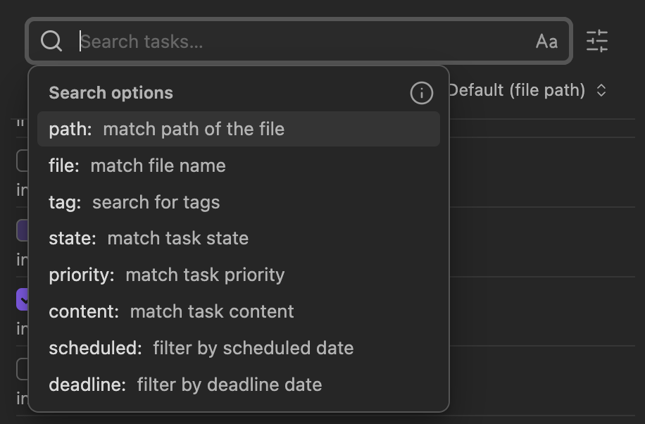

# Search Functionality

The search field in the TODOseq Task List provides a powerful search system that allows you to quickly find and filter tasks across your entire vault. This guide covers all aspects of the search functionality, from basic filtering to advanced query syntax.



## Basic Search

### Search Field Overview

The search field is located in the Task List toolbar and provides live filtering as you type. Basic search matches the entered text against task text, file path, and filename.

### Search Shortcuts

**Focus Search Field:**

Press `/` to focus the search field (unless already typing in another input).

**Clear Search:**

Press `Escape` to clear the current search and remove focus.

**Toggle Case Sensitivity:**

Click the "A/a" button in the toolbar to toggle case-sensitive matching.

## Advanced Search Syntax

TODOseq supports sophisticated search queries with boolean logic and grouping.

### Exact Phrase Search

Use double quotes to search for exact phrases:

```txt
"write documentation"
```

This will only match tasks containing the exact sequence "write documentation".

### OR Logic

Use `OR` to match either term:

```txt
meeting OR call
```

This will match tasks containing "meeting" OR "call".

### AND Logic (Implicit)

Multiple terms without operators use implicit AND:

```txt
meeting work
```

This will match tasks containing BOTH "meeting" AND "work".

### Exclusion (NOT Logic)

Use `-` to exclude terms:

```txt
meeting -personal
```

This will match tasks containing "meeting" but NOT "personal".

### Grouping with Parentheses

Use parentheses for complex expressions:

```txt
(meeting OR call) -personal
```

This will match tasks containing "meeting" OR "call" but NOT "personal".

### Multiple Exclusions

You can exclude multiple terms:

```txt
project -personal -home
```

This will match tasks containing "project" but excluding both "personal" and "home".

### Advanced Search Examples

```txt
"send email" (projectX OR projectY) -external
```

Find "send email" tasks that mention either "projectX" or "projectY" but exclude "external".

```txt
(meeting OR call) project -weekend
```

Find project-related meetings or calls that don't mention "weekend".

```txt
work (home OR office) -phone
```

Find work tasks related to home or office, excluding phone related ones.

## Search Filters

TODOseq supports filter keywords similar to Obsidian's general vault search for targeted searching.

### Available Prefix Filters

| Prefix       | Description                               | Example                   |
| ------------ | ----------------------------------------- | ------------------------- |
| `path:`      | Find tasks in specific file paths         | `path:Journal`            |
| `file:`      | Find tasks in files with matching names   | `file:meeting.md`         |
| `tag:`       | Find tasks containing specific tags       | `tag:urgent`              |
| `state:`     | Find tasks with specific states or groups | `state:active`            |
| `priority:`  | Find tasks with specific priorities       | `priority:high`           |
| `content:`   | Find tasks with specific content          | `content:project`         |
| `scheduled:` | Find tasks with scheduled dates           | `scheduled:due`           |
| `deadline:`  | Find tasks with deadline dates            | `deadline:"this week"`    |
| `closed:`    | Find tasks by closed date                 | `closed:yesterday`        |
| `property:`  | Find tasks based on page properties       | `property:[type:Project]` |

### Using Search Filters

Search filters can be used alone or combined with other search terms:

```txt
path:projects
```

Find all tasks in the "projects" folder.

```txt
file:meeting content:project
```

Find tasks with "project" in the task details only in files containing "meeting" in the file name.

```txt
state:TODO priority:high
```

Find high priority tasks that are in TODO state.

The `state:` filter and state autocomplete suggestions follow the effective keyword configuration from settings. This includes custom keywords and advanced built-in overrides. Archived keywords are excluded from state search suggestions because archived tasks are not collected into the task index.

```txt
[type:Project]
```

Find tasks on pages marked as projects.

### State Group Keywords

In addition to matching individual state keywords (e.g., `state:TODO`, `state:DOING`), the `state:` filter supports group keywords that match all tasks belonging to a keyword group. These group keywords are resolved dynamically based on your settings, so any custom keywords you have configured are included automatically.

| Group Keyword | Description                                                                                                   |
| ------------- | ------------------------------------------------------------------------------------------------------------- |
| `active`      | Matches all active state keywords (default: NOW, DOING, IN-PROGRESS, plus any custom active keywords)         |
| `inactive`    | Matches all inactive state keywords (default: TODO, LATER, plus any custom inactive keywords)                 |
| `waiting`     | Matches all waiting state keywords (default: WAIT, WAITING, plus any custom waiting keywords)                 |
| `completed`   | Matches all completed state keywords (default: DONE, CANCELED, CANCELLED, plus any custom completed keywords) |

#### State Group Examples

```txt
state:active
```

Find all tasks in any active state (NOW, DOING, IN-PROGRESS, and any custom active keywords).

```txt
state:inactive priority:high
```

Find high priority tasks in any inactive state (TODO, LATER, and any custom inactive keywords).

```txt
-state:completed
```

Find all tasks that are not in a completed state. This is a convenient alternative to excluding each completed keyword individually.

```txt
state:active OR state:waiting
```

Find all tasks that are either active or waiting.

```txt
[type:Project] state:active deadline:"this week"
```

Find active tasks on project pages with deadlines this week.

Group keywords must be lowercase (`state:active`, `state:inactive`, `state:waiting`, `state:completed`). Using uppercase (e.g., `state:ACTIVE`) will perform a regular exact match against a task keyword named "ACTIVE" rather than matching the group. This ensures group keywords and individual task keywords never conflict.

## Date Filter Expressions

TODOseq provides powerful date-based filtering expressions.

### Basic Date Expressions

| Expression   | Description                        |
| ------------ | ---------------------------------- |
| `overdue`    | Tasks that are past their deadline |
| `due`        | Tasks due today or overdue         |
| `today`      | Tasks due today                    |
| `tomorrow`   | Tasks due tomorrow                 |
| `this week`  | Tasks due this week\*              |
| `next week`  | Tasks due next week\*              |
| `this month` | Tasks due this month               |
| `next month` | Tasks due next month               |

\*Weeks start on Monday by default; this can be changed in the settings.

### Date Expression Examples

```txt
scheduled:today
```

Find tasks scheduled for today.

```txt
deadline:overdue
```

Find tasks with overdue deadlines.

```txt
scheduled:"this week"
```

Find tasks scheduled for the current week.

```txt
deadline:"next month"
```

Find tasks with deadlines in the next month.

### Next N Days Expression

```txt
scheduled:"next 7 days"
```

Find tasks scheduled in the next 7 days.

```txt
deadline:"next 14 days"
```

Find tasks with deadlines in the next 14 days.

## Date Range Syntax

Use `..` to specify date ranges in `YYYY-MM-DD` format.

### Date Range Examples

```txt
scheduled:2026-01-01..2026-01-31
```

Find tasks scheduled in January 2026.

```txt
deadline:2026-06-01..2026-06-30
```

Find tasks with deadlines in June 2026.

```txt
scheduled:2026-01-01..2026-03-31
```

Find tasks scheduled in Q1 2026.

### Combining Date Ranges with Other Filters

```txt
scheduled:2026-01-01..2026-01-31 priority:high
```

Find high priority tasks scheduled in January 2026.

```txt
deadline:2026-06-01..2026-06-30 state:TODO
```

Find TODO tasks with deadlines in June 2026.

## Closed Date Filter Expressions

The `closed:` prefix filters tasks by when they were marked as complete. It supports unique expressions tailored for completed tasks.

### Closed Date Expressions

| Expression    | Description                                 |
| ------------- | ------------------------------------------- |
| `today`       | Tasks closed today                          |
| `yesterday`   | Tasks closed yesterday                      |
| `last 7 days` | Tasks closed in the last 7 days (inclusive) |
| `last week`   | Tasks closed last calendar week\*           |
| `last month`  | Tasks closed last calendar month            |
| `this week`   | Tasks closed this week\*                    |
| `this month`  | Tasks closed this month                     |
| `none`        | Tasks that are not closed                   |

\*Weeks start on Monday by default; this can be changed in the settings.

### Closed Date Expression Examples

```txt
closed:today
```

Find tasks closed today.

```txt
closed:yesterday
```

Find tasks closed yesterday.

```txt
closed:"last 7 days"
```

Find tasks closed in the last 7 days.

```txt
closed:"last week"
```

Find tasks closed last calendar week.

```txt
closed:"this month"
```

Find tasks closed this month.

```txt
closed:none
```

Find tasks that are not yet closed.

### Closed Date Range Syntax

Use `..` to specify date ranges in `YYYY-MM-DD` format for closed dates.

```txt
closed:2026-01-01..2026-01-31
```

Find tasks closed in January 2026.

### Combining Closed Date with Other Filters

```txt
closed:"last 7 days" priority:high
```

Find high priority tasks closed in the last 7 days.

```txt
closed:2026-01-01..2026-01-31 state:DONE
```

Find tasks marked as DONE in January 2026.

## Priority Filter Values

TODOseq supports multiple ways to filter by priority.

| Value  | Description                    |
| ------ | ------------------------------ |
| `high` | High priority tasks (`[#A]`)   |
| `med`  | Medium priority tasks (`[#B]`) |
| `low`  | Low priority tasks (`[#C]`)    |
| `A`    | Short form for high priority   |
| `B`    | Short form for medium priority |
| `C`    | Short form for low priority    |
| `none` | Tasks without priority         |

### Priority Filter Examples

```txt
priority:high
```

Find high priority tasks.

```txt
priority:med -state:DOING
```

Find medium priority tasks excluding those in DOING state.

```txt
priority:a OR priority:b
```

Find high or medium priority tasks.

```txt
priority:none
```

Find tasks without priority assignments.

## Property Search

You can search for tasks based on page properties (frontmatter/YAML metadata). This allows you to filter tasks by the properties set on your markdown files, providing a powerful way to organize and find tasks based on document context.

### Basic Property Search

To search for tasks on pages with a specific property, use brackets with the property name and value separated by a colon. For example, to find all tasks on pages marked as a "Project", you would use `[type:Project]`. The property name and value are separated by a colon within the brackets. You can use quotes around either the property name or value for exact matching. Without quotes, the search will match partially (case insensitive by default).

```txt
[type:Project]
```

This syntax is consistent with Obsidian's native property search format, making it familiar if you've used Obsidian's property search before. The quotes are optional but recommended for exact matching.

### Key-Only Search

You can also search for pages that have a specific property regardless of its value. Use `[type:]` or just `[type]` to find all pages with the `type` property set. This is useful when you want to see all tasks on pages of a certain category, regardless of their specific status or other property values.

```txt
[type:]
```

This will match all pages that have a `type` property, whether it's set to "Project", "Personal", "Note", or any other value.

### Exact vs Partial Matching

By default, property searches match partially. The search `[type:ject]` would match "Project" because "ject" is contained within "Project". For exact matching, use quotes around the value: `[type:"Project"]`. This will only match pages where the property value is exactly "Project".

```txt
[type:"Project"]
```

Exact matching is case sensitive, while partial matching is case insensitive by default. You can also toggle case sensitivity using the A/a button in the toolbar.

### Negation

You can exclude pages with specific properties using the minus sign. For example, `-[type:Personal]` will exclude all pages where the type property is "Personal".

```txt
-[type:Personal]
```

This is particularly useful when you want to focus on work-related tasks and exclude personal ones.

### Null Values

You can search for properties that exist but have no value using `[type:null]` or `[type:]`. This is different from searching for pages where the property doesn't exist at all. Null value matching is useful for finding pages where a property has been initialized but not yet filled in.

```txt
[type:null]
```

This will match pages where the `type` property exists but has no value assigned to it.

### OR Operator

You can combine multiple values using the OR operator within a property search. For example, `[status:Draft OR Published]` will match pages where the status is either "Draft" or "Published".

```txt
[status:Draft OR Published]
```

This allows you to search for tasks across multiple related categories without needing separate searches.

### Type-Aware Comparisons

For numeric properties, you can use comparison operators like `>`, `<`, `>=`, and `<=`. For example, `["size":>100]` matches pages where the size property is greater than 100.

```txt
["priority":>5]
```

This type-aware comparison works with numeric values and allows for more precise filtering based on quantitative properties.

### Date Property Comparisons

Comparison operators also work with date properties, enabling you to filter tasks based on page property date ranges. You can use `>`, `<`, `>=`, and `<=` with dates in `YYYY-MM-DD` format to find tasks with dates before or after a specific point in time.

```txt
[deadline:>2026-01-15]
```

This finds tasks on pages with a deadline property after January 15, 2026. Similarly, `[created:<2026-01-01]` would find tasks created before the start of 2026.

### Checkbox (Boolean) Property Search

Boolean properties can be searched using `true` and `false` values.

```txt
[published:true]
```

This finds tasks on pages where the published property is set to true. Conversely, `[active:false]` would find tasks on pages where the active property is explicitly set to false.

### Array Property Matching

When a property contains multiple values (an array or list), the search will match if any element in the array matches your search term. For example, if a page has `tags: [work, urgent]`, both `[tags:work]` and `[tags:urgent]` will match that page.

```txt
[tags:work]
```

This finds tasks on pages where "work" appears anywhere in the tags array.

### Property Search Cache

TODOseq builds its own index of all properties across your vault for fast, efficient searching. This approach ensures that property searches work even for files that haven't been recently accessed, providing comprehensive coverage of your entire vault.

The property search engine automatically updates when files change, ensuring that your search results are always current.

## Combining Search Techniques

TODOseq allows combining all search features for powerful, targeted filtering.

### Complex Query Examples

```txt
path:projects tag:urgent priority:high scheduled:"this week"
```

Find urgent, high priority tasks scheduled for this week in the projects folder.

```txt
(file:meeting OR file:notes) content:project state:TODO -tag:blocked
```

Find TODO project tasks in meeting or notes files, excluding tasks with the #blocked tag.

```txt
"code review" (state:TODO OR state:DOING) deadline:"next 7 days"
```

Find code review tasks that are TODO or DOING with deadlines in the next 7 days.

```txt
path:work/ scheduled:2026-01-01..2026-01-31 priority:A OR priority:B
```

Find high or medium priority tasks scheduled in January 2026 in the work folder.

```txt
[type:Project] (state:TODO OR state:DOING) -[status:Blocked]
```

Find TODO or DOING tasks on project pages, excluding those with blocked status.

```txt
[type:Project] state:active deadline:"this week"
```

Find all active tasks on project pages with deadlines this week.

```txt
-state:completed priority:high scheduled:"this week"
```

Find high priority tasks scheduled this week that are not yet completed.

## Saved Searches

Saved searches let you save frequently used search queries along with their view settings as named presets. This allows you to quickly switch between custom views like "Agenda", "Overdue", or "Active" with a single click.

### What Gets Saved

A saved search captures the complete view configuration:

- **Name** - a label for the search (e.g., "Today", "Overdue", "Active")
- **Search query** - the full search string
- **View mode** - optional override (show all / sort completed last / hide completed)
- **Sort method** - optional override (scheduled / deadline / priority / urgency / etc.)
- **Future task sorting** - optional override (show / show upcoming / sort to end / hide)
- **Match case** - optional override (on / off)

When a saved search has optional settings, those override the current view settings when applied. If a setting is not specified in the saved search, the current global setting is used.

When a saved search has optional settings, those override the current view settings when applied. If a setting is not specified in the saved search, the current global setting is used.

### Default Presets

TODOseq ships with three default saved searches:

| Name    | Query              | Sort           | View Mode      | Future Tasks |
| ------- | ------------------ | -------------- | -------------- | ------------ |
| Today   | `scheduled:today`  | Scheduled date | Hide completed | Hide         |
| Overdue | `deadline:overdue` | Deadline date  | Hide completed | Hide         |
| Active  | `state:active`     | Urgency        | Sort to end    | Hide         |

Default presets are fully editable and deletable, just like user-created saved searches.

### Saving a Search

1. Type a search query in the search bar and adjust the view settings (sort, view mode, future tasks, match case) to your liking
2. Click the **bookmark icon** that appears in the search input area
3. Enter a name for the search in the dialog that opens
4. Optionally adjust the match case setting in the dialog (On / Off / Use current setting)
5. Click **Save**

The bookmark icon only appears when the search input is non-empty. If the current search matches an existing saved search, clicking the bookmark icon opens the edit dialog instead.

### Applying a Saved Search

1. Open the search dropdown by clicking on or focusing the search input
2. Find the **Saved Searches** section in the dropdown
3. Click on a saved search name to apply it

When a saved search is applied:

- The search query is set in the search input
- View mode, sort method, and future task settings are applied if specified
- The list immediately re-renders with the saved configuration

### Editing a Saved Search

1. Open the search dropdown
2. Hover over a saved search to reveal the **edit** (pencil) icon
3. Click the edit icon to open the edit dialog
4. Modify the name, query, or any of the settings (including match case)
5. Click **Save changes**

### Deleting a Saved Search

There are two ways to delete a saved search:

**From the dropdown:**

1. Open the search dropdown
2. Hover over a saved search to reveal the **delete** (trash) icon
3. Click the delete icon

**From the edit dialog:**

1. Open the edit dialog for the saved search (click the pencil icon in the dropdown, or click the bookmark icon when the search input matches a saved search)
2. Click the **Delete** button
3. Confirm the deletion

### Saving from Search History

Each search history item has a small **bookmark icon** that appears on hover. Clicking it opens the save dialog with the history query pre-filled, making it easy to promote a recent search to a saved preset.

### Visual Indicator

When viewing a saved search, the bookmark icon in the search bar is highlighted in the accent color, and the saved search name appears as a label near the search input. This helps you know when you're viewing a saved preset.

### Clearing a Saved Search

Pressing Escape or clicking the clear button exits the saved search view, just like clearing any search. The visual indicator disappears and the view returns to default.

## Search Logic and Behavior

### Search Matching Rules

1. **Case Sensitivity**: Off by default, toggle with A/a button
2. **Whitespace**: Multiple spaces are treated as single space
3. **Punctuation**: Most punctuation is treated as literal characters
4. **Order**: Search terms can appear in any order in results
5. **Proximity**: Terms don't need to be adjacent unless using quotes
