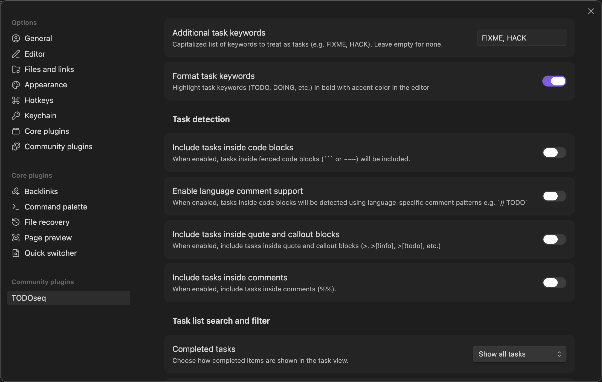

# Settings

TODOseq provides configuration options to customize the plugin to your workflow. This guide covers all available settings and their impact on functionality.



## Accessing Settings

Access TODOseq settings through Obsidian's settings interface:

1. Open Obsidian Settings
2. Navigate to "Community plugins"
3. Find "TODOseq" in the list
4. Click on "TODOseq" to view and edit settings

## General Settings

## Editor Integration Settings

### Format Task Keywords

**Setting**: "Format task keywords" toggle (in TODOseq settings)

**Description**: Enable or disable visual formatting of task keywords in both the editor and reader views.

**Default**: Enabled

**Visual Effects When Enabled:**

Task keywords (`TODO`, `DOING`, `DONE`, etc.) appear in bold font.
All task states use your Obsidian theme's accent color.See [Editor Integration](editor.md) and [Reader View](reader.md) documentation for full details.

## Task Recognition Settings

### Additional Task Keywords

**Setting**: "Additional Task Keywords" (comma-separated list)

**Description**: Add custom keywords to be identified as tasks.

**Format**: Comma-separated list of capitalized words (e.g., `FIXME, HACK, REVIEW`)

**Rules:**

- Keywords must be capitalized
- Are additive (doesn't replace default keywords)
- Only the active state keyword can be added - completion still uses DONE/CANCELED states

**Examples:**

```txt
FIXME, HACK, REVIEW, BLOCKED, IDEA
```

**Suggested Use Cases:**

- Software development: `FIXME`, `HACK`, `REVIEW`
- Research: `QUESTION`, `HYPOTHESIS`, `EXPERIMENT`
- Writing: `DRAFT`, `EDIT`, `REVISE`
- Project management: `BLOCKED`, `DEPENDENCY`, `APPROVAL`

**Custom Keyword Behavior:**

- Appear in Task List like default keywords
- Can be clicked to cycle states
- Follow same state sequences as similar default keywords

### Include Tasks Inside Code Blocks

**Setting**: "Include tasks inside code blocks" (toggle)

**Description**: Enable or disable task detection within fenced code blocks.

**Default**: Disabled

**Impact:**

- **Enabled**: Tasks in code blocks are detected and shown in Task List
- **Disabled**: Code block tasks are ignored (better performance)

**Code Block Examples:**

<pre>
```text
TODO Write unit tests
FIXME Handle edge cases
```
</pre>

### Enable Language Comment Support

**Setting**: "Enable language comment support" (toggle)

**Description**: Enable language-aware commented task detection in code block comments.

**Requirement**: Must have "Include tasks inside code blocks" enabled first

**Default**: Disabled

**Code Block Examples:**

<pre>
```python
# TODO Write unit tests
# FIXME Handle edge cases
```
</pre>

**Supported Languages:**

**C-style languages**: C, C++, C#, Java, JavaScript, TypeScript, Go, Swift, Kotlin, Rust, PowerShell

- Comment syntax: `// TODO task` or `/* TODO task */`

**Scripting languages**: Python, Ruby, Shell/Bash, R

- Comment syntax: `# TODO task`

**Configuration languages**: YAML, TOML, INI

- YAML/TOML: `# TODO task`
- INI: `; TODO task`

**Other**: SQL, Dockerfile

- SQL: `-- TODO task`
- Dockerfile: `# TODO task`

**Language Detection:**

- Automatic based on code block language identifier
- Falls back to generic comment parsing if language unknown
- Supports 20+ programming languages

### Include Tasks Inside Quote and Callout Blocks

**Setting**: "Include tasks inside quote and callout blocks" (toggle)

**Description**: Enable or disable task detection in quoted lines and callout blocks.

**Default**: Disabled

**Supported Formats:**

<pre>
> TODO Task in a quote block

> [!info]
> TODO Task in an info callout

> [!todo]-
> - [ ] TODO Checkbox task in collapsible todo block
</pre>

**Use Cases:**

- Capture tasks from meeting notes in quotes
- Track action items in callout blocks
- Manage tasks in collapsible sections

### Include Tasks Inside Comment Blocks

**Setting**: "Include tasks inside comment blocks" (toggle)

**Description**: Enable or disable task detection inside multiline comment blocks.

**Default**: Disabled

## Task list search and filter settings

### Completed Tasks

**Setting**: "Completed tasks" dropdown

**Description**: Controls how completed tasks are displayed in the Task List view.

**Options:**

- **Show all tasks**: Display all tasks regardless of completion status
- **Sort completed to end**: Show completed tasks at the end of the list
- **Hide completed**: Only show incomplete tasks

**Default**: Show all tasks

### Future Dated Tasks

**Setting**: "Future dated tasks" dropdown

**Description**: Controls how tasks with future scheduled or deadline dates are displayed in the Task List view.

**Options:**

- **Show all**: Display all tasks normally (default behavior)
- **Sort to end**: Show future tasks at the end of the list, after current tasks
- **Show upcoming (7 days)**: Only show future tasks that are within the next 7 days
- **Hide future**: Hide all future tasks completely

**Default**: Show all

### Week Starts On

**Setting**: "Week starts on" (dropdown)

**Description**: Choose which day the week starts on for date filtering.

**Options:**

- **Monday**: Week starts on Monday (default, ISO standard)
- **Sunday**: Week starts on Sunday

**Impact:**

- Affects date-based filtering expressions:
  - `this week`
  - `next week`
- Does not affect absolute date ranges
- Does not change how dates are displayed

**Example Differences:**

With **Monday start**:

- Week 1: Mon Jan 1 - Sun Jan 7
- "this week" on Jan 3 includes Jan 1-7

With **Sunday start**:

- Week 1: Sun Dec 31 - Sat Jan 6
- "this week" on Jan 3 includes Dec 31 - Jan 6

## Other Settings

### Excluded files

TODOseq respects Obsidian's built-in file exclusion system ("Files & links" → "Excluded files"). Files and paths matching your exclusion patterns will not be scanned for tasks.

Obsidian does not notify plugins when the "Excluded files" setting has been modified. To update the task list you can use the "Rescan Vault" action from the command palette.

### Hotkeys

The Toggle task state command palette action is bound the `Ctrl+Enter` by default.

Use the Obsidian Hotkeys setting to add or remove Hot Keys for command palette actions.
