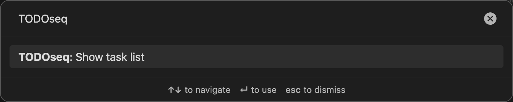
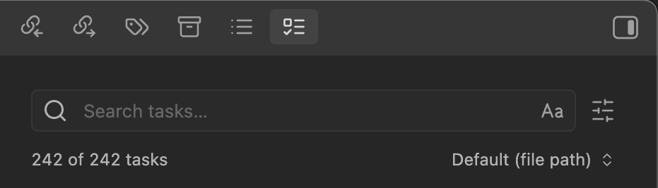
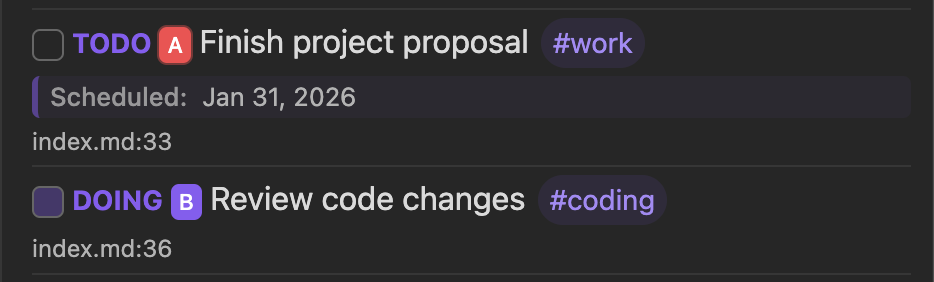

# Task List

The Task List is the central interface for managing all your tasks across your Obsidian vault. It provides a comprehensive overview of your tasks and powerful tools for task management.

## Opening the Task List

### Automatic Opening

The Task List automatically opens in the right sidebar when the TODOseq plugin is first enabled. You can drag and drop the panel to reposition it within the Obsidian interface, such as moving to different panel locations or making it a floating window.

### Command Palette

1. Open the command palette with `Ctrl/Cmd + P`
2. Search for "TODOseq: Show task list"
3. Select the command to open/show the Task List in the right sidebar

### Keyboard Shortcut

You can assign a custom keyboard shortcut to the "TODOseq: Show task list" command in Obsidian's Hotkeys settings.

## Task List Interface

The Task List consists of several key components:

### 1. Search and Settings Toolbar

Located at the top of the Task List, the toolbar contains:

- **Search field**: Live filtering of tasks as you type
- **Case sensitivity toggle**: Button to toggle case-sensitive search
- **View mode icons**: Three buttons for different task display modes
- **Sort method dropdown**: Choose how tasks are ordered
- **Task count**: Shows "X of Y tasks" based on current filters

### 2. Task List

The main area displays all detected tasks with the following information:

- **Checkbox**: Visual indicator of completion status
- **State keyword**: Colored badge showing task state (TODO, DOING, DONE, etc.). Right-click the badge to see all next state options
- **Priority badge**: Shows `[#A]`, `[#B]`, or `[#C]` if present
- **Task text**: The full text of the task
- **File path**: Shows the file name and line number location of the task in your vault. Hover the mouse over it to see the full path

## Task Interactions

### Clicking the State Keyword

Clicking the colored state keyword cycles the task through its state sequence:

- **Basic workflow**: TODO → DOING → DONE → TODO
- **Deferred tasks**: LATER → NOW → DONE
- **Waiting tasks**: WAIT → IN-PROGRESS → DONE
- **Cancelled tasks**: CANCELED → TODO

### Using the Checkbox

The checkbox provides a simple toggle between completed and incomplete states:

- **Check the box**: Task state changes to DONE
- **Uncheck the box**: Task state changes to TODO
- **Automatic synchronization**: Both the keyword and checkbox are updated

### Right-Click Context Menu

Right-click any **task keyword** to see all available state options in a popup menu. This shows all possible states for the current task type, allows direct selection of any state, and provides quick access to less commonly used states.

### Opening Source Location

Clicking on a task row opens the source file in a smart, intuitive way that adapts to your workflow. The behavior varies based on how you click:

**Simple click** opens the file by reusing existing tabs whenever possible. If you already have markdown tabs open, TODOseq will use those to display the new page, keeping your workspace clean and organized. If no tabs are available, it opens in the current active pane or creates a new tab.

**Shift-click** creates a new split pane and opens the file there. This is perfect for when you want to reference the task while working on something else in your main workspace.

**Ctrl/Cmd-click** always opens the file in a brand new tab, ensuring you have a fresh workspace for the task without disrupting your current view.

In all cases, TODOseq navigates to the exact line containing the task and focuses the editor for immediate editing.

## Sort Methods

Choose how tasks are ordered using the sort method dropdown:

### 1. Default (File Path + Line Number)

Tasks sorted alphabetically by vault file path and file name. Within each file, tasks are sorted by line number.

### 2. Scheduled Date

Tasks sorted by their SCHEDULED date. Tasks without scheduled dates appear at the end, with earlier dates appearing first. When two tasks have the same scheduled date, they are sorted by keyword group and position, then by file path and line number.

### 3. Deadline Date

Tasks sorted by their DEADLINE date. Tasks without deadline dates appear at the end, with earlier deadlines appearing first. When two tasks have the same deadline date, they are sorted by keyword group and position, then by file path and line number.

### 4. Priority

Tasks sorted by priority: High (`[#A]`) > Medium (`[#B]`) > Low (`[#C]`) > No priority. Within each priority level, tasks are sorted by keyword group and position, then by file path and line number.

### 5. Urgency

Tasks sorted by calculated urgency score (highest to lowest). Urgency is calculated based on multiple factors including due dates, priority, tags, and task state. Tasks with no urgency score appear at the end, and completed tasks are not included in urgency sorting. When two tasks have the same urgency score, they are sorted by keyword group and position, then by file path and line number.

### 6. Keyword

Tasks are sorted by effective keyword group and keyword order from your settings. That means custom keywords and advanced built-in overrides both affect this sort.

Tasks are classified into 4 ordered groups:

| Group         | Keywords                 |
| ------------- | ------------------------ |
| 1 - Active    | Active group keywords    |
| 2 - Inactive  | Inactive group keywords  |
| 3 - Waiting   | Waiting group keywords   |
| 4 - Completed | Completed group keywords |

**Example:**

If you have current tasks with keywords DOING, TODO, and WAIT, they will be ordered as:

1. DOING tasks (Group 1 - Active)
2. TODO tasks (Group 2 - Inactive)
3. WAIT tasks (Group 3 - Waiting)

Within each group, tasks follow the keyword order currently defined in settings.

## Search Functionality

The search field provides powerful live filtering of tasks.

See [Search Functionality](search.md) for details.

## Task Display and Styling

### Completed Task Indicators

Tasks with DONE, CANCELED, or CANCELLED states are visually marked as completed. Completed tasks appear with strikethrough formatting, and state badges show completed states in distinct colors.

### Priority Badges

Task priority indicators use colors picked from the current active theme:

- `[#A]` - High priority - theme color red
- `[#B]` - Medium priority - theme interactive accent
- `[#C]` - Low priority - theme background modifier border
- No priority - No badge displayed
