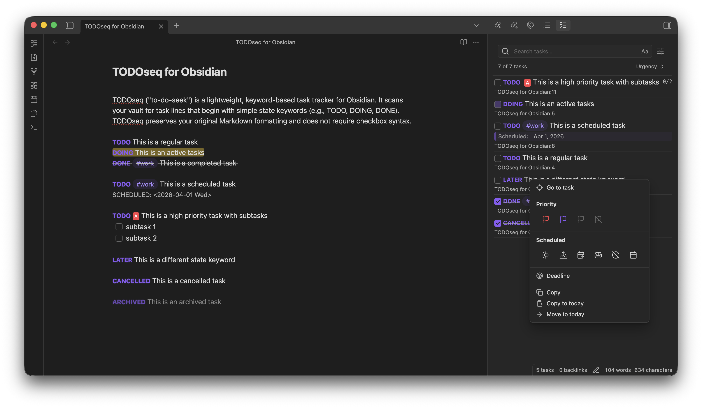
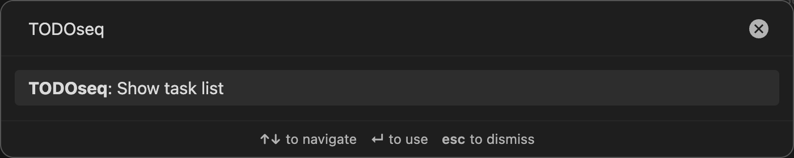
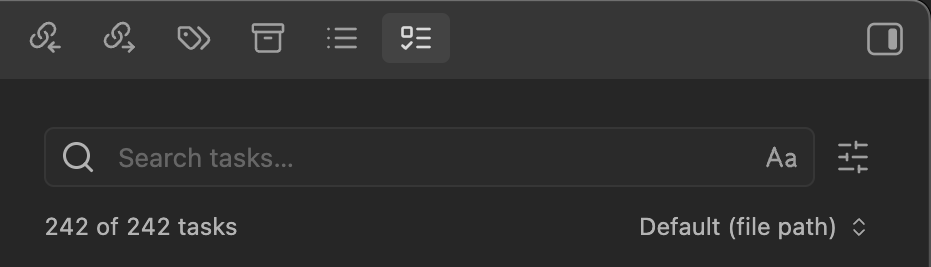
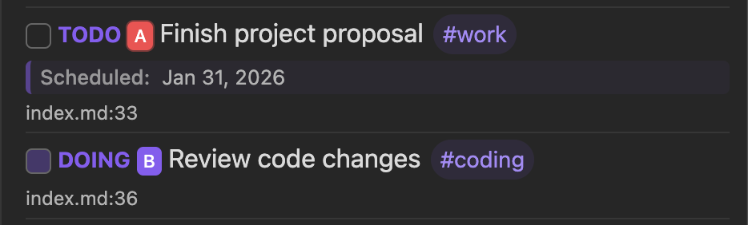
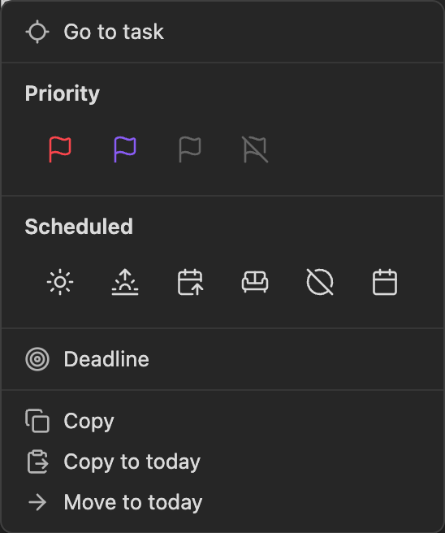
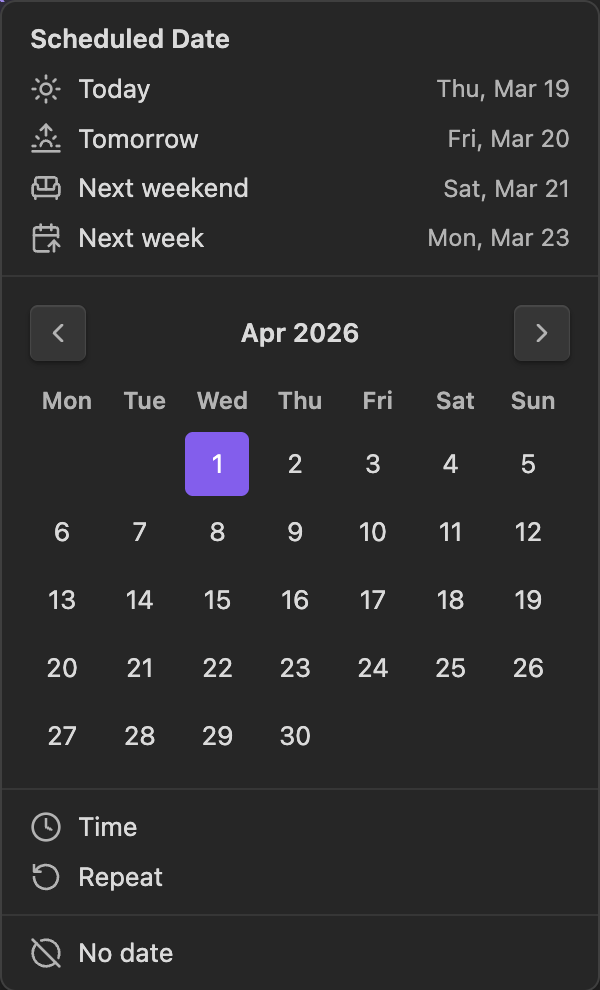

# Task List

The Task List is the central interface for managing all your tasks across your Obsidian vault. It provides a comprehensive overview of your tasks and powerful tools for task management.

## Opening the Task List

### Automatic Opening

The Task List automatically opens in the right sidebar when the TODOseq plugin is first enabled. You can drag and drop the panel to reposition it within the Obsidian interface, such as moving to different panel locations or making it a floating window.

### Command Palette

1. Open the command palette with `Ctrl/Cmd + P`
2. Search for "TODOseq: Show task list"
3. Select the command to open/show the Task List in the right sidebar

### Keyboard Shortcut

You can assign a custom keyboard shortcut to the "TODOseq: Show task list" command in Obsidian's Hotkeys settings.

## Task List Interface

The Task List consists of several key components:

### 1. Search and Settings Toolbar

Located at the top of the Task List, the toolbar contains:

- **Search field**: Live filtering of tasks as you type
- **Case sensitivity toggle**: Button to toggle case-sensitive search
- **View mode icons**: Three buttons for different task display modes
- **Sort method dropdown**: Choose how tasks are ordered
- **Task count**: Shows "X of Y tasks" based on current filters

### 2. Task List

The main area displays all detected tasks with the following information:

- **Checkbox**: Visual indicator of completion status
- **State keyword**: Colored badge showing task state (TODO, DOING, DONE, etc.). Right-click the badge to see all next state options
- **Priority badge**: Shows `[#A]`, `[#B]`, or `[#C]` if present
- **Task text**: The full text of the task
- **File path**: Shows the file name and line number location of the task in your vault. Hover the mouse over it to see the full path

## Task Interactions

### Clicking the State Keyword

Clicking the colored state keyword cycles the task through its state sequence:

- **Basic workflow**: TODO → DOING → DONE → TODO
- **Deferred tasks**: LATER → NOW → DONE
- **Waiting tasks**: WAIT → IN-PROGRESS → DONE
- **Cancelled tasks**: CANCELED → TODO

### Using the Checkbox

The checkbox provides a simple toggle between completed and incomplete states:

- **Check the box**: Task state changes to DONE
- **Uncheck the box**: Task state changes to TODO
- **Automatic synchronization**: Both the keyword and checkbox are updated

### Right-Click Context Menu

Right-click any **task keyword** to see all available state options in a popup menu. This shows all possible states for the current task type, allows direct selection of any state, and provides quick access to less commonly used states.

{width=50% height=50%}

### Task Context Menu

Right-click anywhere on a task row in the Task List to open a comprehensive context menu with quick actions for task management. This menu provides fast access to common operations without needing to navigate to the source file.

The context menu includes several sections:

**Go to Task** - Navigate directly to the task's location in its source file. This opens the file and positions your cursor on the exact line containing the task.

**Priority Selection** - Quickly set or change the task priority using flag icons. Choose from high priority `[#A]`, medium priority `[#B]`, low priority `[#C]`, or remove priority entirely. The priority is updated immediately in the source file.

**Scheduled Date Shortcuts** - Set or modify the task's scheduled date with convenient options:

- Today
- Tomorrow
- This weekend
- Next week
- Clear scheduled date
- Pick date...

These shortcuts help you quickly reschedule tasks without manually editing dates. The new Date Picker provides a calendar view, time picker, and repeat options for more precise scheduling.

- **Deadline** - Access deadline options using the new Date Picker. The date picker provides quick date selections, calendar view, time picker, and repeat options.

- **Copy** - Copy the task text to your clipboard. This includes the task keyword, priority, and task text, making it easy to paste the task elsewhere.

- **Copy to today** - Copy the task to today's daily note. This option appears only when the Daily Notes plugin is enabled. The task is appended to the end of today's daily note while keeping the original task in place.

- **Move to today** - Move the task to today's daily note. This option appears only when the Daily Notes plugin is enabled. The task is removed from its original location and appended to today's daily note. This is useful when you want to consolidate tasks for the current day.

- **Migrate to today** - Copy the task to today's daily note and update the original with a custom state keyword. This option appears only when both the Daily Notes plugin is enabled and a migrated state keyword is configured in settings. The original task's keyword is replaced with the configured state (see [Migrated state keyword](settings.md#migrated-state-keyword)). This is useful for marking tasks as moved or archived while preserving them in today's note.

The context menu supports keyboard navigation with arrow keys and Enter to select options, and can be dismissed with Escape. On mobile devices, long-press on a task row opens the context menu.

### Date Picker

{width=50% height=50%}

Use the Date Picker for selecting and managing task dates. The Date Picker provides:

- **Quick select options**: Today, Tomorrow, Next weekend, Next week
- **Calendar view**: Visual calendar for selecting specific dates
- **Time picker**: 30-minute increment time selection (optional)
- **Repeat options**: Built-in and custom repeat patterns (daily, weekly, monthly, yearly, custom)

The Date Picker can be accessed from the task context menu by selecting "Pick date..." for either scheduled or deadline dates.

### Opening Source Location

Clicking on a task row opens the source file in a smart, intuitive way that adapts to your workflow. The behavior varies based on how you click:

**Simple click** opens the file by reusing existing tabs whenever possible. If you already have markdown tabs open, TODOseq will use those to display the new page, keeping your workspace clean and organized. If no tabs are available, it opens in the current active pane or creates a new tab.

**Shift-click** creates a new split pane and opens the file there. This is perfect for when you want to reference the task while working on something else in your main workspace.

**Ctrl/Cmd-click** always opens the file in a brand new tab, ensuring you have a fresh workspace for the task without disrupting your current view.

In all cases, TODOseq navigates to the exact line containing the task and focuses the editor for immediate editing.

## Sort Methods

Sort the task list

See [Sort Methods](sort-methods.md) for detials.

## Search Functionality

The search field provides powerful live filtering of tasks.

See [Search Functionality](search.md) for details.

## Task Display and Styling

### Completed Task Indicators

Tasks with DONE, CANCELED, or CANCELLED states are visually marked as completed. Completed tasks appear with strikethrough formatting, and state badges show completed states in distinct colors.

### Priority Badges

Task priority indicators use colors picked from the current active theme:

- `[#A]` - High priority - theme color red
- `[#B]` - Medium priority - theme interactive accent
- `[#C]` - Low priority - theme background modifier border
- No priority - No badge displayed

### Subtask Indicators

Tasks can contain subtasks represented by indented checkbox items. TODOseq detects these subtasks and displays a progress indicator in the task list showing how many have been completed.

The subtask indicator appears as `[x/y]` where `x` is the number of completed subtasks and `y` is the total number of subtasks. For example, `[1/3]` means one of three subtasks is complete.
